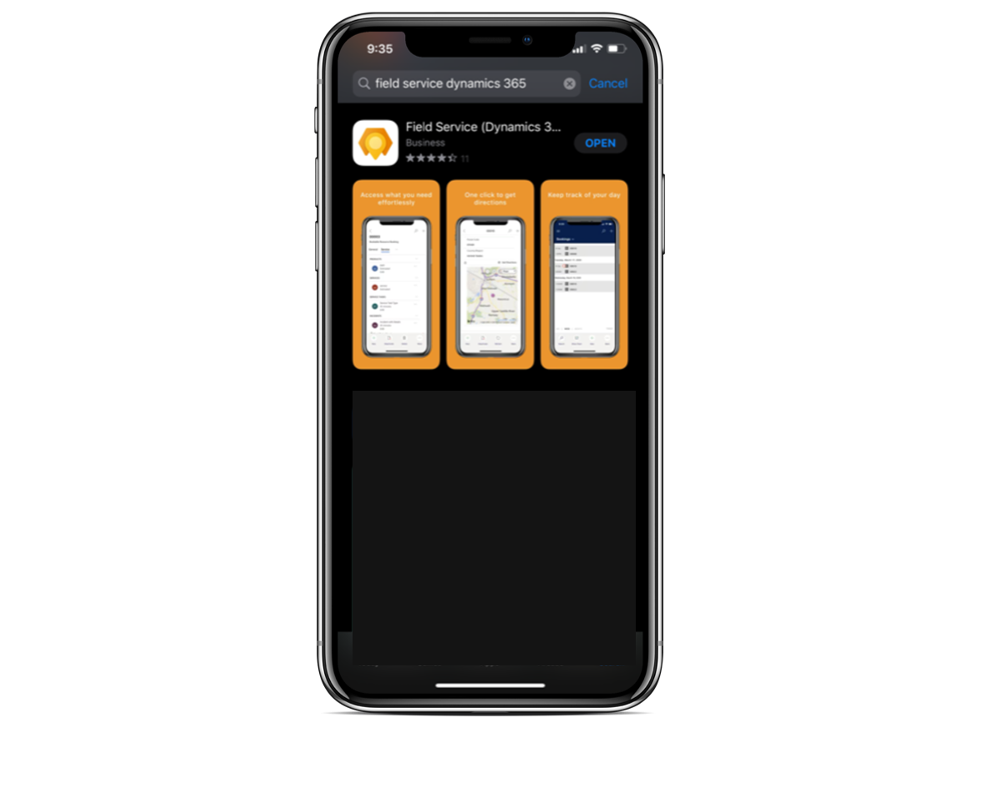

# Implement the Field Service (Dynamics 365) mobile app for your technicians

Field service technicians often need to see and update their work orders while onsite at a job.

To meet this need, Field Service offers the Field Service (Dynamics 365) mobile app.

> [!div class="mx-imgBorder"]
> 

The Field Service (Dynamics 365) mobile app is built on Microsoft Power Platform. In our documentation, we refer to this app as the **Field Service (Dynamics 365) mobile app**. This mobile app is included with your Field Service license.

## Implementation of Field Service (Dynamics 365) mobile app

The Field Service (Dynamics 365) mobile app will evolve over time. New features and continuous investments in Dynamics 365 Field Service and Power Platform will help shape the development. Read on to learn about capabilities for the app. For information about integration and onboarding, see [planning your deployment](#planning-for-your-deployment) and related links.

## Features in the Field Service (Dynamics 365) mobile app

| Feature | Category | Field Service (Dynamics 365) mobile app |  Details |
| --- | --- | --- |  --- |
| Mobile platform |  | iOS, Android, Windows |  [Apple App Store](https://aka.ms/fsmobile-apple),  [Android App Store](https://aka.ms/fsmobile-google), [Microsoft App Store](https://aka.ms/fsmobile-win)  |
| [Camera capture (photo + video](mobile-power-app-use.md#take-notes-with-attached-pictures-videos-and-files)) | Technician | Yes |  Use the device camera to capture images and video |
| [Barcode scanning](mobile-power-app-use.md#barcode-scanning) | Technician | Yes |  Scan bar code from global search or at a field level |
| [Offline data](mobile-power-app-use.md#work-offline-and-update-offline-data) | Technician | Yes |  Offline enabled application allows you to access your data regardless of internet connectivity. |
| [Calendar view](mobile-power-app-use.md#view-scheduled-work-orders) | Technician | Yes |   Customize your calendar with data relevant for your organization. |
| [Driving directions](mobile-power-app-use.md#travel-to-job-location) | Technician | Yes | Use your favorite in app map application for turn by turn directions |
| Speech to text | Technician | Yes | Insert notes with native device speech-to-text capabilities. |
| [Microsoft Intune](mobile-power-app-intune.md)  | Integration | Yes | Provide an extra layer of device and data protection with Microsoft Intune. |
| [Time entry](mobile-power-app-use.md#time-entry)  | Technician | Yes | In application Time Entry enabled by default |
| [Connected Field Service and IoT alerts](mobile-power-app-use.md#iot) | Technician | Yes |  Receive iOT signals and send commands directly from your mobile app. |
| [Inspections](inspections.md) | Technician | Yes | A Field Service technician can find and capture inspections associated with a work order. |
| [Dynamics 365 Remote Assist](/dynamics365/mixed-reality/remote-assist/overview-hololens) | Integration | Yes** | You can get help from remote collaborators with integrated Dynamics 365 Remote Assist. |
| [Push notifications](mobile-power-app-push-notifications.md) | Technician | Yes* |  You can send user notifications, such as a new booking appointment and other out-of-the-box triggers. |
| [Geofencing](mobile-powerapp-geofence.md) | Technician | Yes* | You can automatically set booking status as a technician arrives or leaves a location. |
| [Reporting](mobile-powerapp-reporting.md) | Technician | Yes | You can generate customer service reports with a signature, with the option to email a PDF. |
| [Scan to find asset (Global search)](mobile-power-app-system-barcode-scanning.md) | Technician | Yes |  Not applicable |
| [Location sharing and auditing](mobile-powerapp-location-auditing.md) | Admin | Yes* | You can enable real-time sharing of the technician's location with the back office. |
| [Enhanced offline sync filters](mobile-power-app-system-offline.md) | Admin | Yes |  Data available offline by default and the data available offline can be customized. For example, offline data available by location or by accounts for scheduled bookings. |
| [Offline by default](mobile-power-app-system-offline.md#understanding-offline-vs-online-capabilities) | Technician | Yes |  The app is offline by default, so the technician is always ready. |
| [Allow technician to force data sync](mobile-power-app-use.md#work-offline-and-update-offline-data) | Technician | Yes |  The technician can manually force data sync. |
| Bulk-add users  | Admin | Yes|  You can quickly assign an offline data sync profile to users. |
| Checklist for service tasks  | Technician | Yes |  Use a checklist to quickly mark a task as complete. |

*coming soon to Windows

**not available on Windows

Check [release plans](/dynamics365/release-plans/) to stay up to date on upcoming features for Field Service, including the Field Service (Dynamics 365) mobile app.

## Planning for your deployment

Here are a few more planning tips to help with your project:

**Do user acceptance training**. Ensure buy-in across your organization by bringing the people who will be using the app into the release process early. Select a diverse set of users across geographies or business units. Set up feedback channels to understand pain points and address problems before going live.

**Do a phased roll out**. Reduce risk by segmenting your release over phases. For example, release by geography or by business group. Take feedback from users and expand the deployment once stable.

**Pilot the mobile apps side by side**. If you're a current customer of Field Service, you can pilot the new Field Service (Dynamics 365) mobile app alongside other Field Service apps your organization might be using. Assess how your frontline workers currently use the apps. Identify important data and frequently viewed information. You'll better understand what functionality to include in the Field Service (Dynamics 365) mobile app.

**Measure performance**. How the mobile app performs is a significant factor in how much frontline workers enjoy using the app. Add performance measures to the deployment plan and test how editing forms, the mobile offline profile, and workflows affect app performance. Take feedback from users to determine what is necessary and what can be removed or hidden from forms.

[!INCLUDE[footer-include](../includes/footer-banner.md)]
