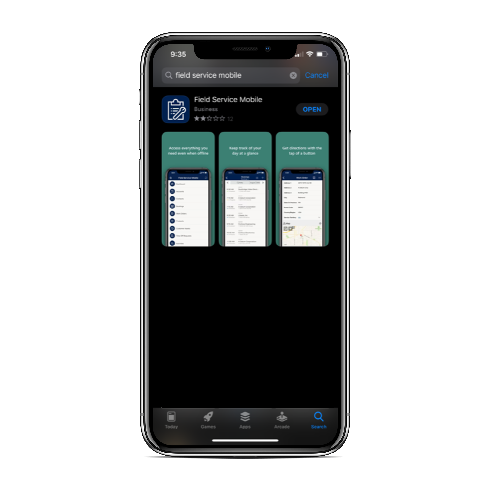
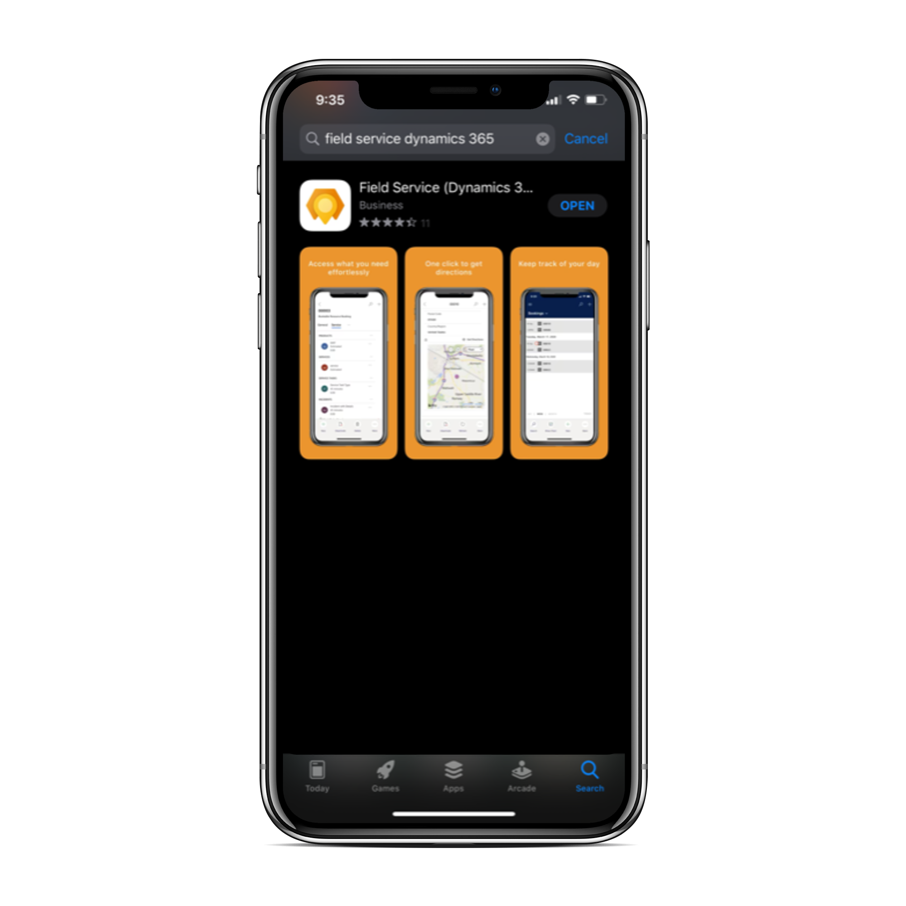

# Implement the right mobile app for your technicians: Field Service Mobile (Xamarin) or Dynamics 365 Field Service mobile (Power App)

Field Service technicians often need to see and update their work orders while onsite at a job. 

There are two mobile apps available for technicians using Dynamics 365 Field Service:

- Field Service Mobile, which is built on the Xamarin platform. In our documentation, we refer to this app as "Field Service Mobile (Xamarin). In the app stores, you'll find this app with the following icon:

> [!div class="mx-imgBorder"]
> 

- Field Service (Dynamics 365), which is built on the Power Platform. In our documentation, we refer to this app as Field Service mobile (Power App). In the app stores, you'll find this app with the following icon.

> [!div class="mx-imgBorder"]
> 

Both Field Service mobile (Power App) _and_ Field Service Mobile (Xamarin) are included with Field Service.

## Implementation and migration guidance

We recommend to continue using the existing "[Field Service Mobile](./field-service-mobile-app-user-guide.md)" app for current and new deployments of Dynamics 365 Field Service. As development in the Field Service mobile (Power App) continues through 2021, capabilities will become comparable to Field Service Mobile (Xamarin) and system administrators should use the feature comparison information below to decide which mobile app is right for their organization or department.

While the new Field Service mobile (Power App) continues to evolve, we'll continue to make available and support the current Field Service Mobile (Xamarin) app. By June 2021, new deployments must use Field Service mobile (Power App); support for the current Field Service Mobile (Xamarin) app will end June 2022. 

## Feature comparison: Dynamics 365 Field Service mobile (Power App) versus Field Service Mobile (Xamarin)

Field Service mobile (Power App) is recommended for **simpler** use cases and for organizations that want to get up and running quickly with a mobile solution for technicians because it is built on the Power Platform and uses the same admin console as Field Service web and the same PCF controls. 

Field Service Mobile (Xamarin) is recommended for more **complex** use cases where you may need custom reporting, push notifications, geofencing, and business processes or validations that work offline.

Use the following feature comparison table to understand which mobile app is right for your business.

| Feature | Category | Field Service mobile Power App | Field Service Mobile | Details |
| --- | --- | --- | --- | --- |
| Mobile platform |  | iOS, Android | iOS, Android, Windows | |
| Camera capture (photo + video) | Technician | Yes | Yes | |
| Barcode scanning | Technician | Yes | Yes | |
| Offline data | Technician | Yes | Yes | |
| Calendar view | Technician | Yes | Yes | |
| Driving directions | Technician | Yes | Yes | |
| Speech to text | Technician | Yes | Yes | |
| Geocoding | Technician | Yes | Yes | |
| [Microsoft Intune](field-service-mobile-intune.md)  | Integration | Yes | Yes | |
| Time entry  | Technician | Yes | Yes | |
| Connected Field Service & IoT alerts | Technician | Yes | Yes | |
| [Inspections](inspections.md) | Technician | Yes | Yes | Field Service technician can find and capture inspections associated with a work order. |
| [Remote Assist](https://docs.microsoft.com/dynamics365/mixed-reality/remote-assist/overview-hololens) | Integration | Yes | Yes | Access to help from remote collaborators with integrated Remote Assist. |
| [Push notifications](mobile-push-notifications.md) | Technician | 2020 release wave 2 | Yes | User notifications, such as new booking appointment. |
| [Geofencing](geofencing.md) | Technician | 2020 release wave 2 | Yes | Ability to autoset booking status as technician arrives or leaves location. |
| Reporting | Technician | 2020 release wave 2 | Yes | Customer service reports with signature, option to email PDF. |
| Scan to find asset | Technician | 2020 release wave 2 | Yes | |
| [Location sharing and auditing](https://docs.microsoft.com/dynamics365/field-service/geofencing#step-3-enable-location-auditing-for-the-field-service-mobile-app) | Admin | 2020 release wave 2 | Yes | Real time sharing tech location with back office. |
| Enhanced offline sync filters | Admin | 2020 release wave 2 | Yes | Customize the data available offline (for example, by location, accounts for scheduled bookings). |
| Offline by default | Technician | 2020 release wave 2 | Yes | App is offline by default so tech is always ready. |
| Allow technician to force data sync | Technician | 2020 release wave 2 | Yes | Technician can manually force data sync. |
| Bulk-add users  | Admin | 2020 release wave 2 | Yes | Quickly assign offline data sync profile to users. |
| Check list for service tasks  | Technician | 2020 release wave 2| Yes | Check list for quickly mark task as complete. |

Check [Release Plans](https://docs.microsoft.com/dynamics365/release-plans/) to stay up to date on upcoming features for Field Service including the Field Service mobile Power App.

### See also

- [What are model-driven apps in Power Apps?](https://docs.microsoft.com/powerapps/maker/model-driven-apps/model-driven-app-overview)
- [Enable entities for mobile offline synchronization](https://docs.microsoft.com//dynamics365/mobile-app/setup-mobile-offline-for-admin#step-1-enable-entities-for-mobile-offline-synchronization)

