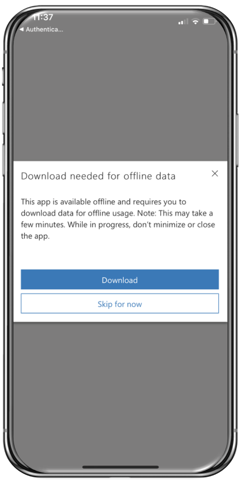
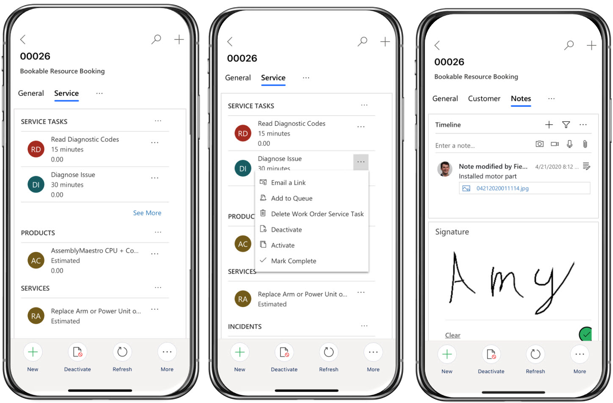
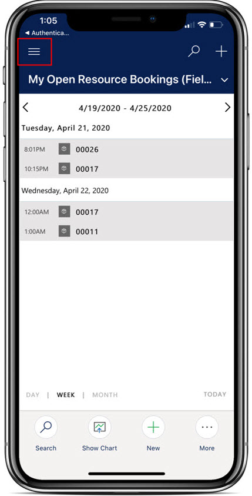
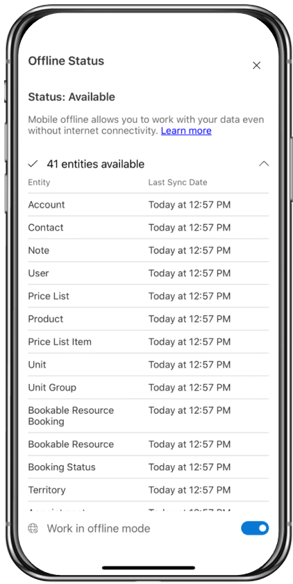
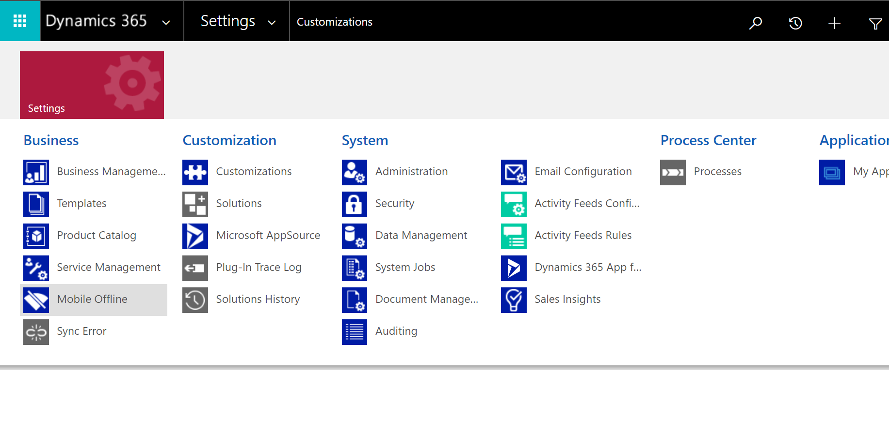
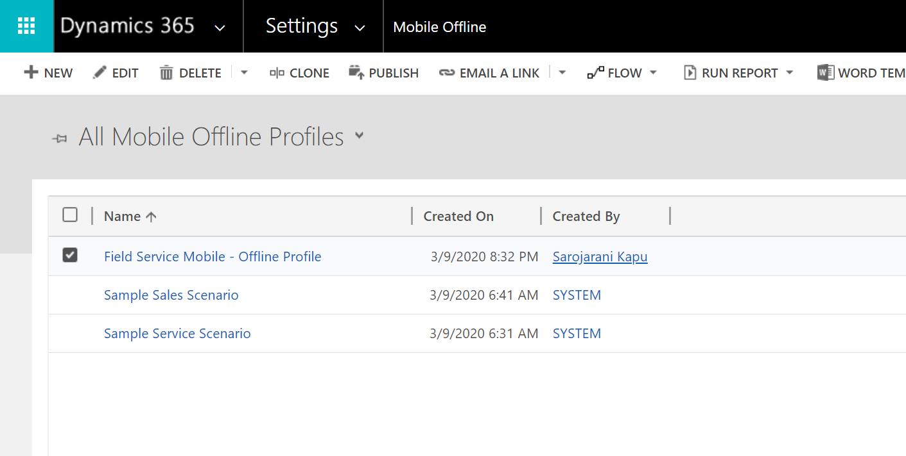
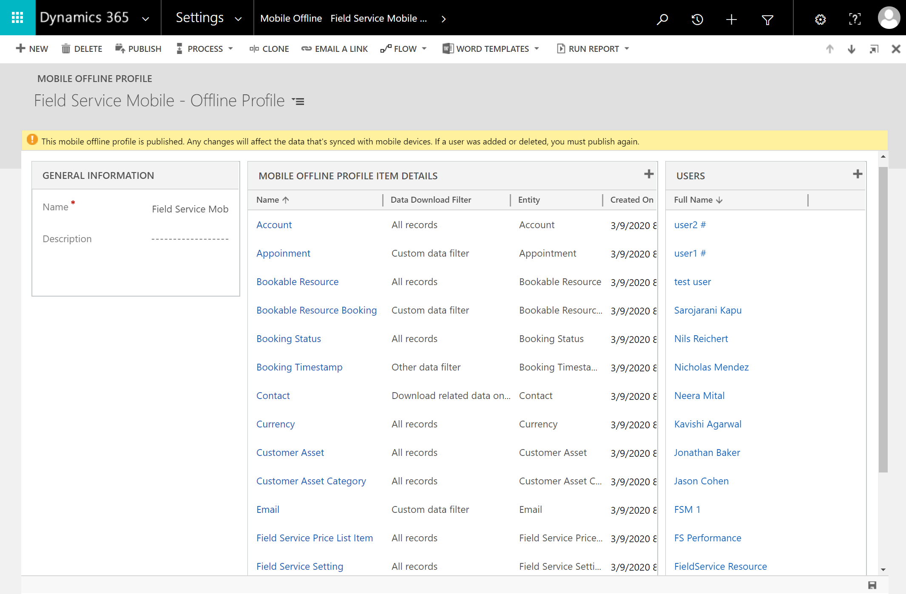
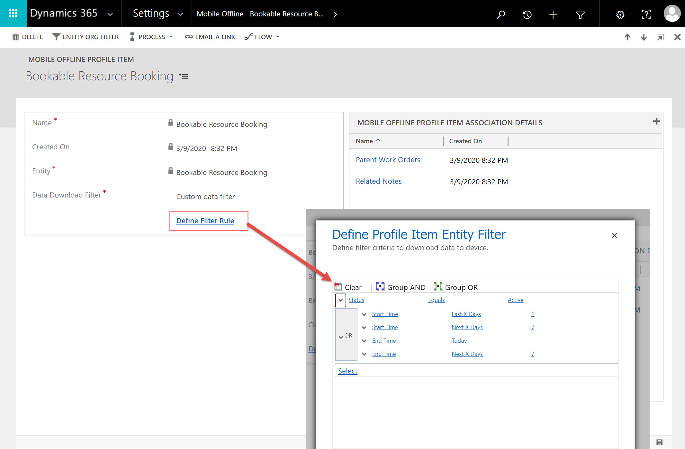

# Field Service (Dynamics 365) mobile app

Field Service (Dynamics 365) is a mobile app designed and optimized for technicians to view Dynamics 365 Field Service work orders, customer assets, accounts, and contacts. Different than Field Service Mobile (see feature comparison below), this alternative mobile app is built on Microsoft's Power Platform as a model-driven app and is customizable to your business needs with the same admin console as all Dynamics 365 business apps.

Both the Field Service (Dynamics 365) mobile app _and_ the Field Service Mobile app are included with Field Service.

Available natively for Apple iOS and Google Android phones, Field Service (Dynamics 365) offers technicians many capabilities they need to perform onsite customer service, such as:  

- A calendar view of assigned jobs 
- Support for picture, video, and asset barcode scanning
- Customer signature capture
- Offline capabilities so technicians can continue viewing and recording work in areas without internet

## Implementation and migration guidance

We recommended to continue using the existing "[Field Service Mobile](./field-service-mobile-app-user-guide.md)" app for current and new deployments of Dynamics 365 Field Service. As development in the Field Service (Dynamics 365) mobile app continues through 2021, capabilities will become comparable to Field Service Mobile and system administrators should use the feature comparison information below to decide which mobile app is right for their organization or department.

While the new Field Service (Dynamics 365) app continues to evolve, we'll continue to make available and support the current Field Service Mobile app. By June 2021, new deployments must use Field Service (Dynamics 365) mobile app; support for the current Field Service Mobile app will end June 2022. 

## Feature comparison: Field Service (Dynamics 365) versus Field Service Mobile

Field Service (Dynamics 365) mobile app is recommended for **simpler** use cases and for organizations that want to get up and running quickly with a mobile solution for technicians because it is built on the Power Platform and uses the same admin console as Field Service web and the same PCF controls. 

Field Service Mobile is recommended for more **complex** use cases where you may need custom reporting, push notifications, geofencing, and business processes or validations that work offline.

| Feature | Category | Field Service (Dynamics 365) | Field Service Mobile | Details |
| --- | --- | --- | --- | --- |
| Mobile platform |  | iOS, Android | iOS, Android, Windows | |
| Camera capture (photo + video) | Technician | Yes | Yes | |
| Barcode scanning | Technician | Yes | Yes | |
| Offline data | Technician | Yes | Yes | |
| Calendar view | Technician | Yes | Yes | |
| Driving directions | Technician | Yes | Yes | |
| Speech to text | Technician | Yes | Yes | |
| Geocoding | Technician | Yes | Yes | |
| [Microsoft Intune](field-service-mobile-intune.md)  | Integration | Yes | Yes | |
| [Push notifications](mobile-push-notifications.md) | Technician | 2020 release wave 2 | Yes | User notifications, such as new booking appointment. |
| [Geofencing](geofencing.md) | Technician | 2020 release wave 2 | Yes | Ability to autoset booking status as technician arrives or leaves location. |
| IoT alerts | Technician | 2020 release wave 2 | Yes | |
| Reporting | Technician | 2020 release wave 2 | Yes | Customer service reports with signature, option to email PDF. |
| Scan to find asset | Technician | 2020 release wave 2 | Yes | |
| [Location sharing and auditing](https://docs.microsoft.com/dynamics365/field-service/geofencing#step-3-enable-location-auditing-for-the-field-service-mobile-app) | Admin | 2020 release wave 2 | Yes | Real time sharing tech location with back office. |
| Enhanced offline sync filters | Admin | 2020 release wave 2 | Yes | Customize the data available offline (for example, by location, accounts for scheduled bookings). |
| Offline by default | Technician | 2020 release wave 2 | Yes | App is offline by default so tech is always ready. |
| Allow technician to force data sync | Technician | 2020 release wave 2 | Yes | Technician can manually force data sync. |
| [Remote Assist](https://docs.microsoft.com/dynamics365/mixed-reality/remote-assist/overview-hololens) | Integration | 2020 release wave 2 | Yes | Access to help from remote collaborators with integrated Remote Assist. |
| Bulk-add users  | Admin | 2020 release wave 2 | Yes | Quickly assign offline data sync profile to users. |
| Time entry  | Technician | 2020 release wave 2 | Yes | |
| Check list for service tasks  | Technician | 2020 release wave 2| Yes | Check list for quickly mark task as complete. |
| [Inspections](inspections.md) | Technician | 2020 release wave 2 | Yes | Field Service technician can find and capture inspections associated with a work order. |

Check [Release Plans](https://docs.microsoft.com/dynamics365/release-plans/) to stay up to date on upcoming features for Field Service including the Field Service (Dynamics 365) mobile app.

## Prerequisites

- **Field Service v8.8.22+**. The Field Service (Dynamics 365) mobile app will appear in your list of Dynamics 365 applications.

> [!div class="mx-imgBorder"]
> 

- Select the ellipses icon on the **Field Service Mobile** application, then choose **Manage Roles** and assign the app to the Field Service-Resource, Field Service-Administrator, and other relevant roles that will need access to the mobile app.

- Set up a Dynamics 35 Field Service user with the **Field Service-Resource** security role. This user will sign in to the Field Service (Dynamics 365) mobile app as a technician.

> [!div class="mx-imgBorder"]
> 

- To view work orders on the mobile app, you must also [create a bookable resource](./set-up-bookable-resources.md) related to your technician user and schedule work orders to the bookable resource.

> [!div class="mx-imgBorder"]
> 

## Install and sign in to Field Service (Dynamics 365) 

Go to the app store on your iOS or Android device and search for **Field Service mobile**.

Download the app called **Field Service (Dynamics 365)**, as seen in the following screenshot. It's the mobile app built on the Power Platform.

> [!div class="mx-imgBorder"]
> 

Launch the app and sign in with your username and password, which should be the user credentials of the technician user with the **Field Service - Resource** security role.

## Use the Field Service (Dynamics 365) mobile app

Once you sign in, the app will prompt you to download offline data (your scheduled work orders) to the device. If you anticipate not having internet access, select **Download**. Otherwise you can **Skip for now**. If you're unsure, we recommend downloading the offline data just in case. 

> [!div class="mx-imgBorder"]
> 

### View scheduled work orders

The first screen you'll see is a calendar view of your scheduled work orders.

Select **More** > **Show as** > **Read Only Grid** to see the bookings as a list as shown on the right side of the following screenshot.

> [!div class="mx-imgBorder"]
> 

Select a booking to see more details about the booking time and the work order. For example, you can update the status to **Traveling** to indicate you are driving to the customer location; on the **Customer tab**, you can see the work order location on a map and trigger turn-by-turn driving directions from a GPS app on your phone such as Bing Maps, Apple Maps, Waze, or Google Maps.

> [!div class="mx-imgBorder"]
> 

On the **Service tab**, you'll see work order details like work order service tasks, products, and services.

On the **Notes tab**, you'll see a way to add note text, pictures, and videos, as well as customer signature capture.

> [!div class="mx-imgBorder"]
> 

### Find more information

To get to the sitemap, select the menu icon from the calendar view.

> [!div class="mx-imgBorder"]
> 

From here, you can find other important information like accounts, contacts, customer assets, or to record time off.

> [!div class="mx-imgBorder"]
> 

### Work offline

If you expect to be in areas without wifi or cellular internet access, you can download important information to your device to keep working. 

From the home screen, select the cloud icon in the bottom left. 

Then select **Download offline updates**. 

> [!div class="mx-imgBorder"]
> 

When **Status** is set to **Available**, you'll have all the data you need to work offline.

Then toggle the **Work in offline mode** to on. If you lose internet connection unexpectedly, the app will automatically work in offline mode if you previously downloaded data.

## Configure the Field Service (Dynamics 365) mobile app

Administrators can edit how Field Service (Dynamics 365) looks and functions for technicians.

Let's walk through three common configurations:

1. Editing the entities displayed in the home screen (sitemap)
2. Editing the fields and layout in the work order and booking forms
3. Editing the entities and records downloaded to the mobile phone in offline mode for use without internet access.

### Edit Sitemap entities on home screen

Sign in to Dynamics 365 as a system administrator.

To see your list of apps, go to: 

      https://[YOUR-ENVIRONMENT-NAME].crm.dynamics.com/main.aspx?forceUCI=1&pagetype=apps

Find the Field Service Mobile app and go to the **App Designer**.

> [!div class="mx-imgBorder"]
> 

Select the edit icon to edit the site map.

> [!div class="mx-imgBorder"]
> 

The groups  **My Work**, **Customers**, and **Other** correspond with the home screen of Field Service (Dynamics 365) and you can rearrange, delete, or edit the display names.

Rearrange the entities displayed within each group with the drag and drop interface, or add new entities by adding new **Subareas**.

> [!div class="mx-imgBorder"]
> 

You can even create entirely new groups with more subareas to display different entities.

> [!div class="mx-imgBorder"]
> 

> [!Note]
> For every entity you display in the sitemap, you can choose the views available on mobile in the App Designer.

### Edit the booking and work order form

You can add and delete fields displayed on Field Service (Dynamics 365); because the app is built as a model-driven Power App, you can use the Power Apps Control Framework to display different field controls like toggle buttons and sliders.

Administrators who want to customize the booking and work order forms must know they are combined in the mobile app where work order forms are displayed within the booking form. That means when a technician views a booking form, they're also viewing the related work order form. In the following screenshot, the **General** section displays **Bookable Resource Booking** ("Booking") fields and the **Customer**, **Service**, and **Notes** sections display work order fields.

> [!div class="mx-imgBorder"]
> 

To edit the work order portion of the form, go to **Settings** > **Customizations** > **Customize the System** and find the **Work Order** entity in the Power Apps admin console.

> [!div class="mx-imgBorder"]
> 

In the **Form** section, there are three forms that correspond to the three sections of the combined Booking-Work Order form.

1. Work Order - Customer
2. Work Order - Service
3. Work Order - Notes

Edit each form as needed and publish. The changes will display in Field Service (Dynamics 365).

> [!div class="mx-imgBorder"]
> 

To edit the **Booking** part of the form, go to the **Bookable Resource Booking** entity in the Power Apps admin console.

> [!div class="mx-imgBorder"]
> 

Find the **Booking and Work Order** form, as seen in the following screenshot.

> [!div class="mx-imgBorder"]
> 

Add and delete booking fields as needed.

> [!div class="mx-imgBorder"]
> 

Another way you can add work order information to the booking form is to add a [quick view form](https://docs.microsoft.com/dynamics365/customerengagement/on-premises/customize/create-edit-quick-view-forms) that displays work order fields. Quick view forms are read-only, but you can go to the related work order form from there.

### Configure offline data and sync filters

Administrators can edit the data downloaded to Field Service (Dynamics 365) in offline mode when no internet access is available. 

> [!Note]
> When internet access is available, users will simply see all data on the server they have access to via their security role.

> [!div class="mx-imgBorder"]
> 

Go to **Settings** > **Mobile Offline**.

> [!div class="mx-imgBorder"]
> 

Then select **Mobile Offline Profiles**. Choose the **Field Service Mobile - Offline Profile**, which is the default configuration for offline data that is included with the Field Service app.

> [!div class="mx-imgBorder"]
> 

The profile dictates which entities and how many records of each entity will be downloaded in offline mode.

> [!div class="mx-imgBorder"]
> 

For each entity, you can choose a data download filter:

1. Download related data only
2. All records
3. Other data filter
4. Custom data filter

For example, the **Bookable Resource Booking** (in other words, the booking) entity has a data download filter set to **custom data filter** that downloads resource bookings that start or end in the next seven days or yesterday.

> [!div class="mx-imgBorder"]
> 

For another example, the **Work Order Product** entity has a data download filter set to **Download related data only**, which means that only work order products related to downloaded work orders are available offline. To accomplish this, the work order product mobile offline profile item was listed as an associated profile item of the work order offline profile, as seen in the following screenshot.

> [!div class="mx-imgBorder"]
> 

> [!Note]
> By default, work orders related to downloaded bookable resource bookings are available offline. This creates a chain of entities and records that are offline: bookings > work orders > work order products. This means that bookings scheduled to you are downloaded, work orders related to those bookings are downloaded, and work order products related to those work orders are downloaded.

### Offline JavaScript

In some cases, an organization may want to run validation on certain field values after a technician updates an entity. For example, let's say you want to make sure the duration of a work order booking is at least two hours once a technician saves a record in the Field Service (Dynamics 365) mobile app.

Validation can be done with the help of some JavaScript and doing so works online and offline.

See the video on [Field Service mobile Power App: Offline JavaScript](https://youtu.be/tUdL5YZA29A) for more details.

Go to **Settings** > **Customizations**.

Go to the **Bookable Resource Booking** entity.

Go to **Forms**.

Go to the **Booking and Work Order** form.

Go to **Form Properties** in the top.

> [!div class="mx-imgBorder"]
> 

Create and add a new JavaScript web resource to the form.

Enter in the following code snippet:

      function TestOnSave(executionContext) {

      var formContext = executionContext.getFormContext(); // get formContext
      var duration = formContext.getAttribute("duration").getValue();

      formContext.ui.clearFormNotification("DurationErrorMessageId");

      if (duration < 120) {
      executionContext.getEventArgs().preventDefault(); // Stop the Save
      formContext.ui.setFormNotification("Duration must be greater than 2 hours", "ERROR", "DurationErrorMessageId");
      }

      }
      
  Ensure the web resource triggers on save of the form.
  
  Save and publish customizations.

## FAQs

### Can I only add and view Field Service entities on Field Service (Dynamics 365)?

Because Field Service (Dynamics 365) is a model-driven app on the Power Platform, any entity can be added; users can only see entities and records that they have the licenses and security to access, regardless of whether it's part of the Field Service app or not.

### Why is the app saying "You're almost there"?

> [!div class="mx-imgBorder"]
> 

If you are getting the error "You're almost there" after signing in to the mobile app, try the following steps:

1. Make sure you have the correct security role (Field Service - Resource) and that the security role is assigned to the Field Service Mobile app.
2. Sign in again, pull down the screen to refresh and wait for at least a few minutes
3. If completing both steps 1 and 2 above do not resolve the issue, [submit a support ticket](https://dynamics.microsoft.com/contact-us/).

