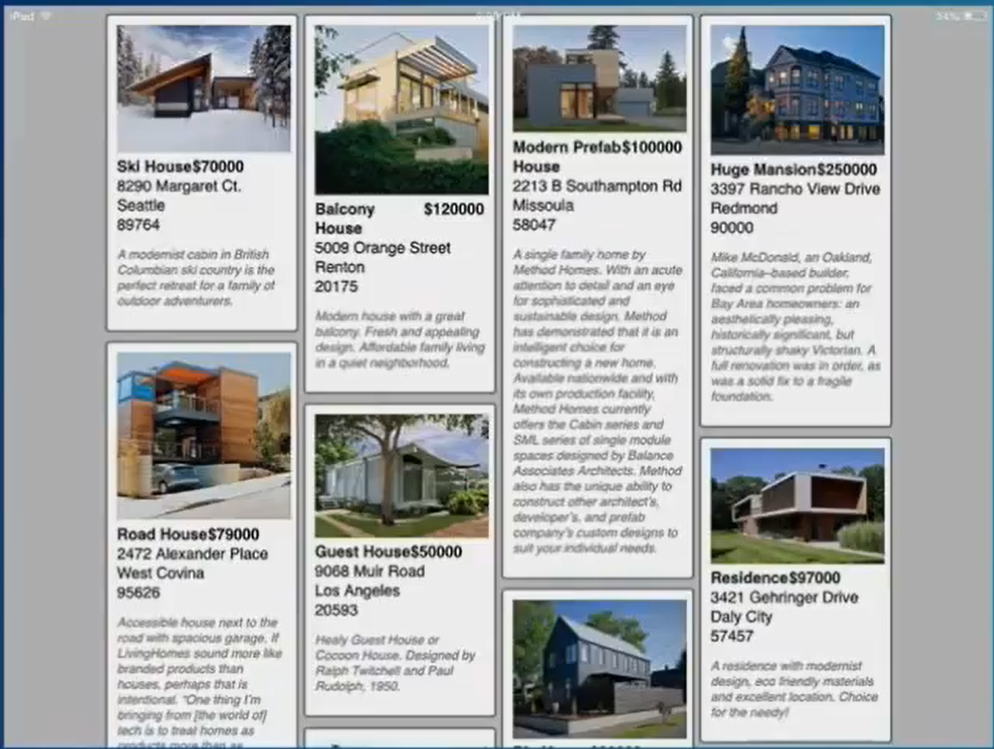

# Customizing and configuring the Field Service mobile app

After setting up the [Field Service mobile application](install-field-service.md), it is common to customize and configure the mobile user interface and data based on your business needs. 

The [Woodford guide](https://www.resco.net/downloads/Woodford_Guide.pdf) provides guidance for customizing and configuring the mobile application via the Woodford solution. All mobile customizations and configurations including the examples below are performed via the Woodford solution by navigating to **Settings > Woodford > MobileCRM Woodford**.

The [Field Service mobile project](https://go.microsoft.com/fwlink/p/?linkid=836310) is a template of customizations and configurations to begin with and should be imported into Woodford.

## Mobile customization examples

The most common customizations are to edit the home screen, fields, forms, and views field technicians see when logged into the Field Service mobile app. Additionally, these customizations can differ based on the security roles of logged in users.

### Home screen
Edit the entities displayed upon logging into the mobile app. For instance, in the Home screen below, mobile administrators can be move Time Off Requests to the top of the list or remove it from the screen completely.

> 

### Views
After selecting an entity, edit the view of records displayed. For instance, in the Account view below, mobile administrators can customize the fields displayed and the position, how the view is sorted, size and color of fonts.
> 

### Fields and forms
After selecting a record in the view, edit the forms and fields. For instance, in the Account form below, mobile administrators can edit which fields are displayed and the order, actions available such as triggering phone/email, and whether related records can be accessed from the form.
> 

### Offline HTML and JavaScript

Moving beyond the traditional entity-view-form layout, mobile customizers can replace the entire mobile interface using custom HTML and JavaScript that works offline.

> 

## Mobile configuration examples

**Security-** users of the mobile app have access to data based on their Dynamics 365 security roles; however, mobile administrators can further restrict security at the entity and field level. As an example, a specific security role may grant a user access to view and create Purchase Orders in the web browser, but when logged into the mobile app, the user is restricted to only viewing Purchase Orders. Furthermore, a user may be allowed to edit the Work Order sub status field in the browser, but is restricted to read only for this field in the mobile app.

**Sync options-** configure when data is sent from the device to the server and vice versa. Common examples include each time the mobile app is launched or each time a field is updated.

**Sync filters-** configure which subset of server data is downloaded locally to the device when in offline mode when there is no internet access. As an example, when connected to the internet, a mobile user may be able to see all booked work orders for this calendar year, but when in offline mode can only view this week's booked work orders that have been donwloaded to the device.

**Workflows-** create mobile workflows called form rules. Common examples include auto-populating data when specific fields are edited or displaying warning messages in the mobile interface.

**Commands-** configure actions and workflows to be performed when custom buttons (commands) are selected. A common example of a command is a camera icon button that when selected triggers the device's camera.

## See also
[Install Field Service with mobile](../field-service/install-field-service.md)

[Resco support guides](https://www.resco.net/support/guides/)
