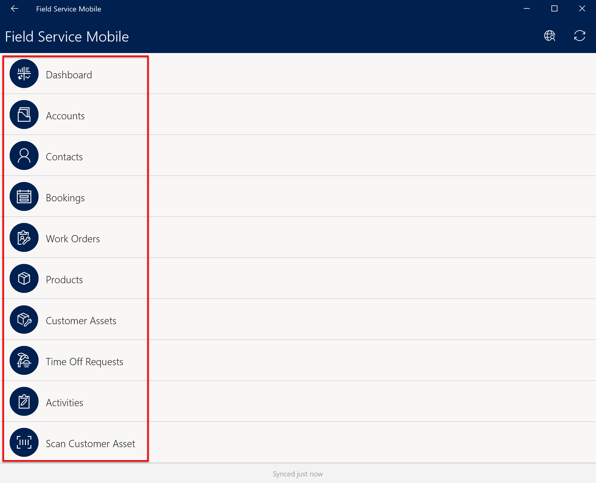
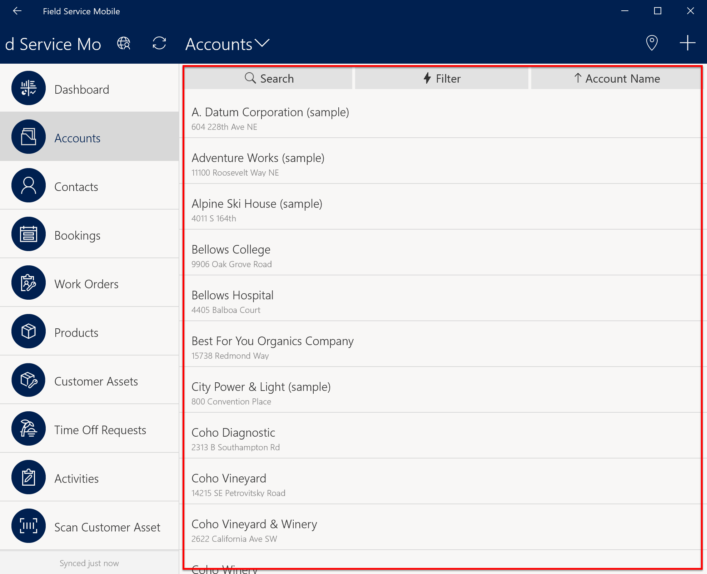
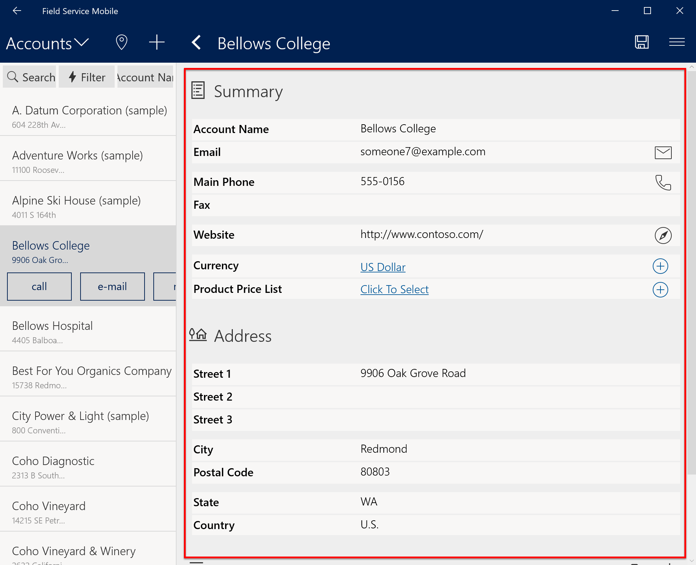

# Customizations and configurations for the Field Service (Dynamics 365) mobile app

After setting up the [Field Service mobile application](https://docs.microsoft.com/dynamics365/customer-engagement/field-service/install-field-service#download-the-field-service-mobile-app-on-a-phone-or-tablet), you can customize and configure the mobile user interface and data based on your business needs. 

The [Woodford guide](https://www.resco.net/downloads/Woodford_Guide.pdf) provides guidance for customizing and configuring the mobile application via the Woodford solution. All mobile customizations and configurations including the examples below are performed via the Woodford solution by navigating to **Settings > Woodford > MobileCRM Woodford**.

Additionally, the [Field Service mobile project](https://aka.ms/fsmobile-project) is a template of customizations and configurations that you can use to get started. It should be imported into Woodford.

In this article, we'll take a look at some **common display customizations** for the mobile app, along with some examples of how you can **configure how the app works**. 

## Common display customizations

There are many customizable elements in the Field Service mobile app, including but not limited to: 

- the home screen
- views
- fields
- forms

These customizations can differ based on the security roles of logged in users.

See below for some common customization examples.

### Home screen
You can edit how entities are displayed and ordered upon signing into the mobile app. For instance, as seen in the screenshot below, mobile administrators can move *Time-Off Requests* to the top of the list, or remove it from the screen completely.

> 

### Views
After selecting an entity, you can decide how records are displayed. For instance, as in the account view below, mobile administrators can customize the fields displayed and the position, how the view is sorted, size and color of fonts.
> 

### Fields and forms
After selecting a record in the view, edit the forms and fields. For instance, in the Account form below, mobile administrators can edit which fields are displayed and the order, actions available such as triggering phone/email, and whether related records can be accessed from the form.
> 

### Offline HTML and JavaScript

Moving beyond the traditional entity-view-form layout, mobile customizers can replace the entire mobile interface using custom HTML and JavaScript that works offline.

## Common configurations

Now that we've looked at a few of the common display customizations, let's take a look at how you can configure the app to work in ways that suit your business and security needs. 

### Security controls
By default, mobile app users have access to data based on their Dynamics 365 security roles; however, mobile administrators can further restrict security at the entity and field level. 

For example, a specific security role may grant a user access to view *and create* purchase orders in the web browser, but when logged into the mobile app, the user is restricted to only *viewing* purchase orders. Additionally, a user may be allowed to edit the work order sub status field in the browser, but can only view the field in the mobile app.

### Data sync options 
With the data sync options, administrators can configure when data is sent from the device to the server and vice versa. 

For instance, you can configure the app to sync whenever it is launched, or each time a specific field is updated.

### Sync filters 
Sync filters allow administrators to configure which subset of server data is downloaded locally to the device when in offline mode. 

For example, when connected to the internet, a mobile user may be able to see all booked work orders for this calendar year; when that user is in *offline* mode, they can only view the current week's booked work orders, which have been downloaded to the device, thanks to a sync filter.

### Workflows
Administrators can also create mobile workflows called **form rules**. Common examples include autopopulating data when specific form fields are edited, or displaying warning messages for fields in the mobile interface.

### Commands

Administrators can configure the app to trigger actions and workflows when custom buttons (commands) are selected. A common example of a command is a camera icon button that when selected, triggers the device's camera.

For detailed information on customizing and configuring the Field Service mobile app, be sure to check out the detailed [Woodford guide (PDF)](https://www.resco.net/downloads/Woodford_Guide.pdf). 

## See also
[Install Field Service with mobile](../field-service/install-field-service.md)

[Resco support guides](https://www.resco.net/support/guides/)

[!INCLUDE[footer-include](../includes/footer-banner.md)]