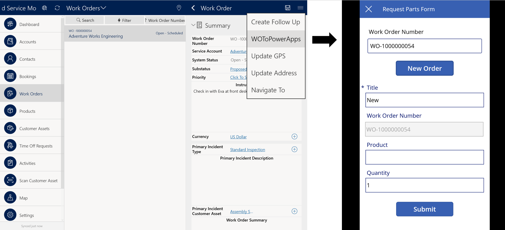
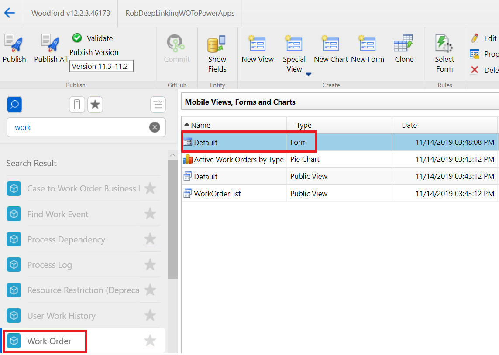
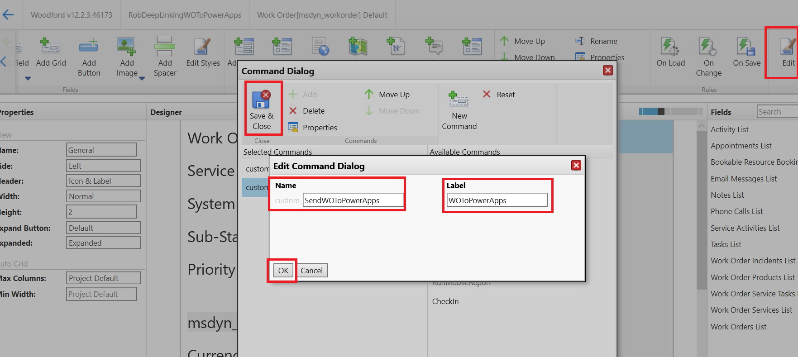
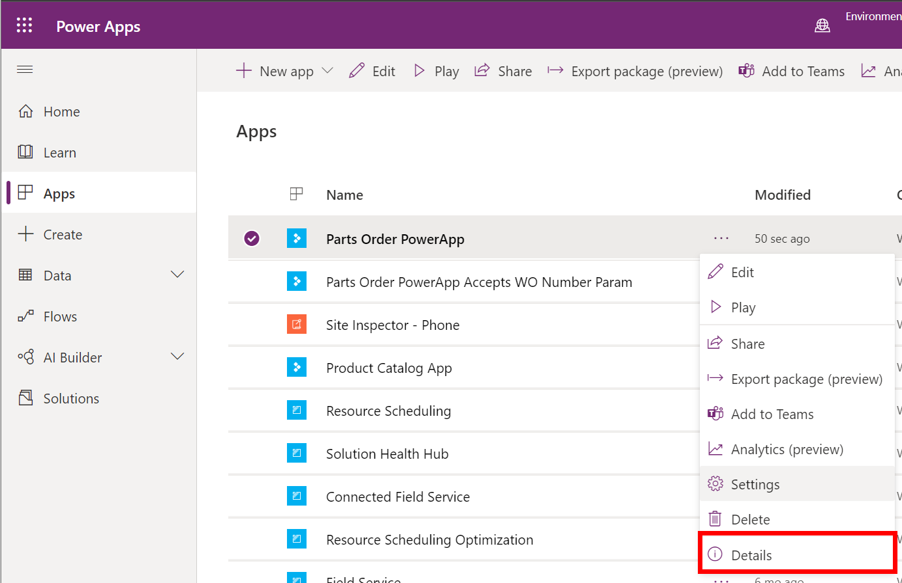
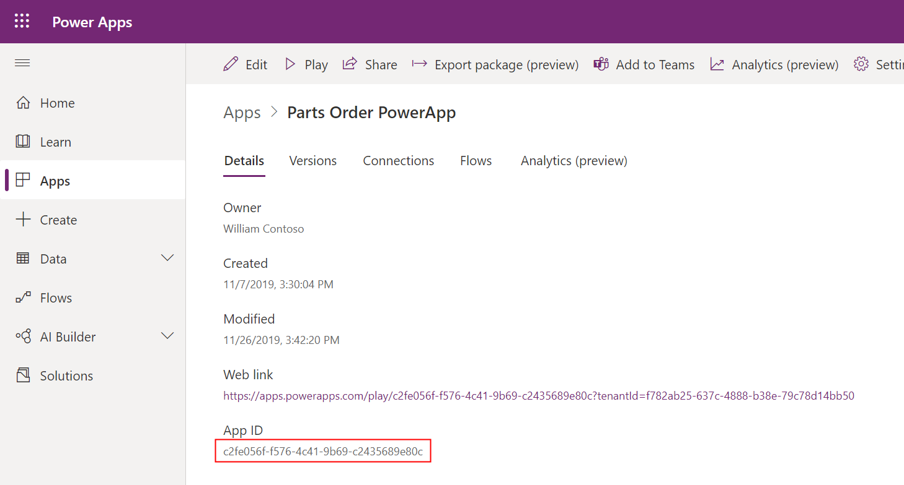
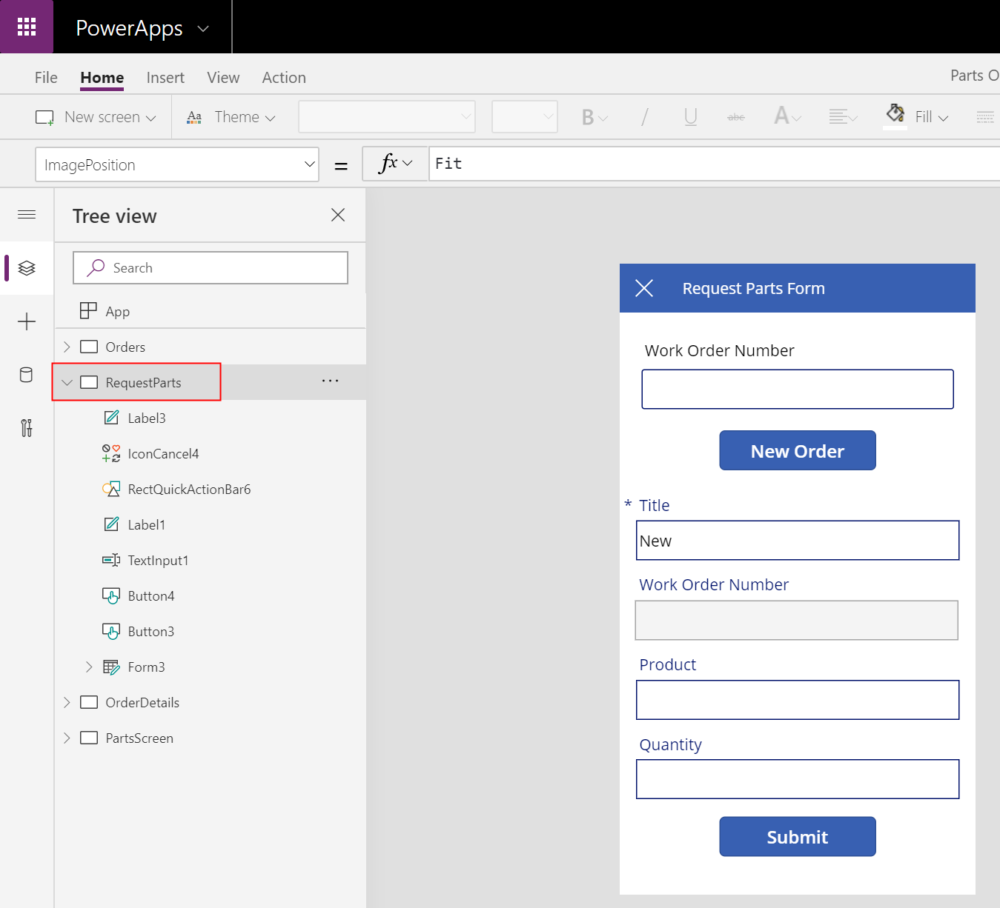
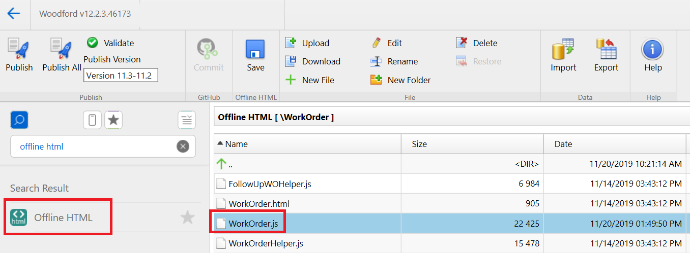
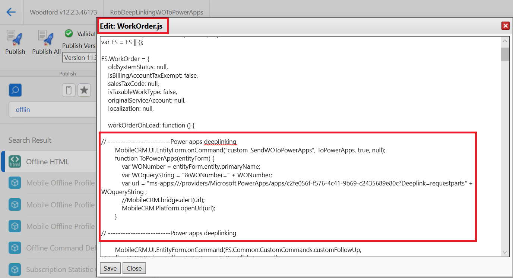
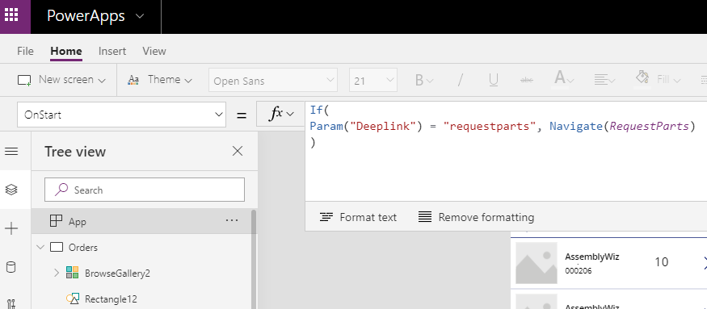
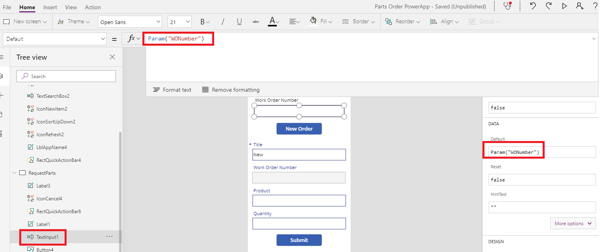

# Use deep links with Field Service Mobile

Deep linking lets users move from one application to another on computers and mobile devices. Simple examples include a mobile application deep linking to Facebook to sign in, an email address deep linking to a mail app to compose a message, or a website deep linking to an app store to download the related mobile application. As multiple apps may be needed to complete onsite work, an organization can allow technicians to deep link from Field Service Mobile to other apps and vice versa. 

In this article, let's explore deep linking from Field Service Mobile to other apps, and how to allow technicians to move between apps while they complete work orders. 

Consider the following scenario. While using work orders on Field Service Mobile to complete onsite work, a field service organization uses a custom-built Power App to request orders for new parts inventory. The organization needs technicians to be able to open the Parts Order Power App from work orders in Field Service Mobile and minimize the inconvenience of switching between interfaces. The organization has a "bring your own device" policy for technicians, so the solution needs to work on Windows, iOS, and Android devices. A proposed solution is to create a deep link from Field Service Mobile to the Power App.

> [!div class="mx-imgBorder"]
> 

In this article, we'll create a work order deep link that when triggered by technicians on Field Service Mobile, will open a specific Power Apps form and pass along the work order number field value. To do this, we'll configure both Field Service Mobile and the Power App by: 

1. Creating a custom command on the work order form to open the Parts Request Power App
2. Constructing the deep link
3. Writing JavaScript to call the deep link in the command
4. Configuring the Power App to accept the deep link and go to the desired form
5. Configuring the Power App to accept the work order number field value and populate a Power Apps form field.

You can reference this [sample mobile project template](https://1drv.ms/u/s!AhAjbOq5aB_lsUMGyM8rQ1g_IVHY?e=Lg32Nu) and this [Sample "Parts Order" PowerApp](https://1drv.ms/u/s!AhAjbOq5aB_lsUKadMDMR9zrTVPW?e=LHZari) for guidance in this article.

## Prerequisites

- Field Service Mobile must be set up for technicians to sign in and view work orders. Follow the instructions in [Field Service installation (web + mobile)](https://docs.microsoft.com/dynamics365/field-service/install-field-service#step-2-download-the-field-service-mobile-app-on-a-phone-or-tablet).

- This article assumes you have a Power App to deep link to. The Parts Order Power App referenced in this article is a simple, custom-built Power App that connects to a SharePoint list. If you are building a Power App for the first time, the [Power App in a day](https://aka.ms/appinaday) guide and the article on [canvas apps](https://docs.microsoft.com/powerapps/maker/canvas-apps/getting-started) is helpful.

## 1. Create custom command

First we need to create a work order command that the technician will select on the mobile work order form to trigger the Power App to open.

Sign in to Field Service as a system administrator and go to **Settings** > **Woodford** > **MobileCRM Woodford HTML5**

Edit the mobile project that holds the customizations for your technicians.

Go to the work order form where you will add a command.

> [!div class="mx-imgBorder"]
> 

In the commands section, select **Edit**, then **New Command** in the window that appears.

> [!div class="mx-imgBorder"]
> 

Enter a **Name**, which must not contain spaces. The name will be referenced in the JavaScript code. 

Enter a **Label**, which is what the technician will see on their mobile app.

## 2. Construct deep link

Next we need to construct our deep link. 

The final deep link will be: 

    ms-apps:///providers/Microsoft.PowerApps/apps/c2fe056f-f576-4c41-9b69-c2435689e80c?deeplink=requestparts&WONumber=18 

This deep link is a concatenation of:

1. Universal Power Apps link 
2. Power App GUID 
3. Power App form name
4. Work order entity **Work Order Number** field

### Universal Power Apps link

All deep links to Windows, iOS, and Android Power Apps apps begin with: **ms-apps:///providers/Microsoft.PowerApps/apps/**

### Power App GUID

To find and add the unique GUID of your Power App, go to **https://make.powerapps.com/** > **Apps**, select your app, and then **Details**.
  
> [!div class="mx-imgBorder"]
> 

Find your Power App GUID in the **App ID** section. It will be a 32-digit number in the following format: XXXXXXXX-XXXX-XXXX-XXXX-XXXXXXXXXXXX

> [!div class="mx-imgBorder"]
> 

> [!Note]
> The web link can be used to open the Power App in a web browser

### Power App form name

Next, find the name of the specific Power Apps form you want to deep link to. In our example, it's "**requestparts**". This will be preceded by "**?deeplink=**" in the deep link.

> [!div class="mx-imgBorder"]
> 

### Work order entity Work Order Number" field

This is a variable that holds the **Work Order Number** field value, which will be passed into the Power Apps form field. We'll see how this value is created in the next script where we write the mobile JavaScript. 

## 3. Add mobile JavaScript

Now that we have a work order form command and a deep link, we need to use a JavaScript code snippet to tell the command to call the deep link.

In the mobile project where you added the work order form command earlier, go to **Offline HTML** in the left pane.

Go to the **WorkOrder** folder then the **WorkOrder.js** file.

> [!div class="mx-imgBorder"]
> 

Here you will enter JavaScript that constructs the deep link and tells the work order form command to call the deep link.

> [!div class="mx-imgBorder"]
> 

Here is the code snippet that was used in our example:

    // -------------------------Power apps deep linking

    MobileCRM.UI.EntityForm.onCommand("custom_SendWOToPowerApps", ToPowerApps, true, null);
        function ToPowerApps(entityForm) {
            var WONumber = entityForm.entity.primaryName;
            var WOqueryString = "&WONumber=" + WONumber;
            var url = "ms-apps:///providers/Microsoft.PowerApps/apps/c2fe056f-f576-4c41-9b69-c2435689e80c?Deeplink=requestparts" + WOqueryString ;
            //MobileCRM.bridge.alert(url);
            MobileCRM.Platform.openUrl(url);
        }

As you can see, the "WONumber" variable takes the **Primary Name** field value of the work order entity, which equals the work order number, and this is added to the deep link URL.

> [!Note]
> **Deep linking in production instances:** By editing the **WorkOrder** folder and WorkOrder.js file, you're editing files included in the Field Service Mobile project. These folders and files may be updated as new mobile projects when released by Microsoft. In this case, you run the risk of 1) not upgrading these files and missing citical new functionality or 2) overwriting your JavaScript file and losing the deep link functionality. To avoid this, use a custom folder and JavaScript file separate from the **WorkOrder** folder an WorkOrder.js file in production instances. 

**Save** and **Publish** the mobile project.

## 4. Deep link to Power Apps form

Now you'll need to tell your Power App to go to the correct form when the app is opened via deep link, and enter into the form the work order number value from Field Service Mobile. 

First, we want the Power App to accept the deep link. 

Go to the **App** section in the left pane of the Power App and edit the **OnStart** formula.

> [!div class="mx-imgBorder"]
> 

In our example, we entered the following logic that tells the Power App to go to the specific form if the deep link parameter is "requestparts":

    If(Param("deeplink") = "requestparts", Navigate(RequestParts))

## 5. Pass work order parameter

In the Power Apps form, find the field you want the work order number value to populate.

> [!div class="mx-imgBorder"]
> 

In the **Advanced** tab of the right panel, enter the following formula for the default value.

    Param("WONumber")

This adds the WONumber variable as the default value for the Power Apps form field.

**Save** and **Publish** your Power App.

At this point, you're ready to test your deep link. 

Open the Field Service Mobile app and go to the work order form (not the booking form). Select the command icon in the top right and select your custom command. 

Power Apps will launch and may ask that you sign in if you haven't done so already.

The correct form will open and the work order number will populate the desired field.

> [!div class="mx-imgBorder"]
> 

## Configuration considerations

### Deep link to Field Service Mobile

This article explains how to deep link _from_ Field Service Mobile _to_ Power Apps. You can also deep link from another app _to_ Field Service Mobile. 

Here is an example:

    fsmobile://open?jsbridge;msdyn_workorder;9a98d429-fe1e-e911-a977-000d3a370909

This is a combination of the **Field Service universal Link** (fsmobile://open?jsbridge;) + **entity_schema_name** (msdyn_workorder;) + **record GUID** (9a98d429-fe1e-e911-a977-000d3a370909).

### Deep linking in production instances

By editing the **WorkOrder** folder and WorkOrder.js file, you're editing files included in the field service mobile project. These folders and files may be updated as new mobile projects are released by Microsoft. In this case, you run the risk of 1) not upgrading these files and missing critical new functionality or 2) overwriting your JavaScript file and losing the deep link functionality. To avoid this, use a custom folder and JavaScript file separate from the **WorkOrder** folder an WorkOrder.js file in production instances.

### See also
- [Sample mobile project template](https://1drv.ms/u/s!AhAjbOq5aB_lsUMGyM8rQ1g_IVHY?e=Lg32Nu)
- [Sample "Parts Order" PowerApp](https://1drv.ms/u/s!AhAjbOq5aB_lsUKadMDMR9zrTVPW?e=LHZari) for guidance in this article.
- [Power Apps update – Universal links, HTML control improvements, new service connections and more](https://powerapps.microsoft.com/ro-ro/blog/powerapps-560-update/) 
- [Set URI parameters for your canvas apps](https://docs.microsoft.com/powerapps/maker/canvas-apps/embed-apps-dev#set-uri-parameters-for-your-app)

[!INCLUDE[footer-include](../includes/footer-banner.md)]