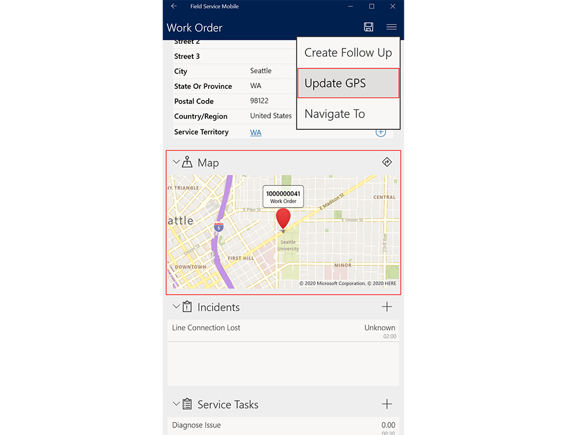
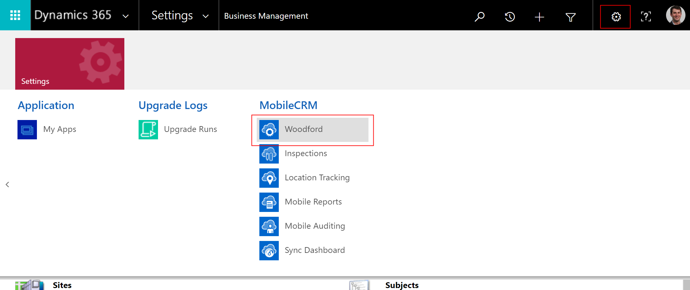
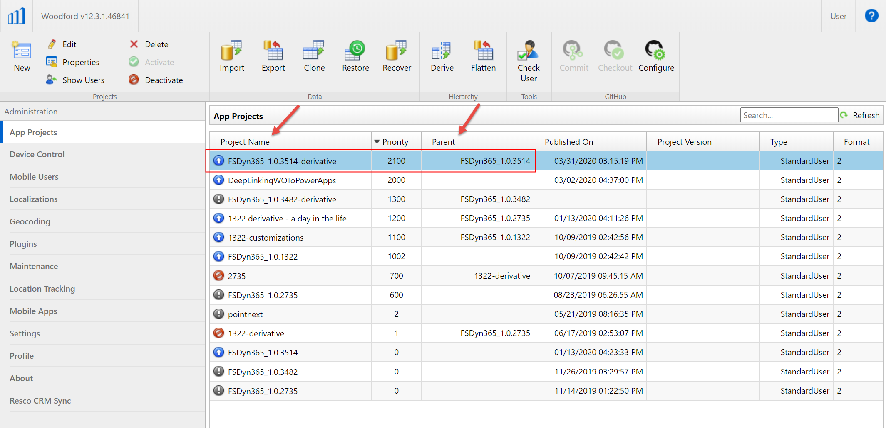
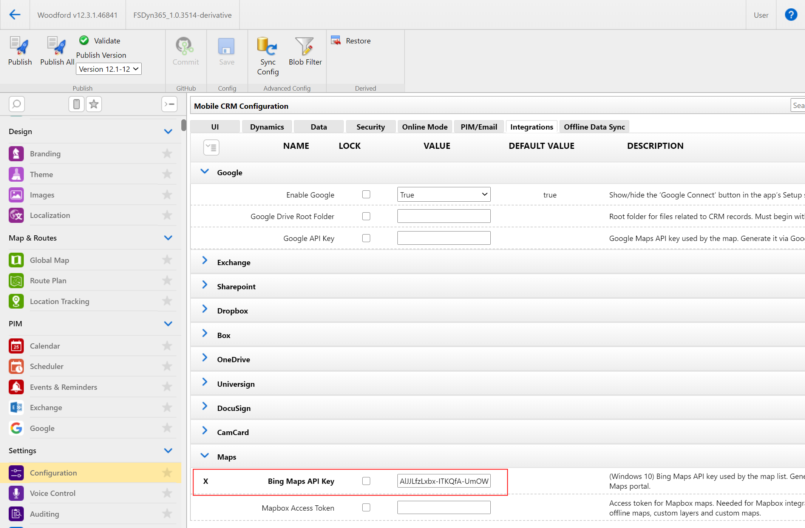
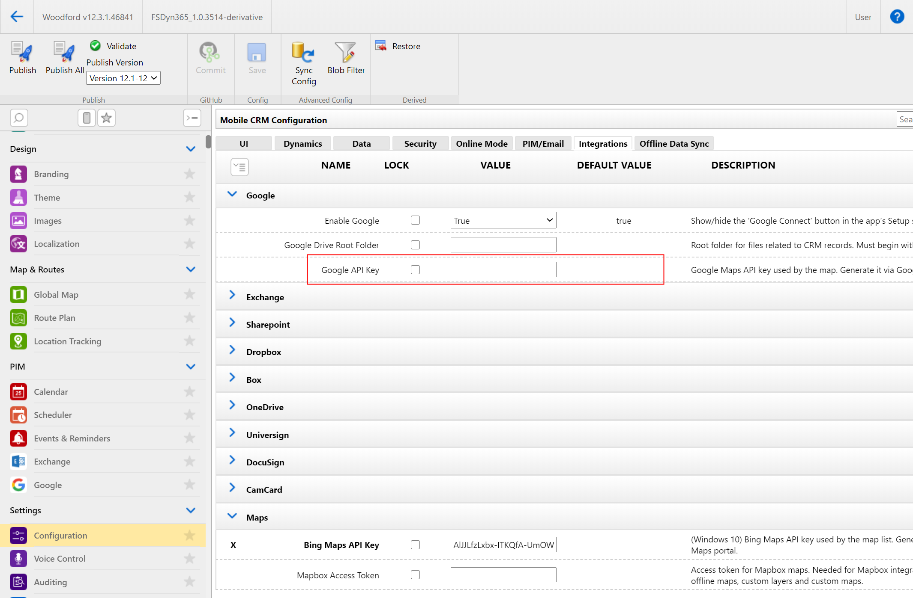

# Enable maps for Dynamics 365 Field Service Mobile

By setting up maps and location services for Field Service Mobile, you'll be able to:

1. See work order locations on a map.
2. Use the **Update GPS** option to replace work order location with current location of the technician's mobile device.
3. Use location auditing to see real-time location of technicians on the schedule board map.
4. Use [geofencing](geofencing.md) to create virtual perimeters around specific locations.

> [!div class="mx-imgBorder"]
> 
 

In this article, we'll walk through how to set up maps and location services by retrieving a Bing Maps API key and adding it in the Mobile Configuration Tool (Woodford) mobile project template.

## Prerequisites

- Minimum Woodford Version required is **Woodford 11.3+**. If you need the latest version, [download it here](https://aka.ms/fsmobile-configurator) and import it into your Dynamics 365 environment at **Settings** > **Solutions**.

## Get Map API key

First, you'll need to generate a Bing Maps API key. For more information about getting a Bing Maps API key, [see this article](/bingmaps/getting-started/bing-maps-dev-center-help/getting-a-bing-maps-key).

1. Go to the [Bing Maps Dev Center](https://www.bingmapsportal.com/).
2. Sign in with a Microsoft account or create a new account. 
3. Under **My Account**, select **My keys**.
4. Select the option to create a new key.
5. Provide the following information to create a key:
  - **Application name**: Required. The name of the application. In our case, Field Service Mobile.
  - **Application URL**:  This field is optional, useful for helping you remember the purpose of that key in the future.
  - **Key type:** Required. Select the key type that you want to create. A **Basic key** is recommended.
  - **Application type:** Required. Select **Mobile Application** the application type.
6. Select **Create**. The new key displays in the list of available keys. 
7. Copy the API key to your clipboard.

## Enter Map API key in the Mobile Configuration Tool (Woodford)

After retrieving your Bing Maps API key, you'll need to add it to the mobile project template that dictates how the mobile app looks and functions. 

In your Dynamics 365 environment, go to **Settings** > **Woodford**.

Go to **MobileCRM** > **Woodford HTML5**.

 
> [!div class="mx-imgBorder"]
> 
 
	
Once in Woodford, double-click into your active project.
  - The active project is indicated by a blue arrow next to project name.
  - If you followed the [Field Service installation instructions](install-field-service.md), double-click into the derivative of the mobile project template.
  - If you use multiple projects for different users, you'll have to follow these steps for each project.
  

> [!div class="mx-imgBorder"]
> 

From the left menu, go to **Configuration** then go to the **Integrations** tab.

> [!div class="mx-imgBorder"]
> 

From there, paste your copied API key in the **Bing Maps API Key** field in the **Maps** section.

Save your project.

Publish your project.

## Configuration considerations

### Google maps

You can also use Google Maps for map visualizations and location calculations.

Minimum Woodford version required is **Woodford 10.0+**.

First retrieve a _Google_ Maps API key. For more information, see the Google documentation on [getting a Google Maps API key](https://developers.google.com/maps/documentation/embed/get-api-key).

1. Visit the [Google Cloud Platform Console](https://console.cloud.google.com/google/maps-apis/overview?pli=1).
2.	Select the project drop-down and select or create the project for which you want to add an API key.
3.	Select the menu option and select **APIs & Services** > **Credentials**.
  - On the **Credentials** page, select **Create credentials** > **API key**.
  - The **API key created** dialog displays your newly created API key.
  - Select **Close**.
5.	The new API key is listed on the **Credentials** page under **API keys**.

Back in Woodford, copy and paste the API key in the **Google API Key** field in the **Google** section.

> [!div class="mx-imgBorder"]
> 

 

 
 

 
 
 

[!INCLUDE[footer-include](../includes/footer-banner.md)]