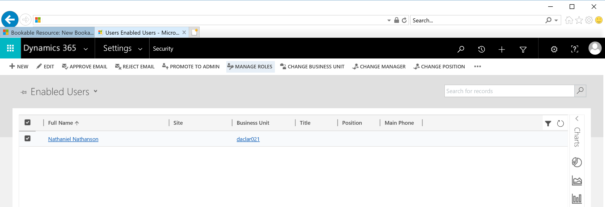

# Bookings not scheduled to me are appearing when logged into the mobile app

If you're seeing a list of bookings that aren't scheduled to you, you're probably signed into the mobile app as a user with Dynamics 365 system administrator or Field Service administrator permissions. 

**Dynamics 365 system administrators** and **Field Service administrators** have access to all Field Service records, including all bookings scheduled to all resources. Users with the security role **Field Service resource** only have access to work orders scheduled to that resource and related user.

Ensure your mobile user has only the **Field Service resource** security role in **Settings > Security > Users > Manage roles** in the ribbon menu.

  

>[!Note]
> Bookings are scheduled to resources, but user records are used to sign into the mobile app. Resources can be tied to user records.

[!INCLUDE[footer-include](../includes/footer-banner.md)]