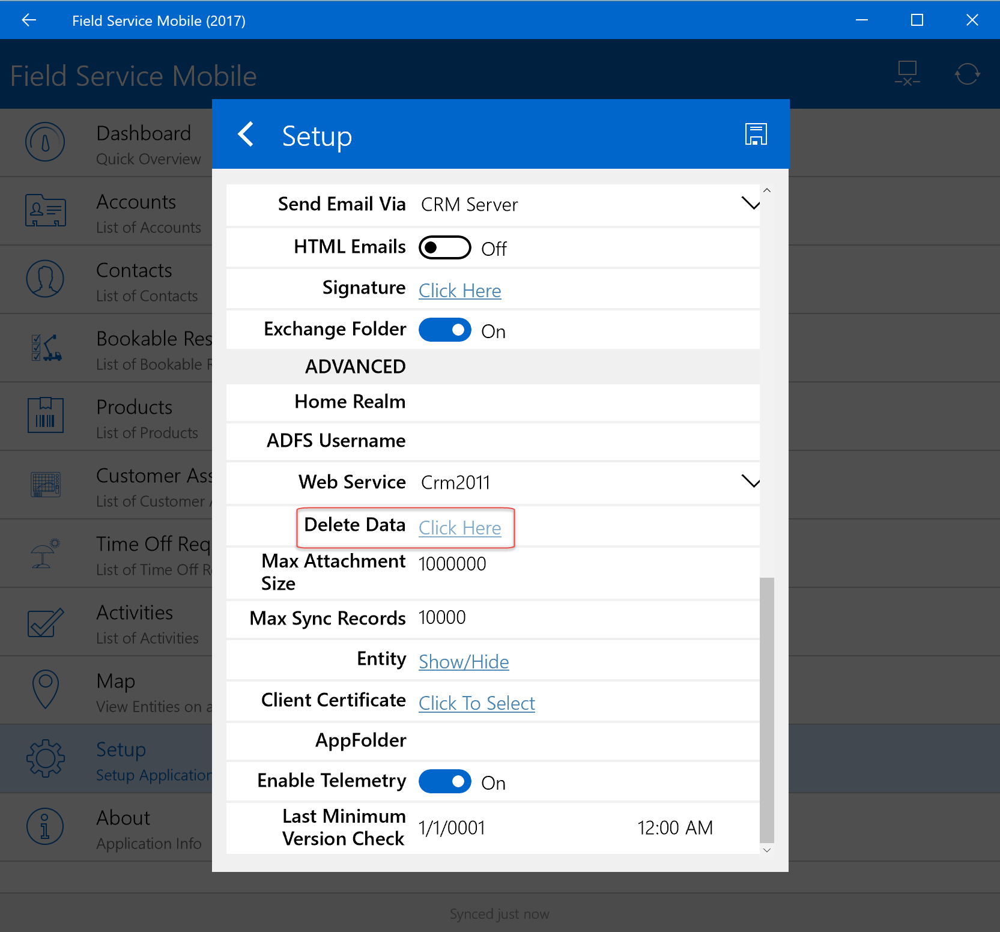
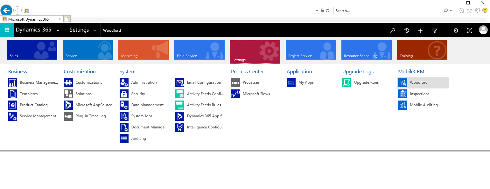
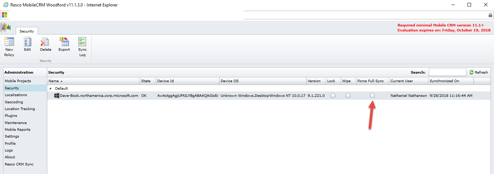
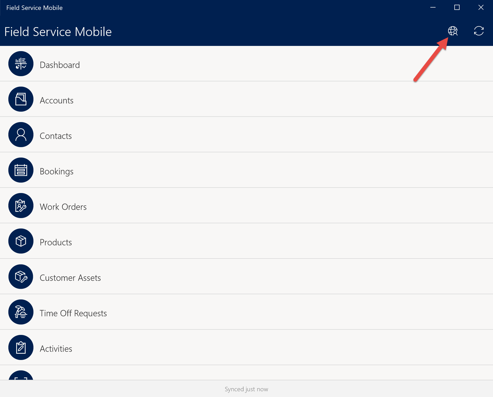
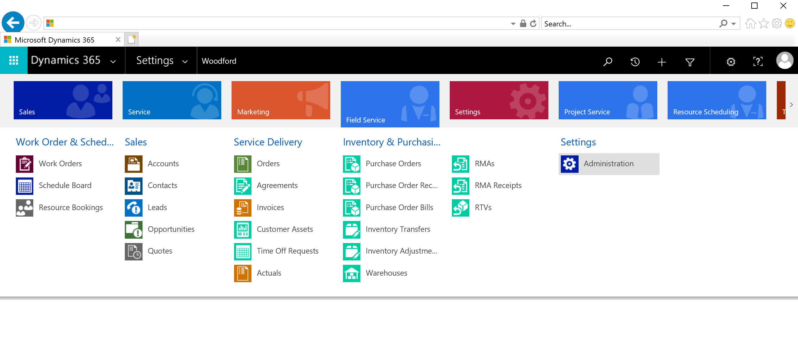
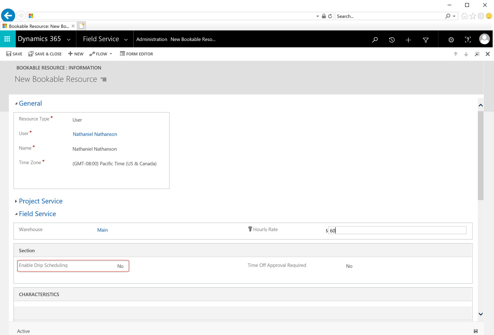

# Why can't I see my bookings when signed into the app?

There are typically three possible reasons bookings don't show up in the mobile app:

1. The mobile application isn't synced to the server 

2. The application is in offline mode and the booking is outside the sync filters

3. Drip scheduling is enabled for the related resource and the booking is outside the *bookings to drip* number parameter

See below for details about each of these possible reasons. 

## 1. The mobile application isn't synced to the server

When a dispatcher books a work order to a resource, syncing takes place on the server and may take time to update on the mobile application. The time it takes for the booking to show on the mobile application can depend on internet speeds, internet connection, and even configurations. For example, the mobile app can be configured to sync data from the server at timed intervals, or only when connected to Wi-Fi.

First, try manually syncing data from the server by selecting the sync button in the mobile app.

  

If you have trouble syncing, try going to **Setup** > **Delete Data** > **Save** in the mobile app, and sync again. This process will erase any data that is stored locally on the device. 

  

Additionally, there are some scenarios where forcing a full sync to the device from Field Service can push changes that will allow the user to see bookings; one such scenario is a change in security roles.

To force a full sync to the device, open Field Service in a non-private Internet Explorer browser, sign in as an administrator, and navigate to **Settings** > **Woodford** > **MobileCRM Woodford.**

Once in the Woodford interface, navigate to Security under the Admin menu, and find the user’s device. Check **Force Full Sync**.

  

Next, sign in to the mobile app with the same user and sync the device.

For more information on forcing full syncs, see [the Woodford guide (PDF)](https://www.resco.net/downloads/Woodford_Guide.pdf).

## 2. The application is in offline mode and the booking is outside the sync filters

The Field Service mobile application is designed for offline scenarios. Offline scenarios mean data is downloaded locally to the device when the user has internet access for later when the user may not have internet access. A common example is performing work in remote areas or in underground tunnels. 

Rather than download all data, a mobile administrator can create sync filters that will download a targeted portion of the data for offline use later. For example, an administrator can make it so the app only downloads this week’s work orders (rather than all work orders). For more information on sync filters, see [the Woodford guide (PDF)](https://www.resco.net/downloads/Woodford_Guide.pdf).

There are two ways to fix this.

The first way is to use the mobile application in online mode, because this mode gives you access to all data.

Log into the mobile app and select the online/offline mode icon.

 

If the icon below appears, you're in offline mode.

Make sure the below icon appears, indicating online mode. 

  

Then navigate to **Bookings** to view your bookings. This may take a few moments to load.

A second way to fix this is to edit the sync filters for offline mode.

To edit sync filters for Bookings, log into Field Service as an administrator in a non-private Internet Explorer browser, and navigate to **Settings** > **Woodford** > **MobileCRM Woodford.**

Select the mobile project and navigate to **Bookable Resource Bookings** > **Sync Filters** in the header menu.

  

This is where an administrator can decide what bookings will download to the mobile application when the app is offline.

If your booking isn't appearing in offline mode, make sure it meets the sync filter criteria (or change the sync filter criteria to match your needs).

  

## 3. Drip scheduling is enabled for the related resource and the booking is outside the *bookings to drip* number parameter

Drip scheduling makes it so the app will only display upcoming bookings, as current bookings are completed. For example, an administrator can choose to only display the next two bookings for a field technician.

One reason you may not see bookings when you log into the mobile app is because drip scheduling may be preventing the booking.

To fix this, navigate to **Field Service** > **Administration** > **Resources**.

  

Find the resource related to the user you are attempting to log into the mobile app with.

  

Under the Field Service section on the resource detail page, set enable drip scheduling to **No**, or leave it as yes and adjust the parameters.

Finally, log into the mobile application and check if your bookings are now showing.

[!INCLUDE[footer-include](../includes/footer-banner.md)]