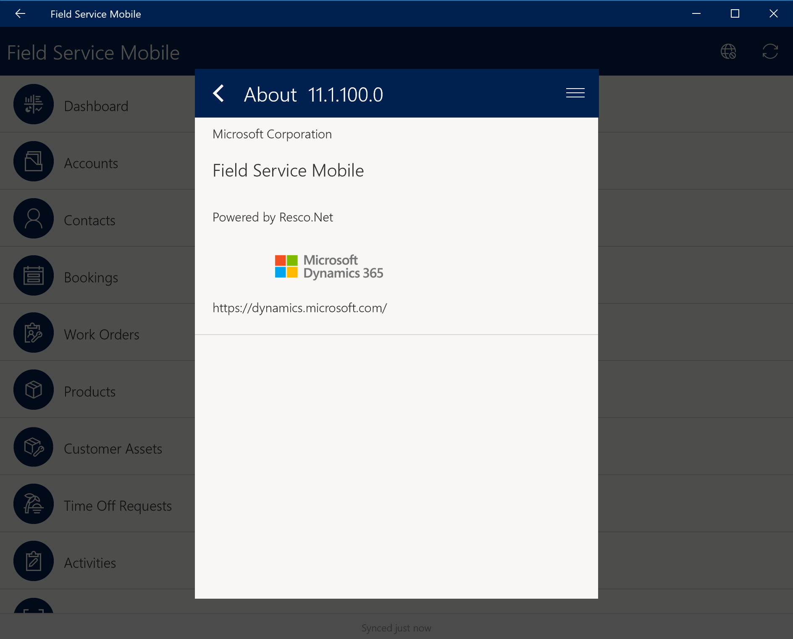
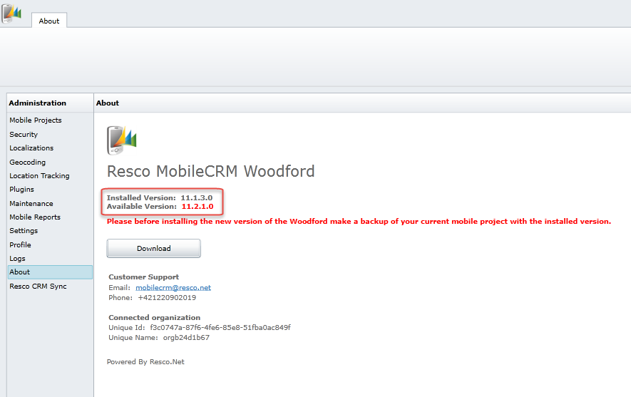
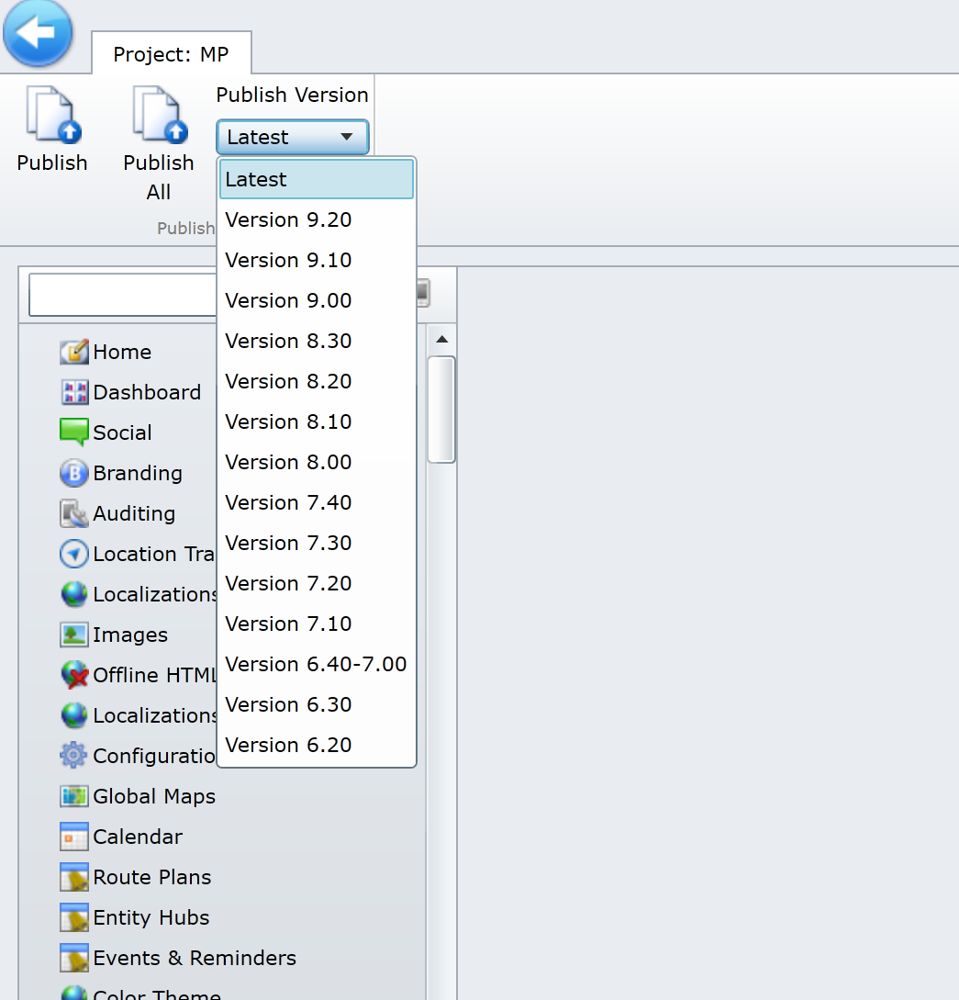

# What version of Field Service Mobile am I using?

To see your mobile app's version number, find the about menu item, and select it. You'll find the version number here.

> [!div class="mx-imgBorder"]
>

>[!Note]
> The Field Service Mobile app can be upgraded like any other mobile app - from the iOS, Android, or Windows app stores. If you have automatic upgrades turned on for your device, then Field Service Mobile will automatically upgrade. 

To find your installed Mobile Configuration tool (Woodford) solution version number, log into Dynamics 365 Field Service and go to **Settings** > **Woodford** > **MobileCRM Woodford**.

> [!div class="mx-imgBorder"]
>

>[!Note]
> You can download the latest version of Woodford and simply publish to a previous compatible version. For example, a Woodford version of 12.0 should be published down to version 11.3 if the Field Service Mobile app is version 11.3.

> [!div class="mx-imgBorder"]
>

You can find the published version number by going to **Mobile projects**, as seen in the following screenshot. Keep in mind that the published Woodford version can't exceed your mobile app version. 

> [!div class="mx-imgBorder"]
> 

[!INCLUDE[footer-include](../includes/footer-banner.md)]