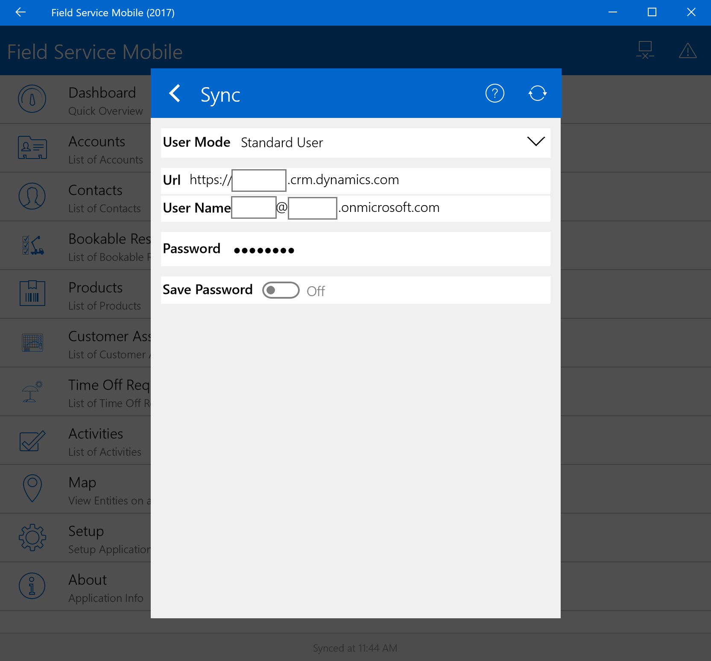
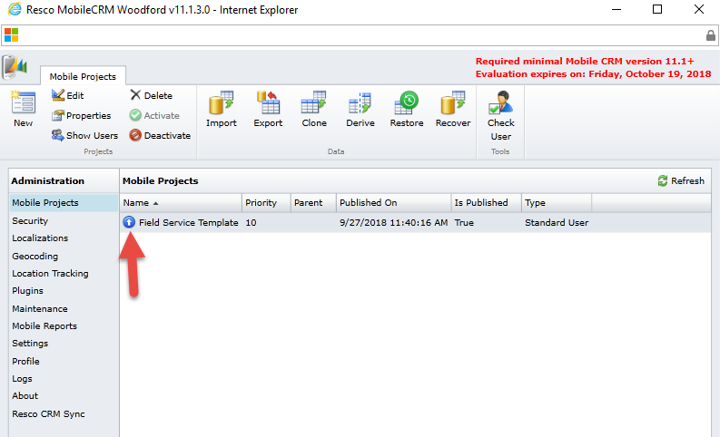
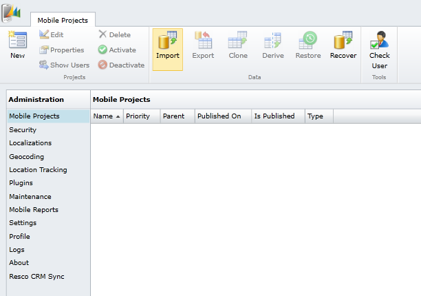
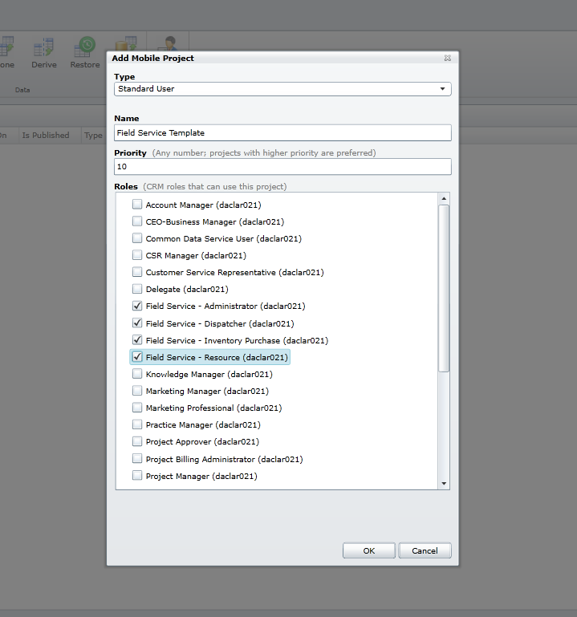
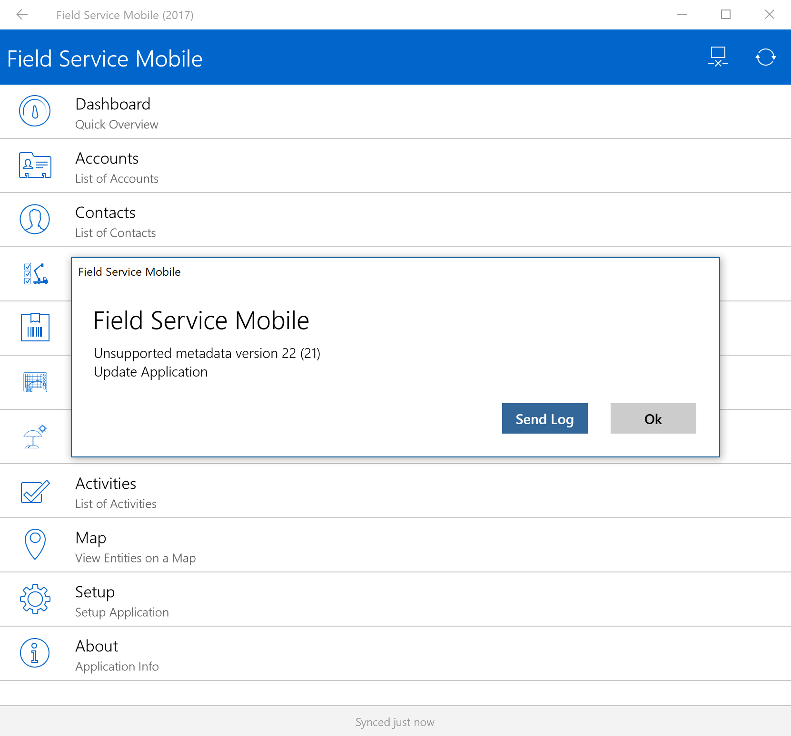
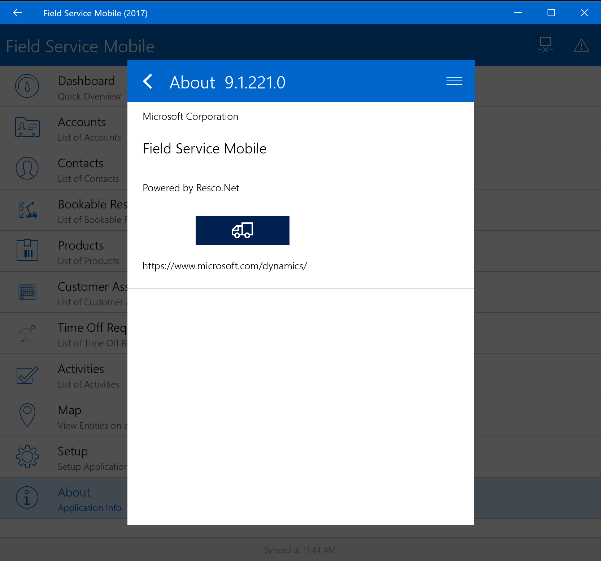
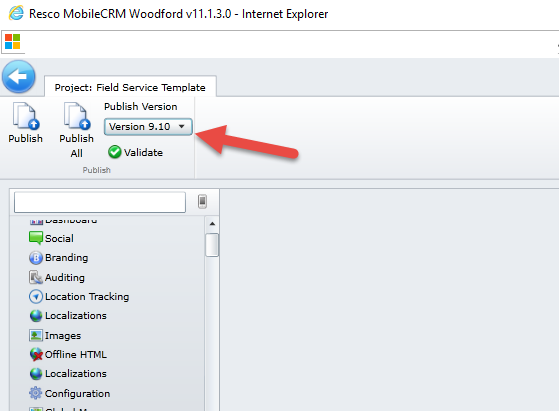
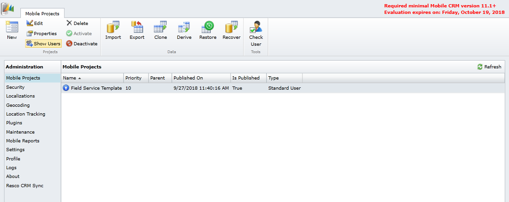
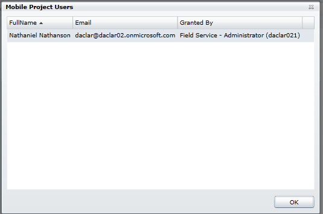
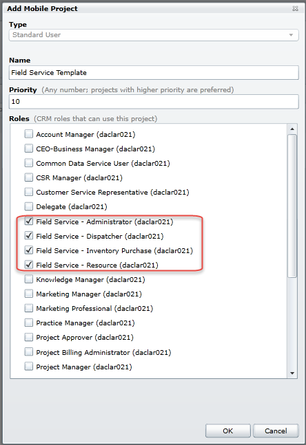

# My mobile app won't sync to the server or it crashes immediately

There are a few reasons why your mobile application may not be syncing (or crashes when launched):

1. Incorrect URL, username, or password. **This reason is the most common issue**.

2. There is no mobile project in Woodford, or the mobile project is unpublished

3. The mobile project is published to a later version than the mobile app

4. Your user doesn't have the correct security role to access the mobile application

See below for details on troubleshooting each possible reason.

## 1. Incorrect URL, username, or password.

In the Field Service Mobile app, double check that the URL, username, and password are correct. Navigate to **Setup** to find these fields, as seen in the below screenshot. Note the username and password are case-sensitive.

## 2. There is no mobile project in Woodford, or the mobile project is unpublished

To fix this issue, sign in to Dynamics 365 as an administrator in a non-private Internet Explorer, and navigate to **Settings** > **Woodford** > **MobileCRM Woodford** to verify a mobile project exists. A blue circle with an upward-pointing arrow indicates it is published, as seen in the below screenshot. The value for "Is published" will also be set to "True."

**If no mobile project exists**, you'll need to download and save the template file:

- If you are on December 2016 Update for Dynamics 365 (online), use [this mobile project template](https://go.microsoft.com/fwlink/p/?linkid=836310)  

- If you are on Dynamics CRM Online 2016 Update 1, use [this mobile project template](https://go.microsoft.com/fwlink/p/?LinkId=808250)

>[!Note]
> You may need to save the template file to a file location on your computer and not the Downloads folder.

Next, import this file into Woodford by selecting **Import** in the header menu.

Next, name the mobile project, set a priority greater than 0, and assign it to all Field Service security roles available in the list.

More details on projects and priorities can be found in the [Woodford Guide (PDF)](https://www.resco.net/downloads/Woodford_Guide.pdf).
Finally, double-click on the project (template) to view it. Select **Publish**

## 3. The mobile project is published to a later version than the mobile app

In order for the mobile app to work, the Woodford solution version number must not exceed your mobile app version number. For example, if your mobile app is version 9.1, but your Woodford solution is published to 9.2 or greater, you'll see an "Unsupported metadata version" error, as seen below.

To fix this issue, first check the version of your mobile app. Open the mobile app, scroll down to the **About** menu option. Select it to see the version number.

Next, you'll need to check your Woodford version number. Open Dynamics 365 in a non-private Internet Explorer window and navigate to **Settings > Woodford > MobileCRM Woodford**.

Find the related mobile project and ensure it's not published to a higher version. In the screenshot below, the mobile project is published to 9.1, which does not exceed the version of our Field Service Mobile (2017) app.

## 4. Your user does not have the correct security role to access the mobile application

When an administrator of the mobile application sets up Woodford, they must assign a set of security roles to a mobile project (default configurations). These roles decide which users get access to the customizations of the project. If a user logs into the mobile app and does not have a security role that corresponds to a published mobile project, the user won't be able to sync to the server.

In a non-private Internet Explorer browser, navigate to **Settings > Woodford > MobileCRM Woodford**.

  

Select and highlight the mobile project your mobile users should have access to and select **Show Users** in the header menu.

If the user who cannot sync is not shown here, they don't have access to the mobile project and will not be able to connect.

To fix this issue, select the mobile project and select **properties** in the header to view the security roles that have access to the mobile project.

Then, match the selected security roles above with the user’s security roles in **D365 > Settings > Security > Users**.

[!INCLUDE[footer-include](../includes/footer-banner.md)]