# Frequently asked questions for Field Service Mobile

> [!Note]
> If you're looking for help with **errors**, **unexpected behavior**, **crashes**, and **bugs**, create a [Dynamics 365 support ticket](https://dynamics.microsoft.com/contact-us/). 

## How do I extend or activate my mobile configuration tool (Woodford) trial?

The Mobile Configuration Tool (Woodford) is used to configure and customize the Field Service Mobile app. After [installing and setting up Field Service Mobile](https://docs.microsoft.com/dynamics365/field-service/install-field-service#download-the-field-service-mobile-app-on-a-phone-or-tablet), you'll need to activate or extend the Mobile Configuration Tool (Woodford) within 30 days. For more information, see the article on [activating or extending the mobile configuration tool (Woodford) trial](activate-fs-mobile-app-license.md).

## What version of Field Service Mobile am I using?

See the article on [identifying your Field Service Mobile version](mobile-faq-latest-version.md).

## What is the latest version of the mobile app and configuration tool?

See the article on [Field Service version history](version-history.md) to understand the latest versions of Field Service, Field Service Mobile, Mobile Configuration tool (Woodford), and the mobile project template.

## My mobile app will not sync to the server or crashes immediately

There are a few reasons why your mobile application may not be syncing (or crashes when launched):

1. Incorrect URL, username, or password. This is the most common reason.
2. There is no mobile project in Woodford, or the mobile project is unpublished
3. The mobile project is published to a later version than the mobile app
4. Your user doesn't have the correct security role to access the mobile application

For more information, see the article on [common reasons Field Service Mobile does not sync to the server or crashes](mobile-faq-sync-crash.md).

## Why can't I see my bookings when logged into the app?

There are typically three reasons bookings don't show up in the mobile app:

1. The mobile application isn't synced to the server
2. The application is in offline mode and the booking is outside the sync filters
3. Drip scheduling is enabled for the related resource and the booking is outside the bookings to drip number parameter

For more information, see the article on [common reasons no bookings are displayed in Field Service Mobile](mobile-faq-bookings-not-showing.md).

## Bookings not scheduled to me show up when logged in to the mobile app

Ensure your mobile user has only the Field Service resource security role. For more information, see the article on [seeing bookings not scheduled to me](mobile-faq-bookings-not-scheduled-to-me.md).

## What are the supported encodings for barcode scanning in Field Service Mobile?

Field Service Mobile supports the following barcode encoding:  
 
 | 1D product | 2D product | 3D product |
 | --- | --- | --- |
 | UPC-A | Code 39 | QR Code |
 | UPC-E | Code 93 | Data Matrix |
 | EAN-8 | Code 128 | Aztec (beta) |
 | EAN-13 | Codabar | PDF 417 (beta) |
 || ITF | MaxiCode |
 |||RSS-14 |
 ||| RSS-Expanded|

## Why is loading data in offline mode often faster than in online mode?

When in offline mode, the user is looking at data stored locally on the device's storage; and in online mode the mobile app is looking at data on the server. Retrieving local data from the device is always faster than retrieving remote data from the server. Offline performance is often better because the mobile application is not making calls directly to the Dynamics 365 database. 

Field technicians don't typically need access to the entire Field Service entity database, so we recommend using sync filters in offline mode to filter the data that is downloaded to the device.

In online mode, certain logic will run instantly rather than waiting for a sync. If you'd like to work in online mode but not call so much data, there is an option to **Use Sync filter in Online Mode**  in the properties dialog of a view.

> [!div class="mx-imgBorder"]
> 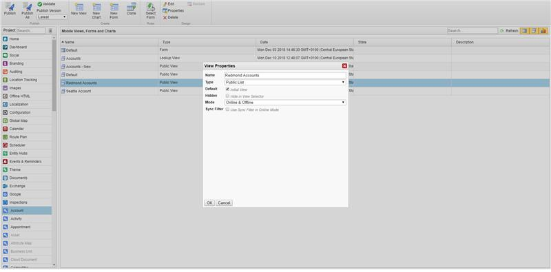
 

## What attribute does the "Scan Customer Asset" match for and how do I edit it? 

From the Field Service Mobile app home screen, the **Scan Customer Asset** function will by default attempt to match the scanned code with the GUID of a customer asset.

This is dictated by Offline HTML within your mobile project in **Woodford** > **Offline HTML** > **CustomerAsset** > **ScanCustomerAsset.JS**. To change the function to look for a customer asset attribute other than the GUID, such as a custom serial number field, you can create your own JavaScript using JSBridge. 

> [!Note]
> Offline HTML and JavaScript that is included with Microsoft's mobile project should never be edited. You must create your own JavaScript.

## Can a mobile form appear differently between Windows, iOS, and Android devices?  

Yes. In the forms and views editor, you can select **Form Rules** and in the rule, you can choose configuration by platform. See the following screenshot for reference. 

> [!div class="mx-imgBorder"]
> 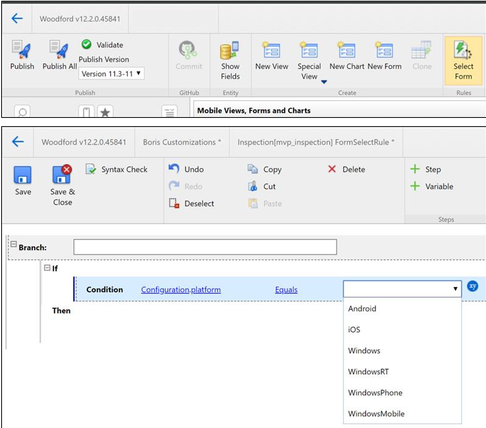

## Are Dynamics 365 Sales entities such as leads and opportunities available for use on Field Service Mobile? 

Any entity can be used in Field Service Mobile as long as it is used in the context of Field Service. That is, a field service representative who needs access to opportunities can have access to those, but a sales person could not use Field Service Mobile for sales functions. 

## Why isn't the total amount on the work order product being automatically calculated when marking the work order product as "Used"? 

This depends on the version of the app: 

- **For Field Service Mobile v11+**: When in offline mode, calculated fields such as **Total Amount** will not be calculated and populated until the user syncs to the server or goes in online mode because the calculations take place in the server and not the mobile app. This is especially advantageous for [entitlement capabilities](work-order-entitlements.md), which apply dynamic pricing to work order products and services based on different factors.

- **For Field Service Mobile 2016 and 2017 v9**: Subtotal and total amount are calculated in offline mode and online mode.

## How can field technicians chat with each other from their mobile devices? 

We recommend using Microsoft Teams or Microsoft's Kaizala. See the [article on deep linking to Teams](https://docs.microsoft.com/microsoftteams/platform/concepts/deep-links) from Field Service Mobile. 

## Why do users get the error "Your Organization has not configured the Field Service Mobile app with the correct project"?

This message means the mobile application has not been set up with the correct mobile project or the logged in user is getting access to an incorrect mobile project based on their security role. See the article on [installing and setting up Field Service Mobile](https://docs.microsoft.com/dynamics365/field-service/install-field-service#download-the-field-service-mobile-app-on-a-phone-or-tablet) to set up the mobile app with Microsoft's mobile project as a base parent and [Field Service mobile project library](https://docs.microsoft.com/dynamics365/field-service/version-history#mobile-project-file-library) to see a list of previous mobile projects. 

## When field technicians are performing onsite service, can they connect to bluetooth devices?

Yes, on Android only. Field Service Mobile v11.3+ can use a bluetooth RFID reader. If you have a bluetooth RFID reader, you can connect it to Field Service Mobile. Connect the reader to your phone or tablet, then in Field Service Mobile, go to **Setup** > **RFID Bluetooth Reader** and select the reader you connected. Then whenever you tap the barcode button in the app, you will see the scanner. Then you can select the scanner's button.

## How do you add or edit a logo in Field Service Mobile?

For more information, see this [blog post](https://www.resco.net/woodford-user-guide/#__RefHeading__5907_1627906509).

## Why am I getting the error "UNSUPPORTED CUSTOMIZATION VERSION: App:23 Srv:25" in the Field Service Mobile app? 

If you're receiving this error, it means that you published the mobile project to a version that is higher than your app supports.
Try publishing the mobile project again to match the version of the app. For instance, for Field Service Mobile v11.2, publish to 11.2.

> [!div class="mx-imgBorder"]
> 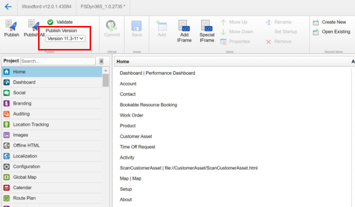

## Can I use the Dynamics 365 mobile application to access Field Service? 

We strongly recommend using the Field Service Mobile app to access Field Service, rather than the Dynamics 365 mobile app with the Unified Interface. While the native Dynamics 365 app does work in offline mode, it doesn't fully support offline mode for Field Service-specific scenarios. For more information, visit our article on Field Service Mobile.

## Does Field Service Mobile support SharePoint integration? 

Yes, Field Service Mobile supports SharePoint integration for accessing and uploading documents. Note at this time, only Basic authentication with SharePoint is supported; OAuth support is planned for a future app release.

## How can I correct the error "Your Server customization requires new version of the Application"?

> [!div class="mx-imgBorder"]
> 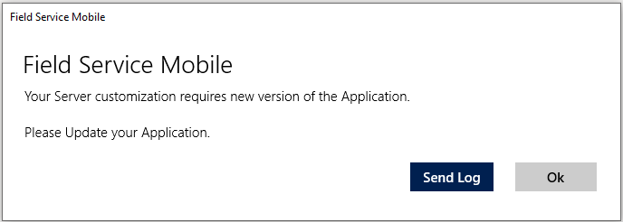

Correct this error by updating your Woodford project version to match the version of your Field Service Mobile application currently in use. 
 
To solve:
1.	Access Woodford: **Advanced Settings** > **Settings** > **mobileCRM** > **Woodford**.
1.	Enter Woodford Solution and **Edit** your active project.
1.	Set **Version** to mirror your mobile app version (should not be **Latest**).
1.	Publish Woodford.

> [!div class="mx-imgBorder"]
> 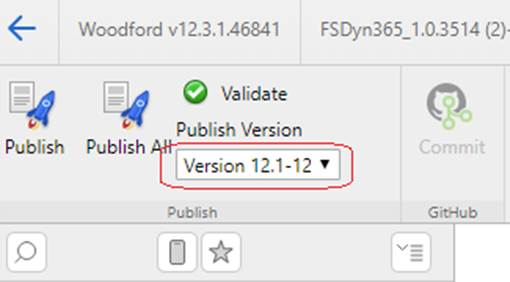

## Why am I getting the error "Your organization needs to configure Field Service Mobile. There may not be a published mobile project or the mile project is not configured for a security role assigned to you."

> [!div class="mx-imgBorder"]
> 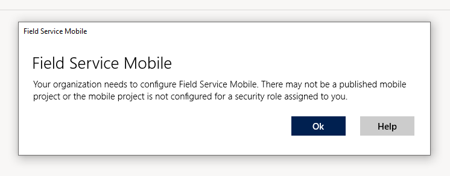

This error is a signal that the Woodford Project has not been published or a role assigned to your user either in Woodford or CRM user security settings. 
 
To check if Woodford is published:
1. Access Woodford: **Advanced Settings** > **Settings** > **mobileCRM** > **Woodford**.
1. Enter Woodford Solution.
2. Check the symbol next to your Woodford project; if it's a red circle with a slash through it, select **Activate** in command bar.

This is what an unpublished project looks like: 
> [!div class="mx-imgBorder"]
> 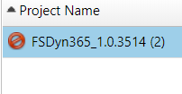

This is what a published project looks like: 
> [!div class="mx-imgBorder"]
> 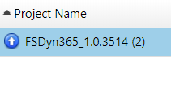

If you still can't sign in to the app and get the same error, confirm your resource has the correct roles applied. 
1. Go to **Properties** in top navigation.
2. Select Field Service roles for this project.

> [!div class="mx-imgBorder"]
> 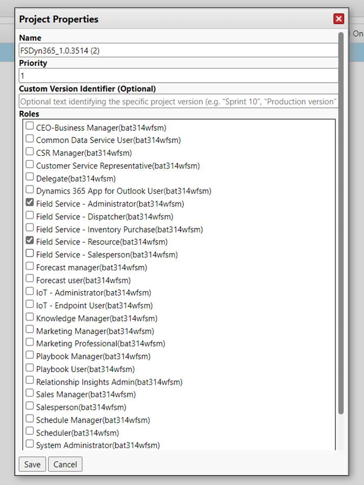

You can then select **Check Users** and type in desired users name to check their role level or access.

> [!div class="mx-imgBorder"]
> 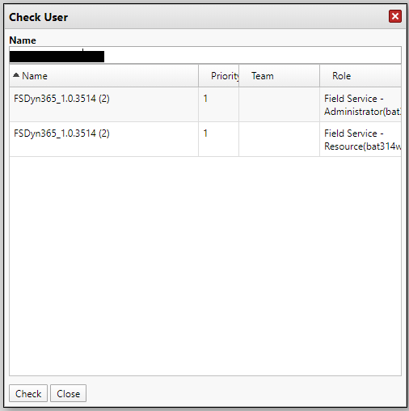

If you can't find the user or set up their role, the user may not have the required Dynamics 365 Security Roles in place. In Dynamics 365, go to **Settings** > **Security** > **Users** > [User] > **Manage Roles**; select all security roles user should be part of for Field Service.

> [!div class="mx-imgBorder"]
> 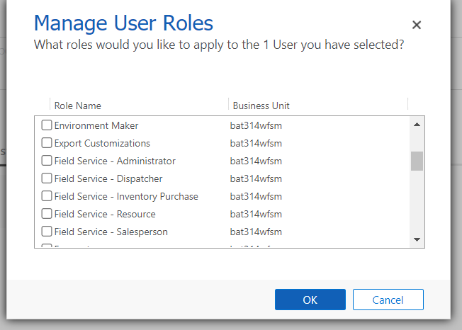

## Why am I getting the error "Your organization has not set your account's Bookable Resource to be 'Enabled for Field Service Mobile'"

> [!div class="mx-imgBorder"]
> 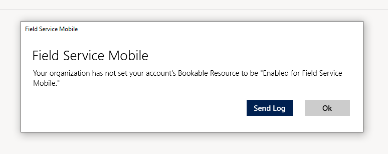

This error notes that the resource trying to access the mobile application is not set as a bookable resource.
 
To correct:

1.	Enter Field Service CRM.
1.	Select **Resources**.
1.	Select the desired user.
1.	Go to the **Field Service** tab.
1.	Set **Yes** for **Enable for Field Service Mobile**.

> [!div class="mx-imgBorder"]
> 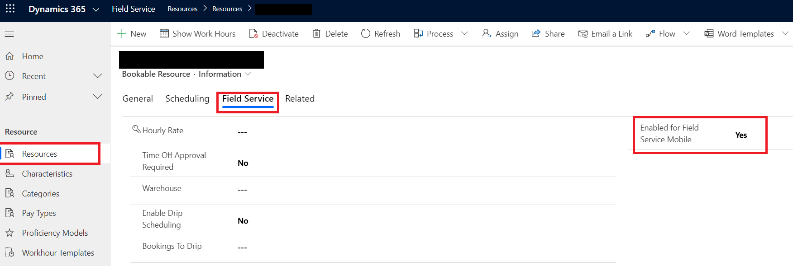

## Why am I getting the error "One or more errors occurred. AADSTS50097: Device Authentication Required…"

> [!div class="mx-imgBorder"]
> 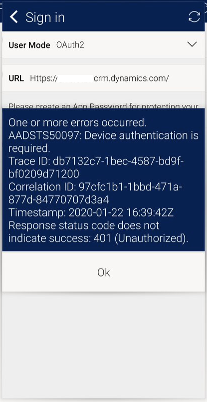

This error notes that your AAD security settings have a conditional access block, which disallows Field Service Mobile from reaching authentication servers. 
 
To correct, you'll need to discuss with your network security team and evaluate conditional access policies that may be blocking Dynamics 365. For more information, see the article [Troubleshoot Conditional Access](https://docs.microsoft.com/azure/active-directory/conditional-access/troubleshoot-conditional-access-what-if).

## Why won't my password save?

To avoid having to enter a password each time someone uses the application, administrators can set the **Save Password** to _True_ in **Configurations** in the Field Service Mobile Configuration tool (Woodford). 

> [!div class="mx-imgBorder"]
> 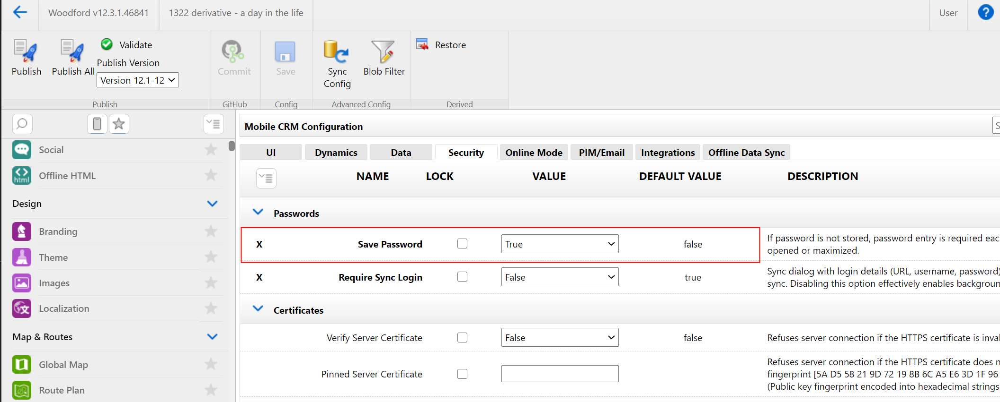

However, Android users who have **Save password** set to true will be prompted for the password every time they launch the latest version (12.3.x) of the Field Service Mobile (Xamarin) app. This will impact all Android users with **Save password** set to true who migrate to the latest version (12.3.203) of the Field Service Mobile (Xamarin) app. This issue will also occur when user upgrades from the present version 12.1.224 to the upcoming version 12.3.206.

> [!div class="mx-imgBorder"]
> 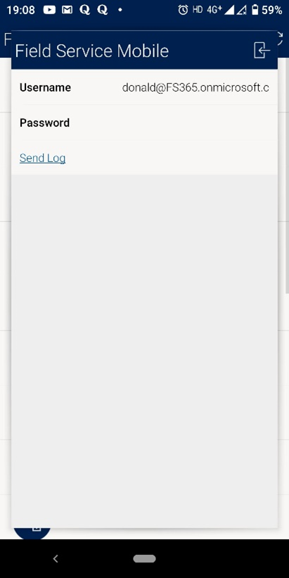

The issue is due to a necessary security upgrade of encryption method on Field Service Mobile (Xamarin) and a bug in the Android operating system.

### Solution:

There are two options to avoid the issue:

1. Uninstall the application from the device and reinstall the application from the [Field Service Mobile android App store](https://play.google.com/store/apps/details?id=com.microsoft.d365.fs.mobile).
2. Go to Android settings and clear app data for the Field Service Mobile (Xamarin) app to avoid the recurrent password prompt. Note: This will not lead to any permanent data loss within the application; users will need to sync to get all data from the servers.

Steps to clear app data:

1.	Go to **Settings** > **Apps & Notifications**.
2.	Choose **Field Service Mobile App**.
3.	Go to **Storage & Cache**.
4.	Choose the option **Clear Cache**.
5.	Choose the option **Clear Storage**.
6.	When prompted to **Delete app data?** Choose **OK**.

> [!div class="mx-imgBorder"]
> 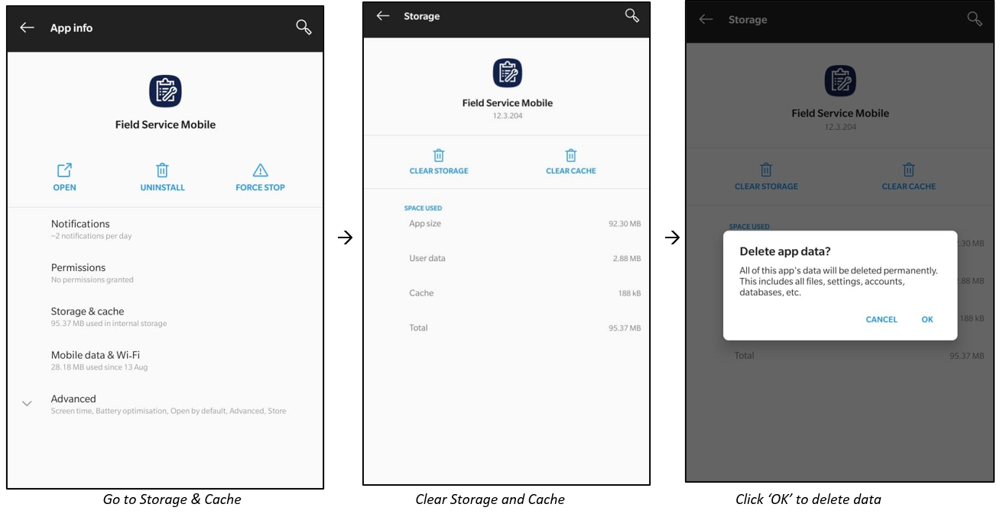

[!INCLUDE[footer-include](../includes/footer-banner.md)]