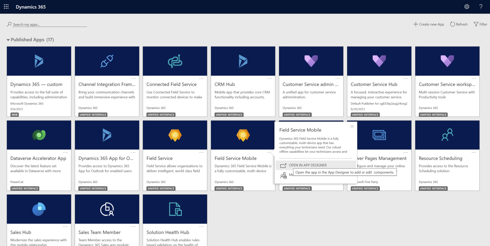
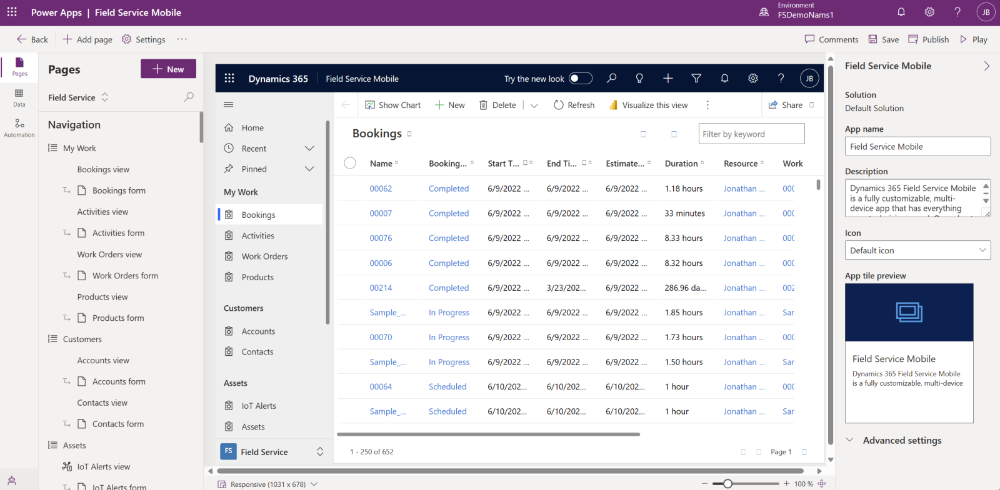
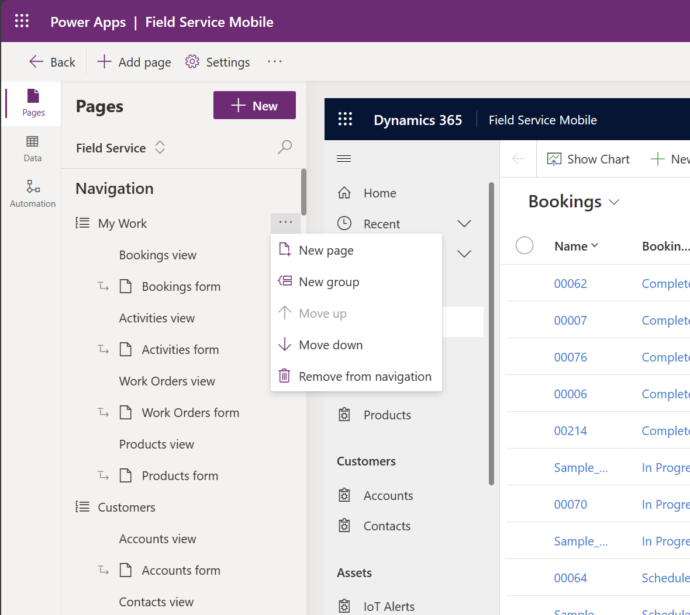

# Edit Sitemap entities (tables) on the home screen

Sign in to Dynamics 365 as a system administrator.

To see your list of apps, go to:

`https://[YOUR-ENVIRONMENT-NAME].crm.dynamics.com/main.aspx?forceUCI=1&pagetype=apps`

Find the Field Service Mobile app and **Open In App Designer**.

> [!div class="mx-imgBorder"]
> 

From the app designer, you will see the current Sitemap. The out of the box sitemap will contain groups of pages, including "My Work", "Customers" and "Assets". You can modify this to add or remove groups and pages as needed for your business scenario. 

> [!div class="mx-imgBorder"]
> 

You can even create entirely new groups with more subareas to display different entities.

> [!div class="mx-imgBorder"]
> 

> [!Note]
> For every entity you display in the sitemap, you can choose the views available on mobile in the App Designer.

## Edit mobile views

- [Create and edit public or system model-driven app views](/powerapps/maker/model-driven-apps/create-edit-views-app-designer) 

- [Customize entity views](/powerapps/developer/model-driven-apps/customize-entity-views)

- [Customize Booking Calendar](/dynamics365/field-service/mobile-powerapp-customize-booking-calendar)

[!INCLUDE[footer-include](../includes/footer-banner.md)]
