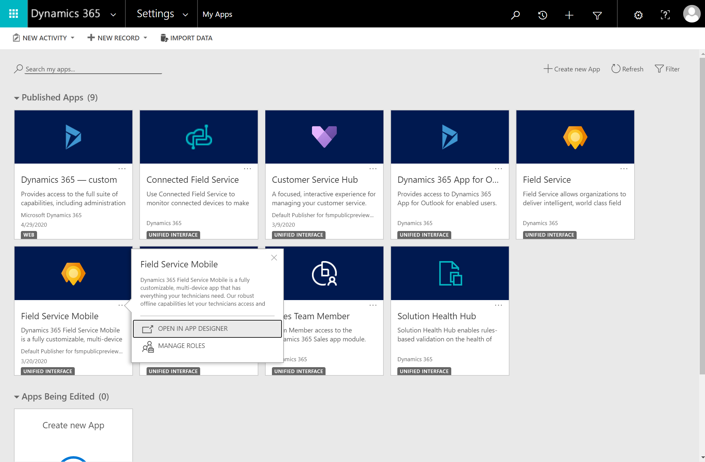
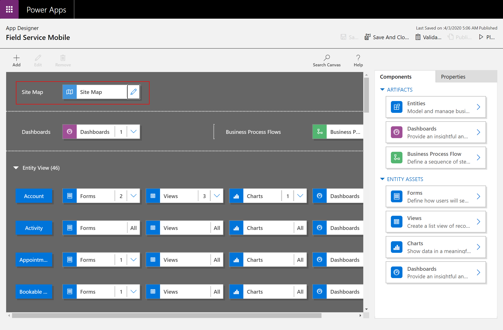
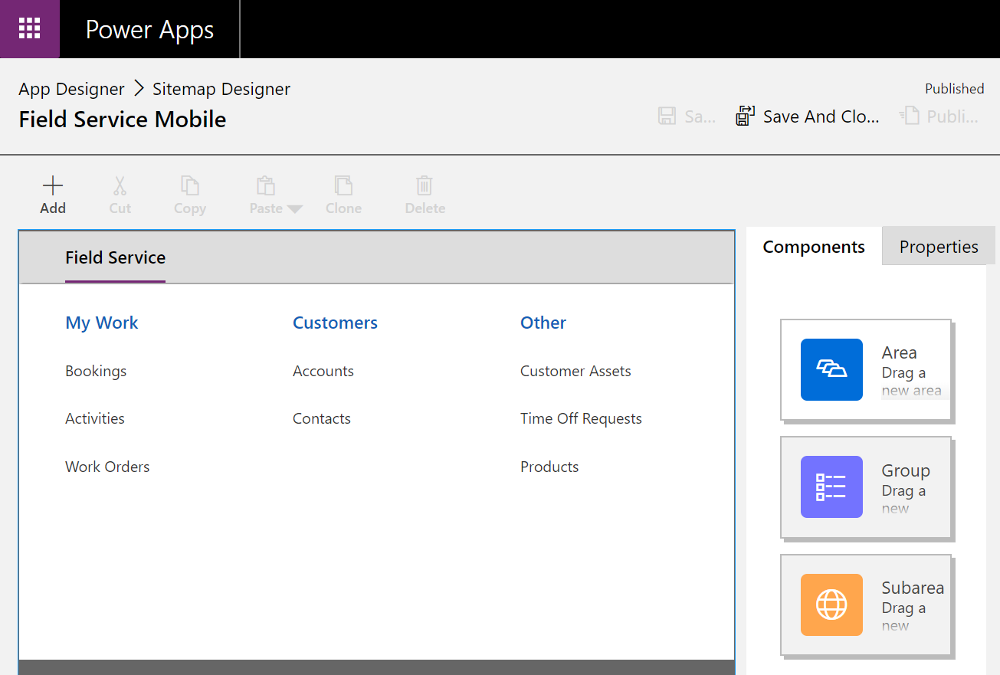
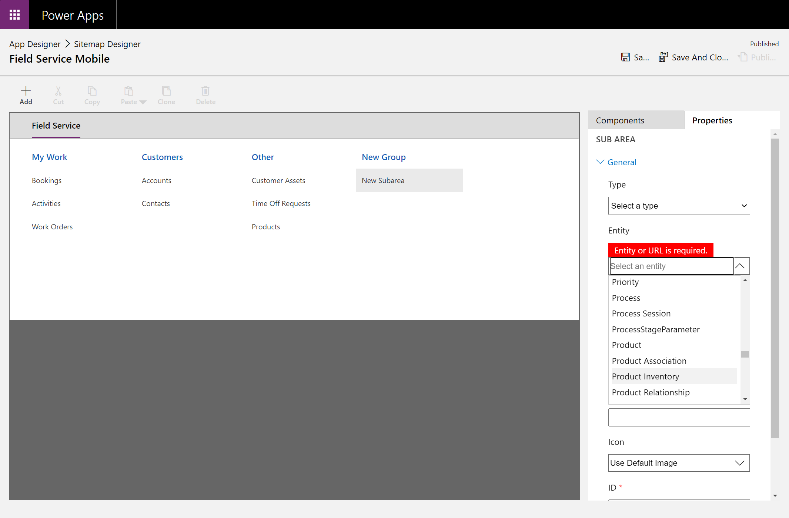
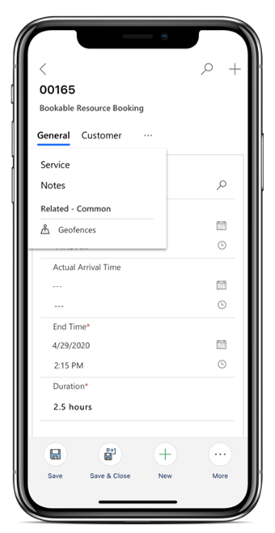
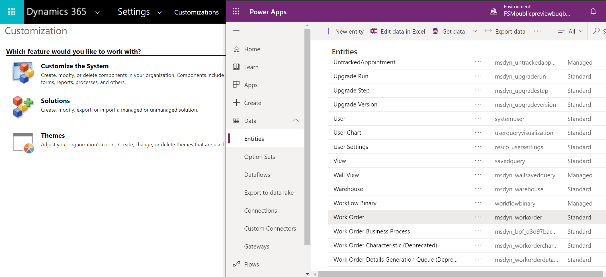
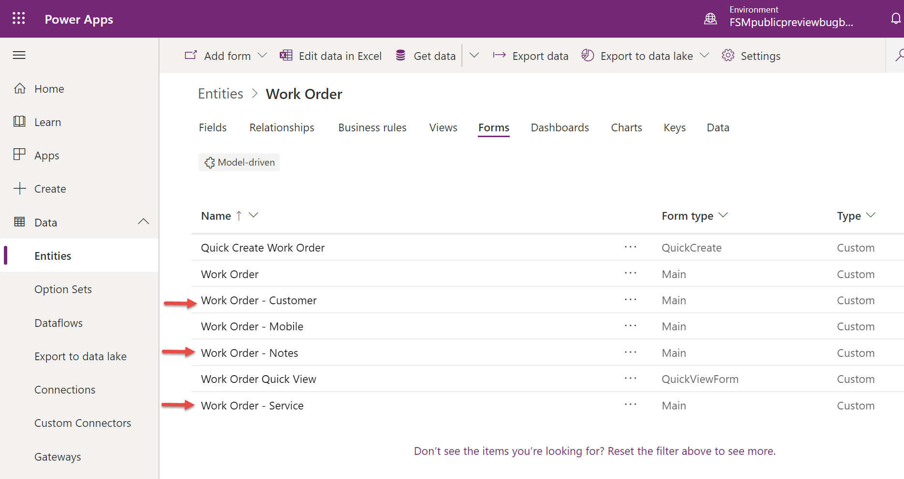
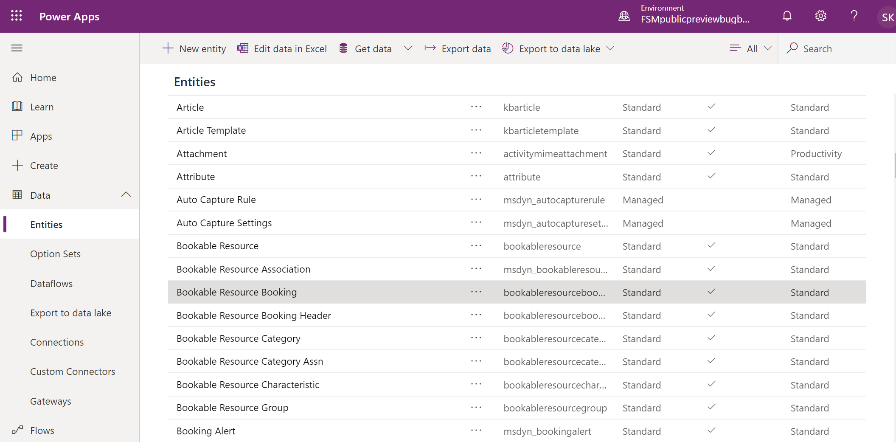
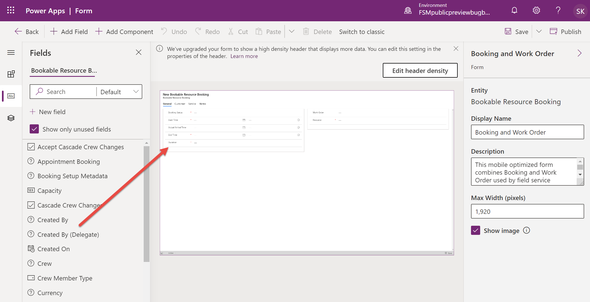

# Edit the sitemap (home screen), forms, and views

Administrators can edit how the Field Service (Dynamics 365) mobile app looks and functions for technicians.

## Edit Sitemap entities on home screen

Sign in to Dynamics 365 as a system administrator.

To see your list of apps, go to:

```https://[YOUR-ENVIRONMENT-NAME].crm.dynamics.com/main.aspx?forceUCI=1&pagetype=apps```

Find the Field Service Mobile app and go to the **App Designer**.

> [!div class="mx-imgBorder"]
> 

Select the edit icon to edit the site map.

> [!div class="mx-imgBorder"]
> 

The groups  **My Work**, **Customers**, and **Other** correspond with the home screen of the Field Service (Dynamics 365) mobile app and you can rearrange, delete, or edit the display names.

Rearrange the entities displayed within each group with the drag and drop interface, or add new entities by adding new **Subareas**.


> [!div class="mx-imgBorder"]
> 

You can even create entirely new groups with more subareas to display different entities.

> [!div class="mx-imgBorder"]
> 

> [!Note]
> For every entity you display in the sitemap, you can choose the views available on mobile in the App Designer.

## Edit the booking and work order form

You can add and delete fields displayed on the Field Service (Dynamics 365) mobile app; because the app is built with Power Apps, you can use the Power Apps Control Framework to display different field controls like toggle buttons and sliders.

Administrators who want to customize the booking and work order forms must know they are combined in the mobile app where work order forms are displayed within the booking form. That means when a technician views a booking form, they're also viewing the related work order form. In the following screenshot, the **General** section displays **Bookable Resource Booking** ("Booking") fields and the **Customer**, **Service**, and **Notes** sections display work order fields.


> [!div class="mx-imgBorder"]
> 

To edit the work order portion of the form, go to **Settings** > **Customizations** > **Customize the System** and find the **Work Order** entity in the Power Apps admin console.

> [!div class="mx-imgBorder"]
> 

In the **Form** section, there are three forms that correspond to the three sections of the combined Booking-Work Order form.

1. Work Order - Customer
2. Work Order - Service
3. Work Order - Notes

Edit each form as needed and publish. The changes will display in the Field Service (Dynamics 365) mobile app.

> [!div class="mx-imgBorder"]
> 

To edit the **Booking** part of the form, go to the **Bookable Resource Booking** entity in the Power Apps admin console.

> [!div class="mx-imgBorder"]
> 

Find the **Booking and Work Order** form, as seen in the following screenshot.

> [!div class="mx-imgBorder"]
> 

Add and delete booking fields as needed.

> [!div class="mx-imgBorder"]
> 

Another way you can add work order information to the booking form is to add a [quick view form](https://docs.microsoft.com/dynamics365/customerengagement/on-premises/customize/create-edit-quick-view-forms) that displays work order fields. Quick view forms are read-only, but you can go to the related work order form from there.

For more information, see the article on [customizing entity forms](https://docs.microsoft.com/powerapps/developer/model-driven-apps/customize-entity-forms).

## Edit views

- [Create and edit public or system model-driven app views](https://docs.microsoft.com/powerapps/maker/model-driven-apps/create-edit-views-app-designer) 

- [Customize entity views](https://docs.microsoft.com/powerapps/developer/model-driven-apps/customize-entity-views)

> [!Note]
> Currently, the booking calendar view is not editable. You cannot edit the fields displayed in the time slots on the calendar.

### See also

- [What are model-driven apps in Power Apps?](https://docs.microsoft.com/powerapps/maker/model-driven-apps/model-driven-app-overview)
- [Enable entities for mobile offline synchronization](https://docs.microsoft.com/dynamics365/mobile-app/setup-mobile-offline-for-admin#step-1-enable-entities-for-mobile-offline-synchronization)

[!INCLUDE[footer-include](../includes/footer-banner.md)]