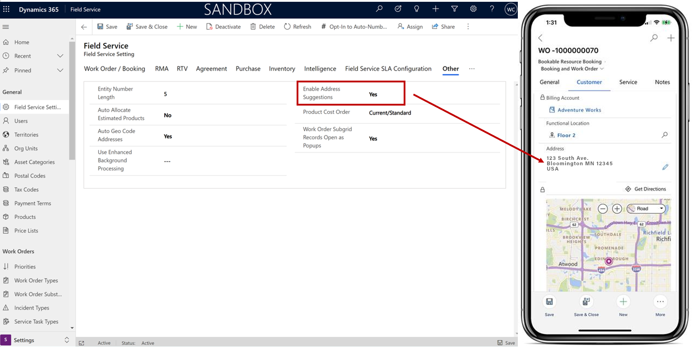
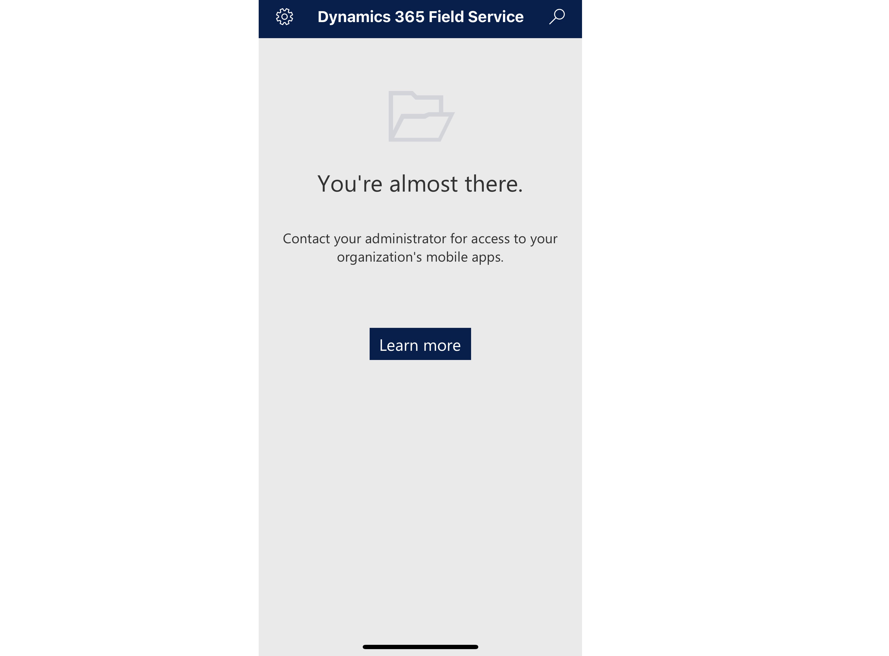
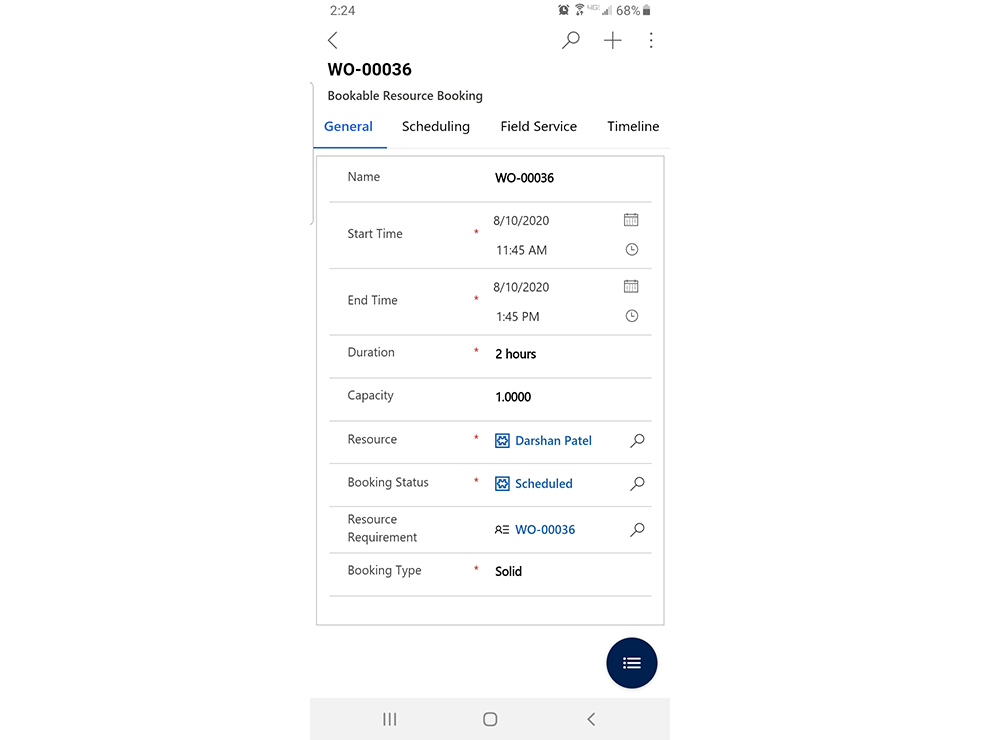
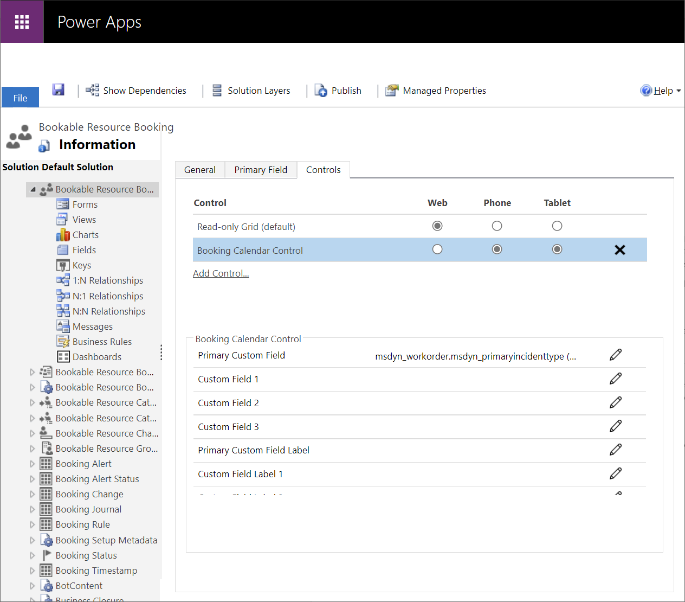
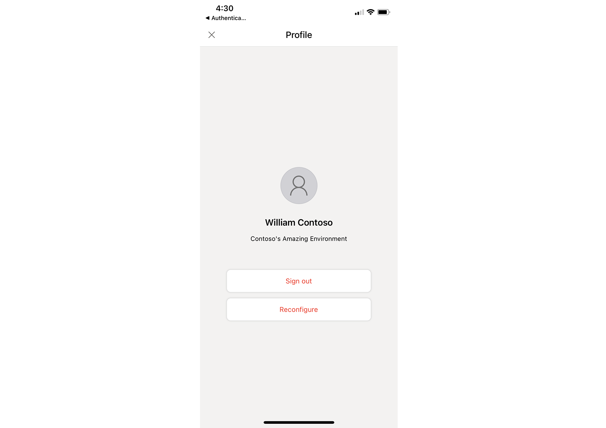

# Frequently asked questions for the Field Service (Dynamics 365) mobile app

## How do I enable address suggestions?

The mobile app can recommend addresses as technicians type them into a work order when an Internet connection is available. Address suggestions make data entry quicker and more accurate.    

Enable or disable address recommendations by going to **Field Service app** > **Settings** > **Field Service Settings** > **Other section**.

Then set **Enable Address Suggestions** to **Yes**.

> [!div class="mx-imgBorder"]
> 

When the mobile user has no Internet access, they can select **Edit** to manually enter address fields.

## Why does the app say "Contact your administrator for access to your organization's mobile apps"?

> [!div class="mx-imgBorder"]
> 

If you are getting this message, try the following steps:

1. The list shows production apps by default and you may be using a trial or sandbox. Select the menu icon in the top left and toggle **Show non-production apps** to _Yes_. 
2. Make sure you have the correct security role (Field Service - Resource) and that the security role is assigned to the Field Service Mobile app.
3. Sign in again, pull down the screen to refresh and wait for at least a few minutes.
4. If completing steps 1 and 2 does not resolve the issue, [submit a support ticket](https://dynamics.microsoft.com/contact-us/).

## Can I only add and view Field Service entities on the Field Service (Dynamics 365) mobile app?

Because the Field Service (Dynamics 365) mobile app is a model-driven app on the Power Platform, any entity can be added; users can only see entities and records that they have the licenses and security to access, regardless of whether it's part of the Field Service app or not.

## Why is the app saying "You're almost there"?

> [!div class="mx-imgBorder"]
> 

If you are getting the error "You're almost there" after signing in to the mobile app, try the following steps:

1. Make sure you have the correct security role (Field Service - Resource) and that the security role is assigned to the Field Service Mobile app.
2. Sign in again, pull down the screen to refresh and wait for at least a few minutes
3. If completing both steps 1 and 2 above do not resolve the issue, [submit a support ticket](https://dynamics.microsoft.com/contact-us/).

## Why doesn't the bookable resource booking form show work order details like **Customer**, **Service**, and **Notes**?

Sometimes you may not see the correct booking form. You may see the following result:

> [!div class="mx-imgBorder"]
> 

If you see something like the previous screenshot, you're viewing the booking form, and *not* the combined booking and work order form.

To solve this issue, make sure the user you're signed into the mobile app as has the **Field Service - Resource** security role. Also make sure that the right form (the mobile optimized booking and work order form) is associated with the booking entity in the app designer.

## I can't see the calendar or the wrong calendar is showing

To fix this issue, make sure the **Booking Calendar Control** is enabled for phones and tablets from the bookable resource booking entity.

> [!div class="mx-imgBorder"]
> 

## Can I customize the default booking calendar control, such as by changing the booking cell content?

Currently, customizations for the default booking calendar control are not supported.

## Is there a maximum number of records supported by the offline profile?

There is no limitation to the number of records that can be downloaded in offline mode outside of the physical device limitations. Going beyond 2MB per record is not recommended. Keep in mind that the sync duration will depend on the number and size of records being synced, as well as the quality of the network that the mobile device is connected to. For a good user experience, make sure the offline profile only includes the data that is relevant to the user. The configuration of the out-of-the-box offline profile takes into account the common scenarios faced by field service technicians and mobile app users.

For more information, review the [platform documentation](https://docs.microsoft.com/dynamics365/mobile-app/mobile-offline-capabilities).

## Can I connect Field Service (Dynamics 365) mobile app to GCC, GCC-High, and DoD cloud enviornments?

Not at this time. Support for non-public clouds will be added to Field Service mobile in the near future.

## What does "Reconfigure" and "Sign out" do?

**Sign Out**: User is signing out of the application. After signing out they will navigate back to the original sign in screen where they can sign in or use an alternate account to sign in. Signing out and back in will clear Field Service mobile application data which had previously been synced to the device. 
**Reconfigure**: User remains signed into the application but will navigate back to the app module picker where they can select an alternate app modulue if available. "Reconfigure" will clear Field Service mobile application data which had previously been synced to the device. 

> 

[!INCLUDE[footer-include](../includes/footer-banner.md)]
