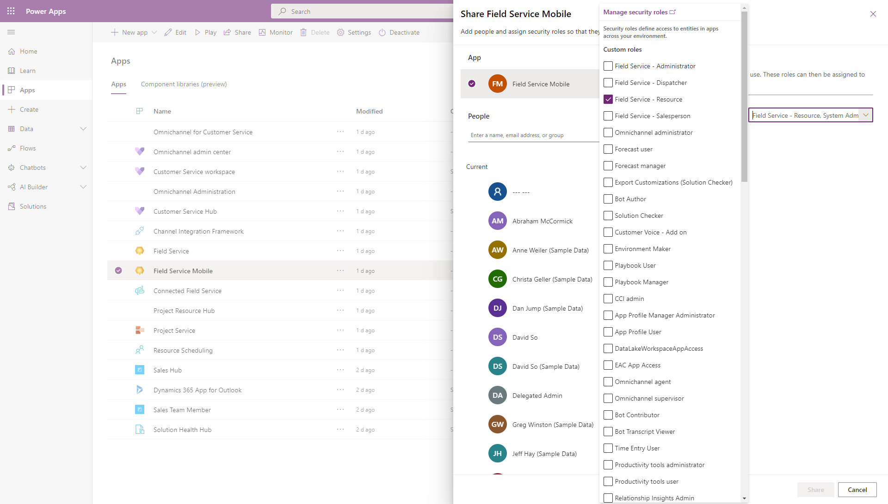

# Install and set up the Field Service (Dynamics 365) mobile app

The Field Service (Dynamics 365) mobile app is designed and optimized for technicians. They can work with Dynamics 365 Field Service work orders, customer assets, accounts, and contacts. The app is built on Microsoft Power Platform as a [model-driven app](/powerapps/maker/model-driven-apps/model-driven-app-overview). You can customize it to your business needs.

For a guided walkthrough, check out the following video.

> [!VIDEO https://www.microsoft.com/videoplayer/embed/RE4HKRL]

## Prerequisites

To use the Field Service (Dynamics 365) mobile app, you must have [Field Service installed](install-field-service.md) and [set up](field-service-get-started.md).

## Assign mobile app users appropriate security roles

Set up a Dynamics 365 Field Service user with the **Field Service-Resource** security role and **Field Service-Resource** field security profile. This user will sign in to the Field Service (Dynamics 365) mobile app as a technician.

> [!div class="mx-imgBorder"]
> 

>[!TIP]
> Use the [frontline worker setup](frontline-worker-set-up.md) to quickly create a frontline worker and automate setup steps.

## Assign security roles to the Field Service mobile app

Go to [https://make.powerapps.com/](https://make.powerapps.com/) > **Apps** in the left pane.

Find the **Field Service Mobile** model-driven app and select the ellipses (...), select **Share**, and assign the app to the **Field Service-Resource**, **Field Service-Administrator**, and other relevant roles that will need access to the mobile app.

> [!div class="mx-imgBorder"]
> 

## Download the app and sign in

Go to the app store on your iOS, Android or Windows device, and search for **Dynamics 365 Field Service**.

Download the app named **Field Service (Dynamics 365)**, the mobile app built on Microsoft Power Platform.

> [!div class="mx-imgBorder"]
> 

Open the app and sign in with your username and password, which should be the user credentials of the technician user who has the **Field Service - Resource** security role. View the articles on [setting up users and security roles](../field-service/view-user-accounts-security-roles.md) and [creating a Bookable Resource](set-up-bookable-resources.md) for help.

## (Optional) Schedule a work order

To view work orders on the mobile app, you must also [set up a frontline worker](frontline-worker-set-up.md) related to your technician user, and schedule work orders to the bookable resource.

> [!div class="mx-imgBorder"]
> 

## Next steps

- [Set up offline data and sync filters](mobile-power-app-system-offline.md)
- [Five tips for implementing the Field Service (Dynamics 365) mobile app](https://cloudblogs.microsoft.com/dynamics365/it/2021/04/21/5-tips-for-implementing-the-field-service-dynamics-365-mobile-app/)
- [Get started with Dynamics 365 Field Service](field-service-get-started.md)

[!INCLUDE[footer-include](../includes/footer-banner.md)]
