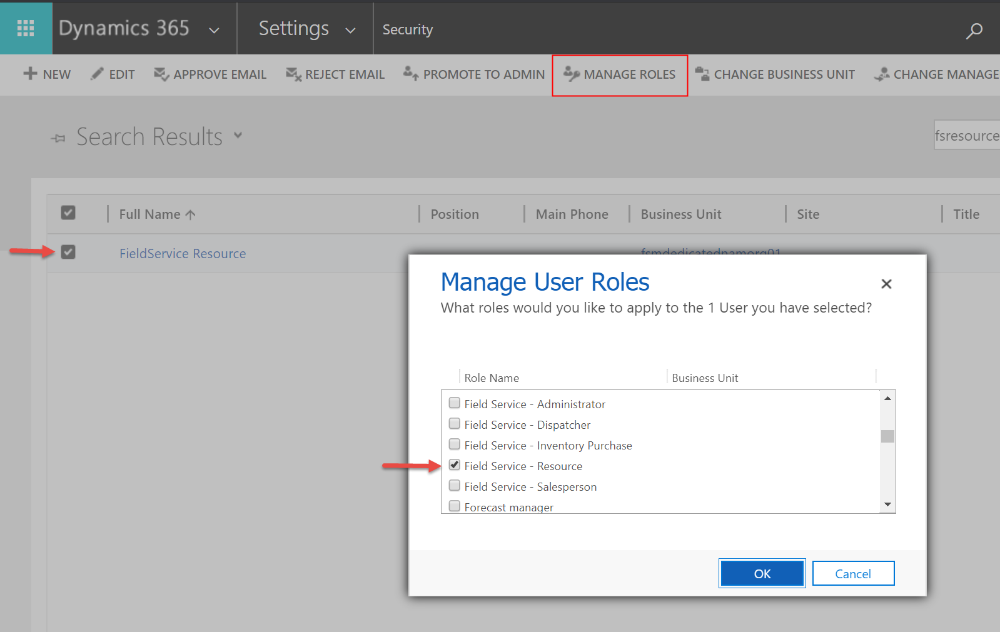
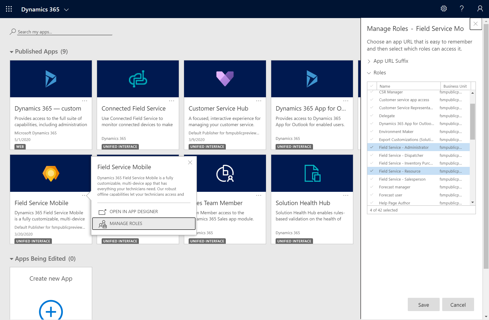
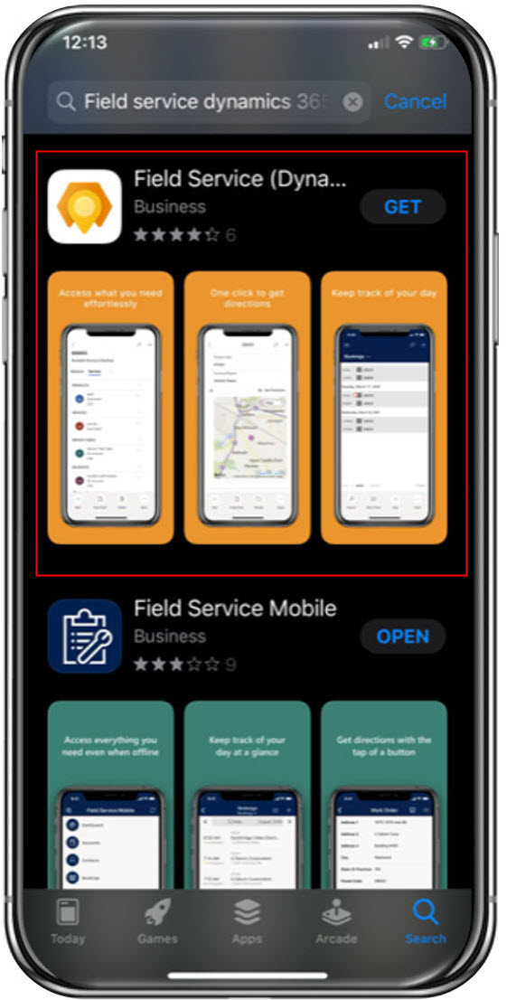
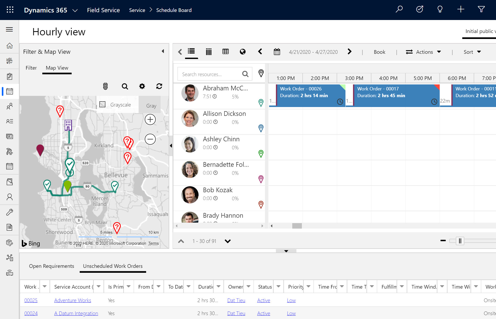

# Install and set up the Field Service (Dynamics 365) mobile app
<!--note from editor: Please note (and verify) the edit to the title metadata. The title, H1, and description all need to be unique.-->
The Field Service (Dynamics 365) mobile app is designed and optimized for technicians to view Dynamics 365 Field Service work orders, customer assets, accounts, and contacts. This mobile app is built on Microsoft Power Platform as a [model-driven app](/powerapps/maker/model-driven-apps/model-driven-app-overview) and you can customize it to your business needs by using the same admin console as all Dynamics 365 business apps.<!--note from editor: Suggested.-->

For a guided walkthrough, check out the following video.

> [!VIDEO https://www.microsoft.com/videoplayer/embed/RE4HKRL]

## Prerequisites

To use the Field Service (Dynamics 365) mobile app, you must have Field Service installed and set up.

See the following articles if you haven't yet set up Field Service:

- [How to install Dynamics 365 Field Service](install-field-service.md)
- [Set up users and security roles](../field-service/view-user-accounts-security-roles.md)
- [Perform initial configurations](perform-initial-configurations-setup.md)
- [Create a Bookable Resource](set-up-bookable-resources.md)


## Install or upgrade Field Service

After you install or upgrade to Field Service v8.8.22+, the **Field Service** and **Field Service Mobile** apps will appear in the list of apps when you sign in. You can find these apps by going to:

```https://[your-environment-name].crm.dynamics.com/apps```

> [!div class="mx-imgBorder"]
> 

## Assign mobile app users appropriate security roles

Set up a Dynamics 365 Field Service user with the **Field Service-Resource** security role. This user will sign in to the Field Service (Dynamics 365) mobile app as a technician.

> [!div class="mx-imgBorder"]
> 

## Assign security roles to the Field Service mobile app

On the **Field Service Mobile** card<!--note from editor: Edit okay?-->, select the ellipses (...), select **Manage Roles**, and assign the app to the **Field Service-Resource**, **Field Service-Administrator**, and other relevant roles that will need access to the mobile app.

> [!div class="mx-imgBorder"]
> 

## Download the app and sign in

Go to the app store on your iOS or Android device, and search for **Dynamics 365 Field Service**.

Download the app named **Field Service (Dynamics 365)**, as seen in the following screenshot. This is the mobile app built on Microsoft Power Platform.

> [!div class="mx-imgBorder"]
> 

Open the app and sign in with your username and password, which should be the user credentials of the technician user who has the **Field Service - Resource** security role. View the articles on [setting up users and security roles](../field-service/view-user-accounts-security-roles.md) and [creating a Bookable Resource](set-up-bookable-resources.md) for help.

## (Optional) Schedule a work order

To view work orders on the mobile app, you must also [create a bookable resource](./set-up-bookable-resources.md) related to your technician user, and schedule work orders to the bookable resource.

> [!div class="mx-imgBorder"]
> 

## Next steps

- [Set up offline data and sync filters](mobile-power-app-system-offline.md)
- [Quickstart: Schedule a work order and view it on the mobile application](quickstart-schedule-work-order.md)

[!INCLUDE[footer-include](../includes/footer-banner.md)]