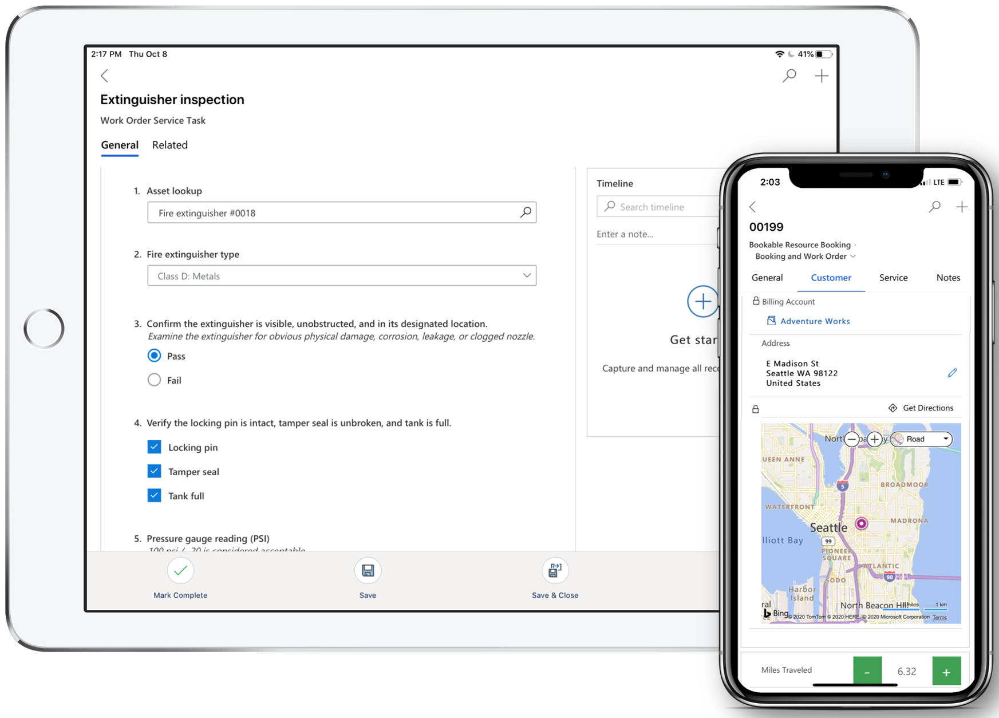

# Overview of the Field Service (Dynamics 365) mobile app

The Field Service (Dynamics 365) mobile app lets technicians view Dynamics 365 Field Service work orders, customer assets, accounts, and contacts. This mobile app is built on Microsoft Power Platform as a [model-driven app](/powerapps/maker/model-driven-apps/model-driven-app-overview). It's customizable to your business needs with the same admin console as all Dynamics 365 business apps.

> [!div class="mx-imgBorder"]
> 

Available natively for Apple iOS and Google Android phones and tablets, the Field Service (Dynamics 365) mobile app offers technicians many capabilities they need to perform onsite customer service, such as:  

- A calendar view of assigned jobs.
- Support for picture, video, and asset barcode scanning.
- Customer signature capture.
- Offline capabilities so technicians can continue viewing and recording work in areas without internet.

For a guided walkthrough, check out the following video.

> [!VIDEO https://www.microsoft.com/videoplayer/embed/RE4HKRL]

[!INCLUDE[footer-include](../includes/footer-banner.md)]