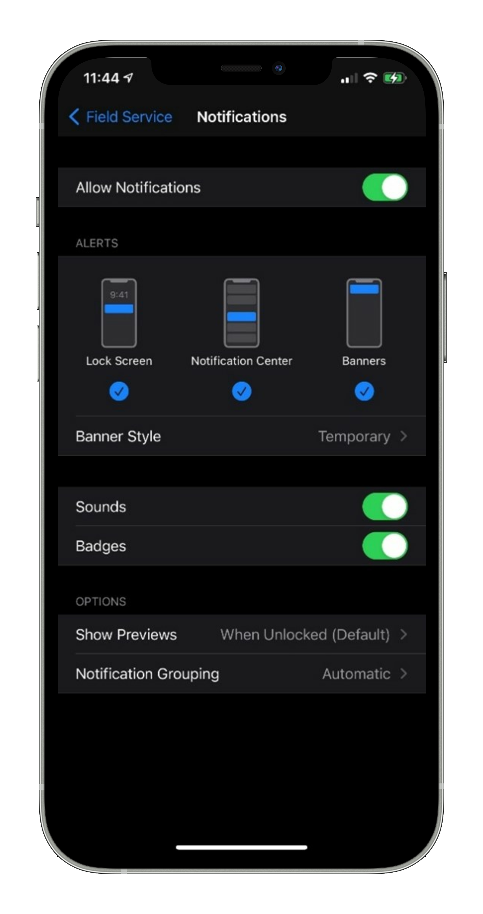
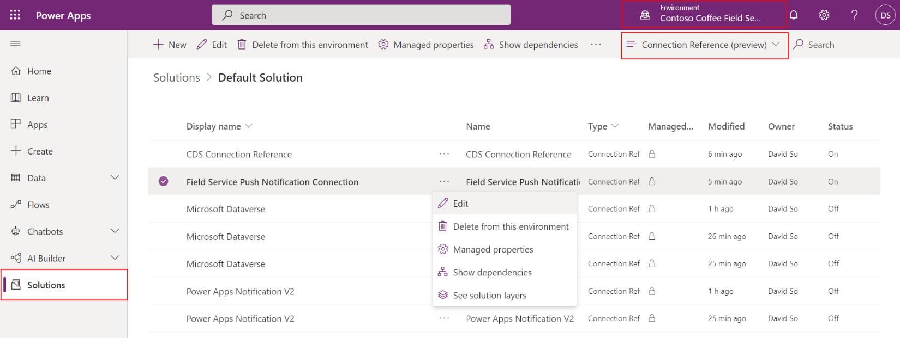
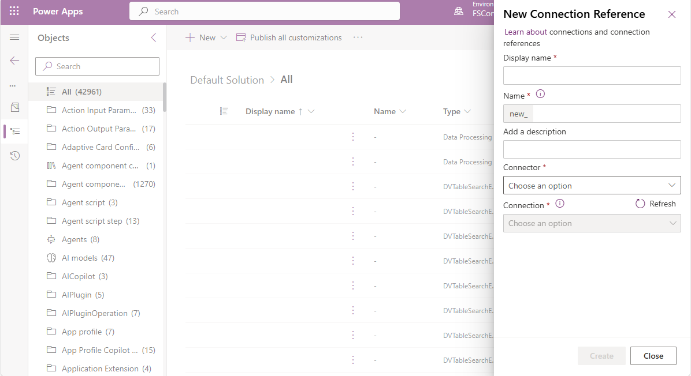
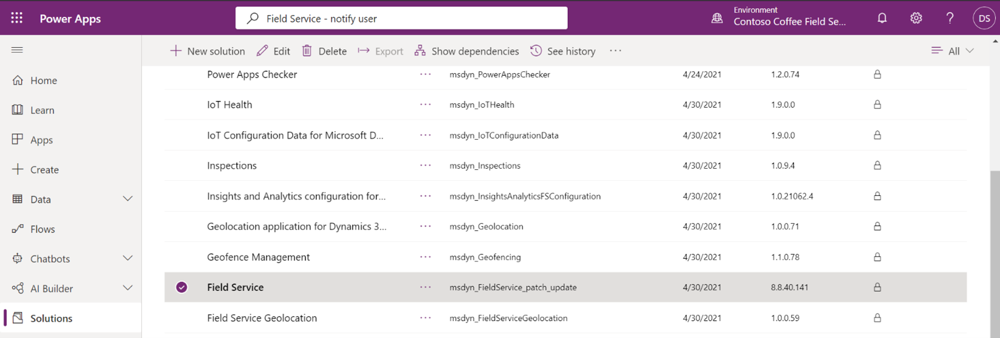
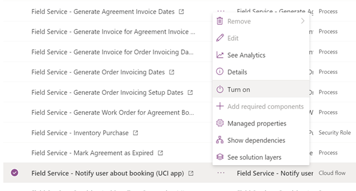
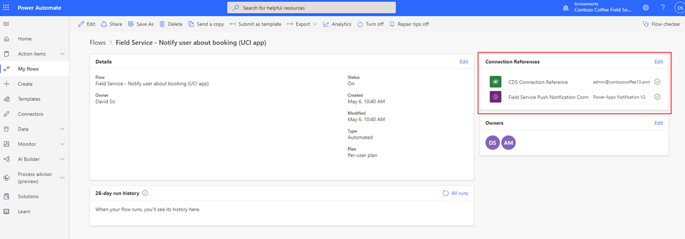
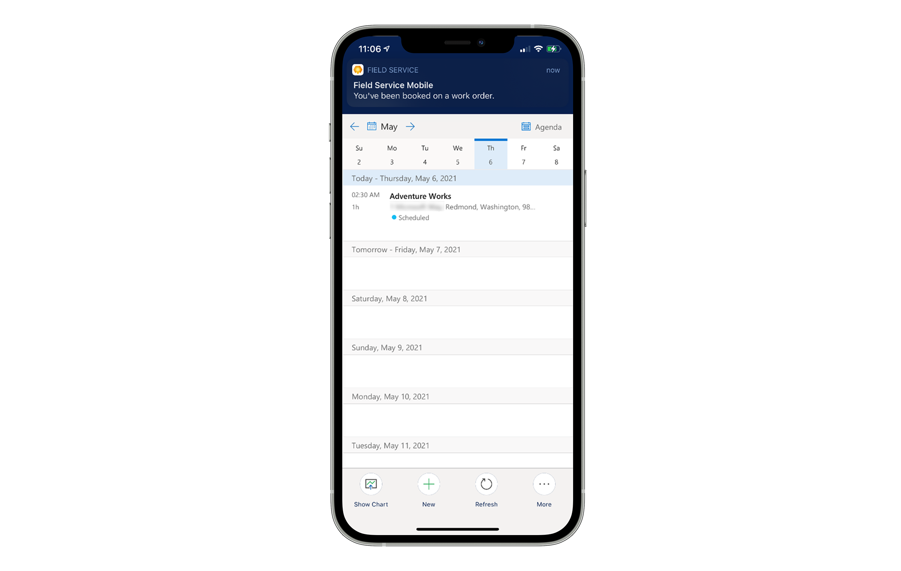
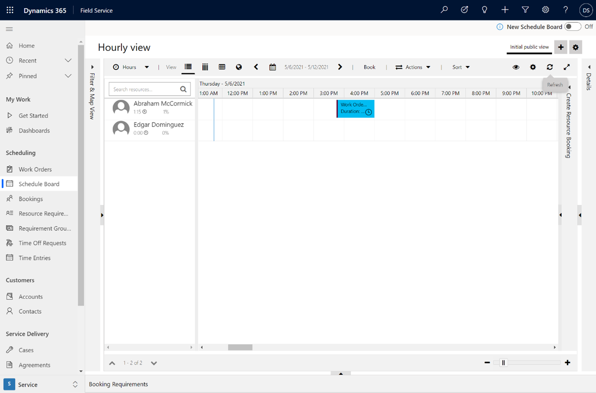
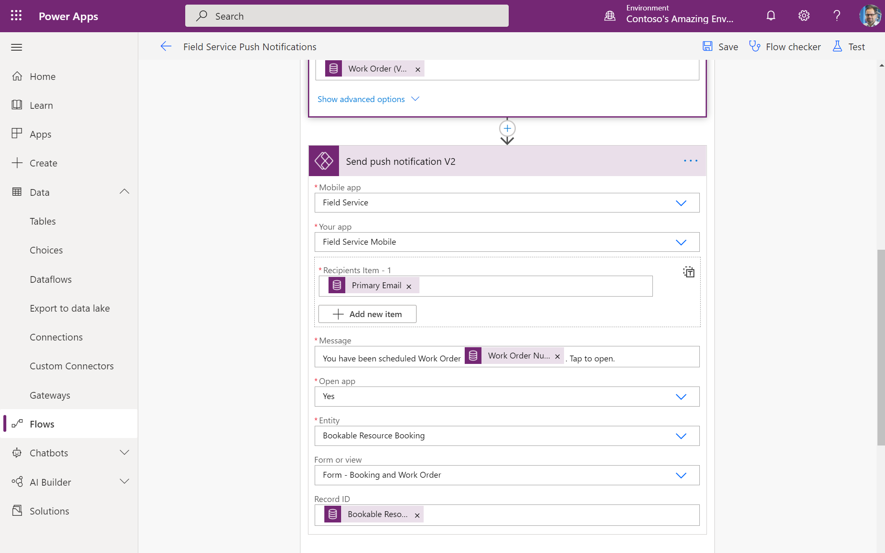
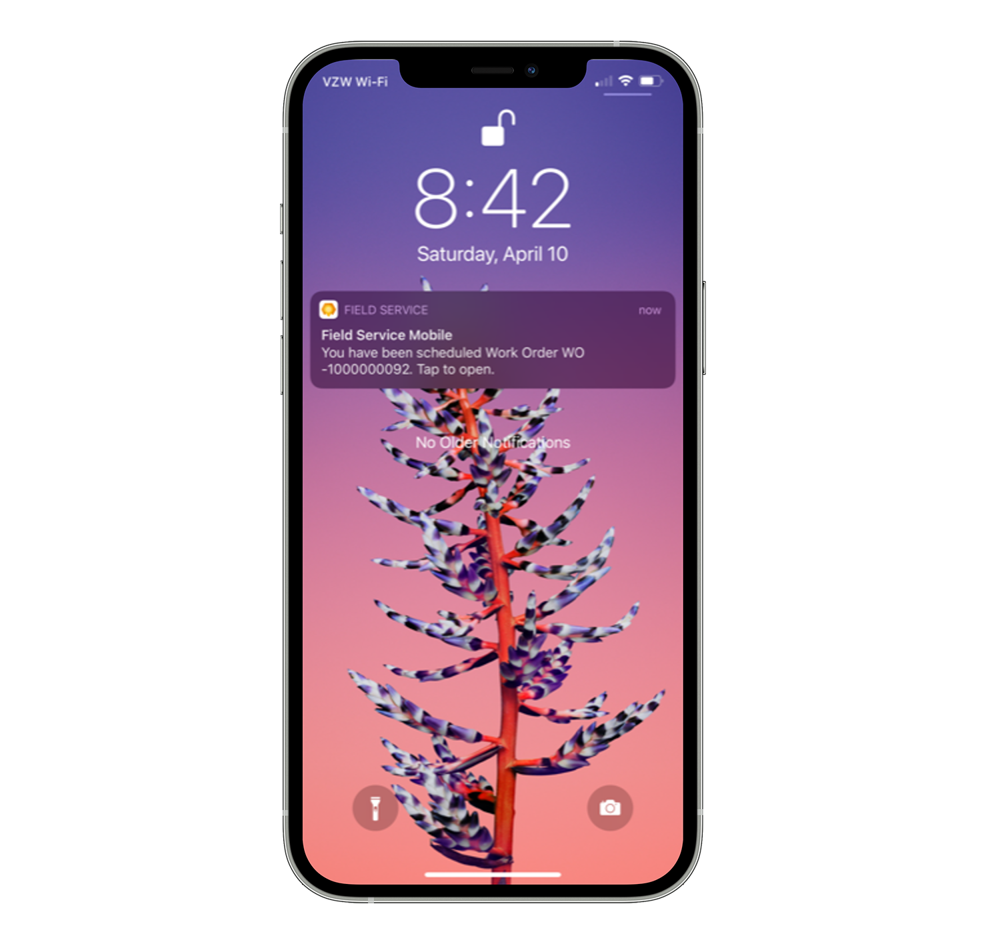

# Enable push notifications

In the Field Service (Dynamics 365) mobile app, push notifications allow you to send updates to technicians through their mobile phones or tablets. Push notifications use Microsoft Power Automate and can be triggered by many scenarios.

Push notifications can be used to:

- Notify technicians they have been assigned a booking.
- Remind technicians to enter important business data.

There are two ways to enable push notifications for your organization.

1. Enable the push notification cloud flow included with Dynamics 365 Field Service. The included push notification notifies technicians when they have been assigned a booking.
2. Create a custom push notification based on custom triggers using the Power Automate **Send Push Notification V2** connector.

## Prerequisites

To use push notifications in the Field Service (Dynamics 365) mobile app, you'll need:

- [Microsoft Power Automate](https://flow.microsoft.com/).
- The Field Service (Dynamics 365) mobile app v13.20101.19+ for iOS or v3.20101.19+ Android devices. Visit the app's **About** section to check which version you have.
- Consent for notifications in your device's settings for the Field Service (Dynamics 365) mobile app. In your mobile device settings, enable push notifications. See the following screenshot for an example in iOS.

> [!div class="mx-imgBorder"]
> 

- Review the [privacy notes for Field Service push notifications](mobile-push-notifications-privacy.md). 

> [!Note]
> Google Firebase Cloud Messaging, Apple Push Notification, and Windows Push Notification services are not provisioned in a dedicated data center for exclusive use by you and does not provide data segregation, such as for the Government Community Cloud. Your use of Google Cloud Messaging, Apple Push Notification, and Windows Push Notification services shall not be subject to any product-specific terms and conditions applicable to Dynamics 365 online for Government. If you do not wish to use the push notification,ensure that your administrator keeps the feature off.

## Turn on push notifications included with Field Service

Push notifications are messages delivered by apps on your phone. Dynamics 365 Field Service includes a template for push notifications for the mobile app. You can use the Power Apps **Notifications V2** on the Power Platform to create custom push notifications based on custom triggers. 

Configure the following cloud flow to send frontline workers a push notification on their mobile device when they are scheduled a work order.  
 
Go to [https://make.powerapps.com](https://make.powerapps.com).

Make sure the Field Service environment you created in the prerequisites is chosen in the top right.

Select **Solutions** in the left pane, then go to the **Default Solution**.

> [!div class="mx-imgBorder"]
> 
 
Edit the **Field Service Push Notification Connection** and make sure it's enabled for your environment.

> [!div class="mx-imgBorder"]
> 
 
Next, edit the **CDS Connection Reference** and make sure it's enabled for your environment.

> [!div class="mx-imgBorder"]
> 
 
Back in **Solutions**, find the Field Service solution called `msdyn_FieldService_patch_update`. There are several solutions named Field Service, so make sure to choose the right one. 

> [!div class="mx-imgBorder"]
> 
 
**Turn On** the cloud flow called **Field Service – Notify user about booking (UCI app)**. 

> [!div class="mx-imgBorder"]
> 

Double-click into the **Field Service – Notify user about booking (UCI app)** cloud flow and make sure the **Connection References** section contains both the **CDS Connection Reference** and the **Field Service Push Notification Connection**.

> [!div class="mx-imgBorder"]
> 

> [!Note]
> If the **Connection References** are not listed, repeat the previous steps in this article in a new private web browser window.

> [!div class="mx-imgBorder"]
> 

## Test push notifications

Schedule a work order to a frontline worker that has a user set up for the mobile app.

> [!div class="mx-imgBorder"]
>  

Within 60 seconds, you should receive a push notification from the Field Service mobile app.

## Create a custom push notification

### 1. Go to Power Automate and create a new flow

Go to Power Automate and select **Create**. Start from blank or a template to create a flow based on your needs.

> [!div class="mx-imgBorder"]
> 

### 2. Use any of the available connector triggers

Power Automate supports hundreds of pre-built connectors that can be used to trigger and provide data to the push notifications. You can use any of these triggers to send targeted push notifications to the desired set of users.

For the next example, we use the Common Data Service (current environment) connector with the *When a record is created, updated, or deleted* trigger so that we can notify the relevant user when a new record has been created. 

> [!div class="mx-imgBorder"]
> 

### 3. Get bookable resources

From the bookable resource booking, get the associated resource value. This value is the resource the booking was scheduled to.

> [!div class="mx-imgBorder"]
> 

### 4. Create condition (optional)

Isolate resources that have **Resource Type** set to *User*. Isolating these resources makes it so push notifications are only sent to resources who are users, rather that resources that represent equipment, pools, and contractors. 

> [!div class="mx-imgBorder"]
> 

### 5. Get users 

From the resources, get the associated user values. Technicians sign into the mobile app with their Dynamics 365 user credentials, so this step is necessary to send push notifications to the appropriate users.

> [!div class="mx-imgBorder"]
> 

### 6. Get work orders (optional)

In order to include work order information in the push notification message, configure the flow to get work orders. 

> [!div class="mx-imgBorder"]
> 

### 7. Add the push notification action

The **Power Apps Notifications v2** connector includes the *Send a push notification V2* action. Add this action as a step in your flow and enter the necessary information to configure the push notification, using any of the dynamic data provided by earlier steps.

In the following screenshot, we create a push notification to the Field Service technician (bookable resource) when a new booking has been assigned. The push notification, when selected, will open the booking resource booking record on the booking and work order form. 

> [!div class="mx-imgBorder"]
> 

To send a message to the Field Service (Dynamics 365) mobile app, make sure the following fields are configured:

- Mobile app: Field Service
- Your app:  Field Service Mobile

If you want to redirect the technician to the new booking and work order form, configure these fields:

- Open app: Yes
- Entity: Bookable Resource Booking
- Form or view:  Form – Booking and Work Order
- Record ID: Bookable Resource Booking

Use these fields to provide a custom message:

- Recipient Items: The desired set of recipients for the notification
- Message: The notification message.

### 8. View in the Field Service (Dynamics 365) mobile app

Download the Field Service (Dynamics 365) mobile app from the app store.

When the app launches, accept the prompt to receive notifications. Otherwise, enable notifications in your devices settings. 

The push notifications will be shown to the technician using the mobile phone. Field technicians do not need to be in the app or using their device to receive push notifications.

> [!div class="mx-imgBorder"]
> 

> [!Note]
> Push notifications are currently not available on Field Service (Dynamics 365) Windows app.

[!INCLUDE[footer-include](../includes/footer-banner.md)]
