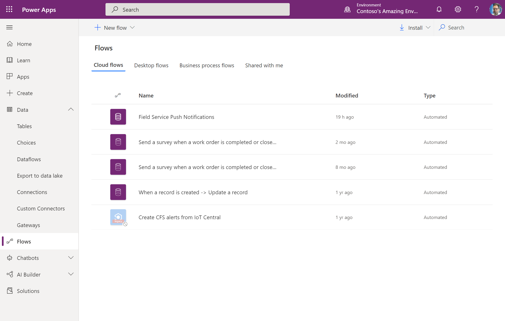
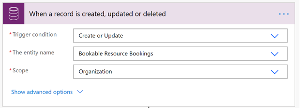
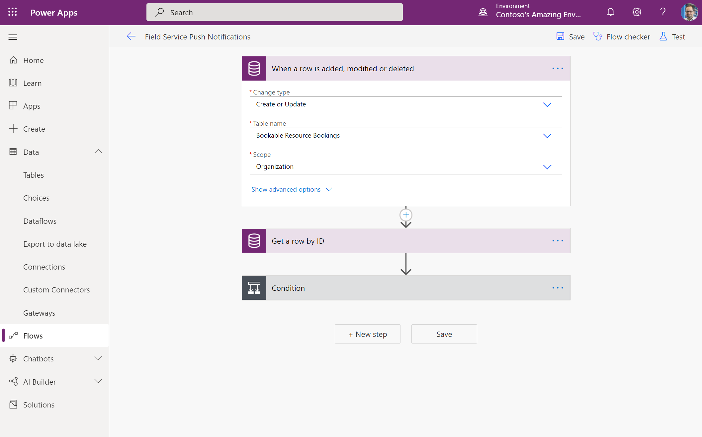
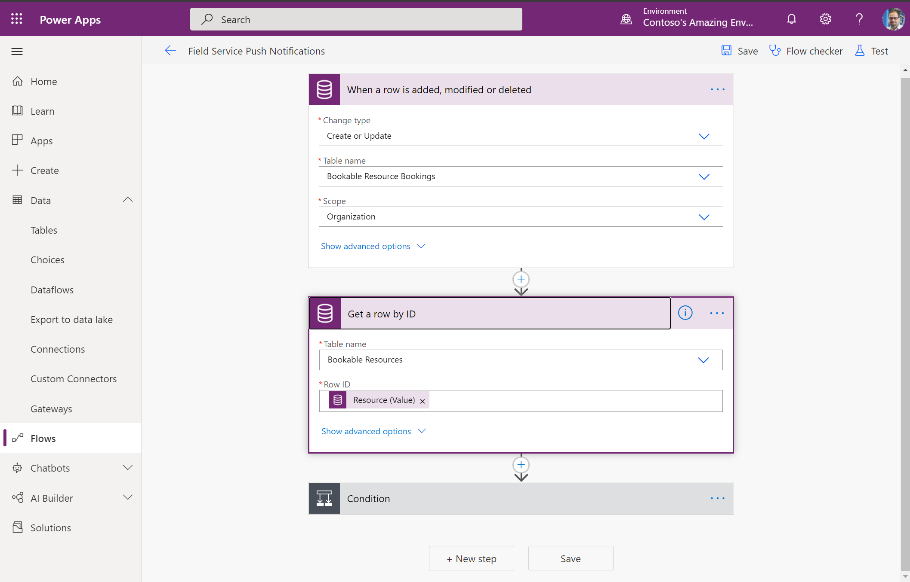
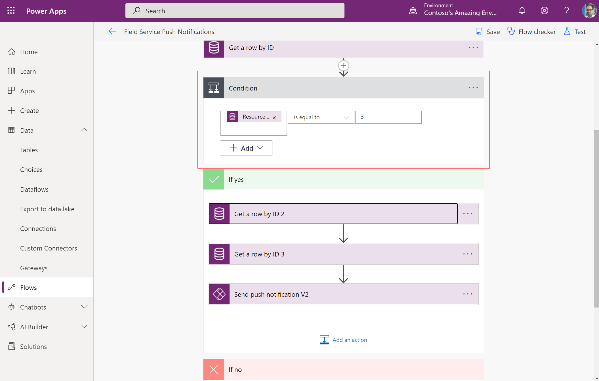
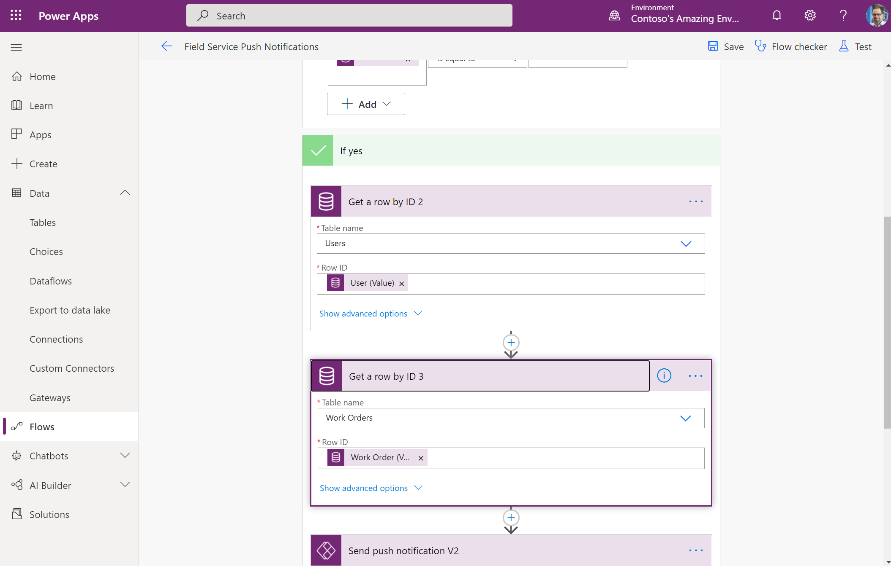
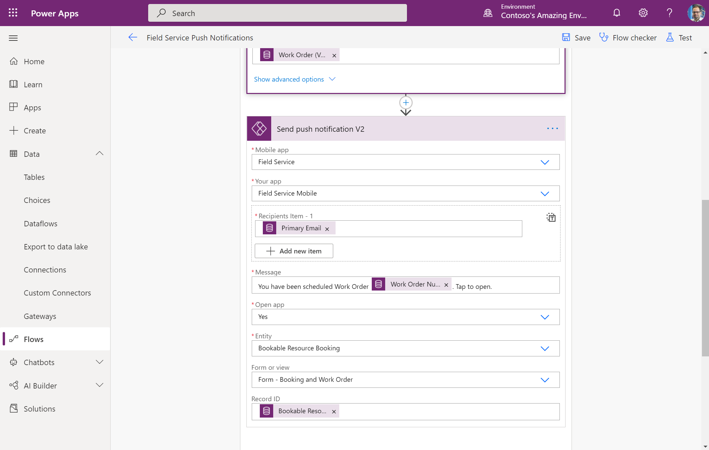
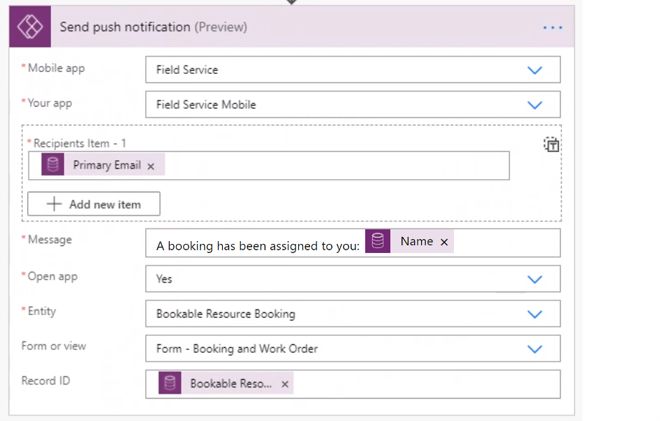
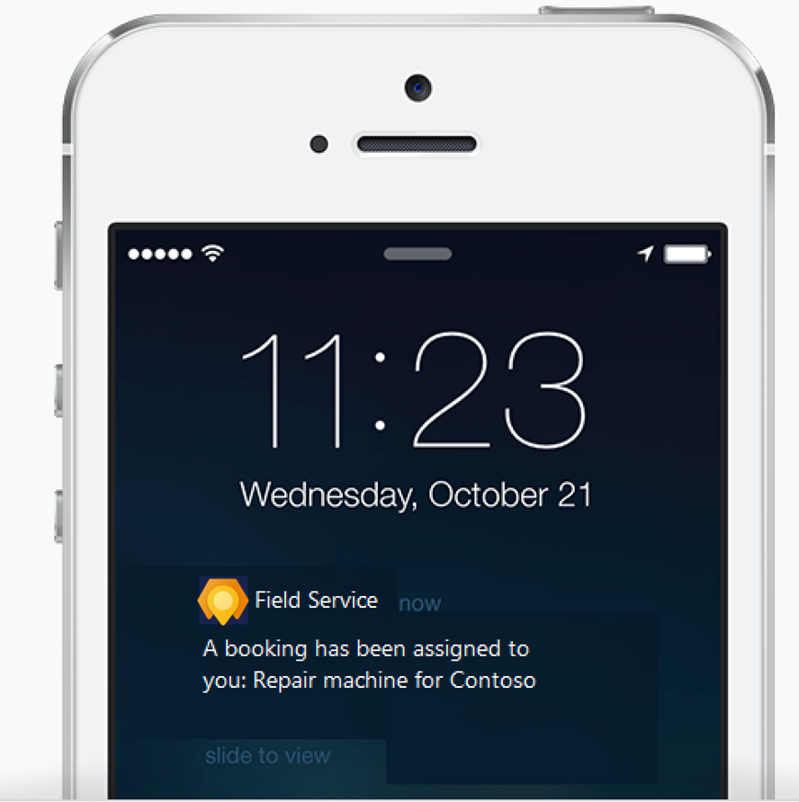

# Enable push notifications

In the Field Service (Dynamics 365) mobile app, push notifications allow you to send updates to technicians through their mobile phones or tablets. Push notifications use Microsoft Power Automate and can be triggered by many scenarios.

Push notifications can be used to:

- Notify technicians they have been assigned a booking.
- Remind technicians to enter important business data.

## Prerequisites

To use push notifications in the Field Service (Dynamics 365) mobile app, you'll need:

- [Microsoft Power Automate](https://flow.microsoft.com/)
- The Field Service (Dynamics 365) mobile app v13.20101.19+ for iOS or v3.20101.19+ Android devices. Visit the app's **About** section to check which version you have.
- Consent for notifications in your device's settings for the Field Service (Dynamics 365) mobile app.
- Review the [privacy notes for Field Service push notifications](mobile-push-notifications-privacy.md). 

> [!Note]
> Google Cloud Messaging, Apple Push Notification, and Windows Push Notification services are not provisioned in a dedicated data center for exclusive use by you and does not provide data segregation, such as for the Government Community Cloud. Your use of Google Cloud Messaging, Apple Push Notification, and Windows Push Notification services shall not be subject to any product-specific terms and conditions applicable to Dynamics 365 online for Government. If you do not wish to use the push notification,ensure that your administrator keeps the feature off.

## 1. Go to Power Automate and create a new flow

Go to Power Automate and select **Create**. Start from blank or a template to create a flow based on your needs.

> [!div class="mx-imgBorder"]
> 

## 2. Use any of the available connector triggers

Power Automate supports hundreds of pre-built connectors that can be used to trigger and provide data to the push notifications. You can use any of these triggers to send targeted push notifications to the desired set of users.

For the next example, we use the Common Data Service (current environment) connector with the *When a record is created, updated, or deleted* trigger so that we can notify the relevant user when a new record has been created. 

> [!div class="mx-imgBorder"]
> 

> [!div class="mx-imgBorder"]
> 

## 3. Get Bookable Resources

> [!div class="mx-imgBorder"]
> 

## 4. Create condition

> [!div class="mx-imgBorder"]
> 

## 5. Get Users 

> [!div class="mx-imgBorder"]
> 

## 6. Get Work Orders (optional)

> [!div class="mx-imgBorder"]
> 

## 7. Add the push notification action

The **Power Apps Notifications v2** connector includes the *Send a push notification V2* action. Add this action as a step in your flow and enter the necessary information to configure the push notification, using any of the dynamic data provided by earlier steps.

To send a message to the Field Service (Dynamics 365) mobile app, make sure the following fields are configured:

- Mobile app: Field Service
- Your app:  Field Service Mobile

If you want to redirect the technician to the new booking and work order form, configure these fields:

- Open app: Yes
- Entity: Bookable Resource Booking
- Form or view:  Form – Booking and Work Order
- Record ID: Bookable Resource Booking

Use these fields to provide a custom message:

- Recipient Items: The desired set of recipients for the notification
- Message: The notification message.

In the following screenshot, we create a push notification to the Field Service technician (bookable resource) when a new booking has been assigned. The push notification, when tapped on, will open the booking resource booking record on the booking and work order form. 

> [!div class="mx-imgBorder"]
> 

## 4. View in the Field Service (Dynamics 365) mobile app

Download the Field Service (Dynamics 365) mobile app from the app store.

When the app launches, accept the prompt to receive notifications.

The push notifications will be shown to the technician using the mobile phone. Field technicians do not need to be in the app or using their device to receive push notifications.

> [!div class="mx-imgBorder"]
> 

### See also

- For more information, see the [Power Apps mobile push notification documentation](https://docs.microsoft.com/powerapps/mobile/power-apps-mobile-notification).
- These notifications work with the [Power Apps mobile app](https://powerapps.microsoft.com/blog/announcing-the-public-preview-of-new-power-apps-mobile-app-that-runs-both-canvas-and-model-driven-apps/) that runs both canvas and model-driven apps.

[!INCLUDE[footer-include](../includes/footer-banner.md)]