# Barcode scanning and global search

Technicians can use the Field Service (Dynamics 365) mobile app to scan barcodes.

By scanning barcodes, technicians can:

1. Enter a field with the barcode value to facilitate data entry
2. Search the database for records that match the barcode for easy lookup.

> [!div class="mx-imgBorder"]
> 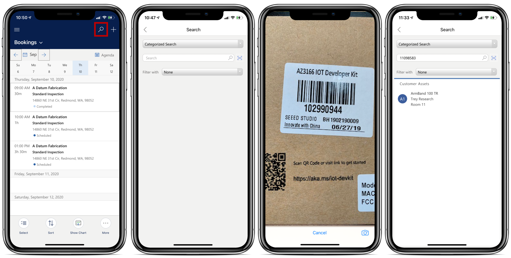

## Step 1: Add a barcode field to the form

First make sure there is a barcode field on the entity you wish to add the barcode information to or retrieve via search later on. A common example is adding a barcode field to the customer asset form which we will show in this article. 

> [!Note]
> For an additional walkthrough, see this video: [Use and configure the Dynamics 365 Field Service mobile app](https://youtu.be/tcDt_vJ5csI?t=479).
).

1. Find Field Service Mobile in your list of Dynamics 365 and select **Open in App Designer**.

> [!div class="mx-imgBorder"]
> 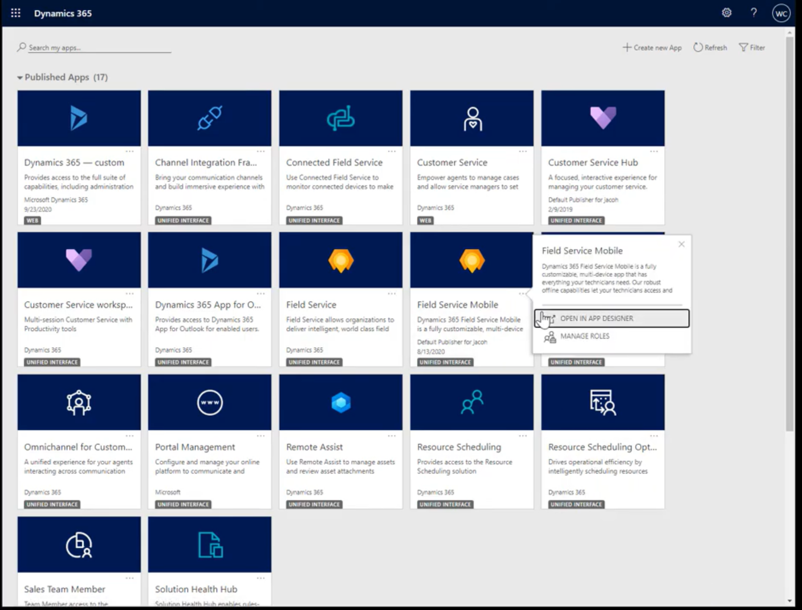

2. Go to **Edit form** and select the form you want to use barcode scanning for.

> [!div class="mx-imgBorder"]
> 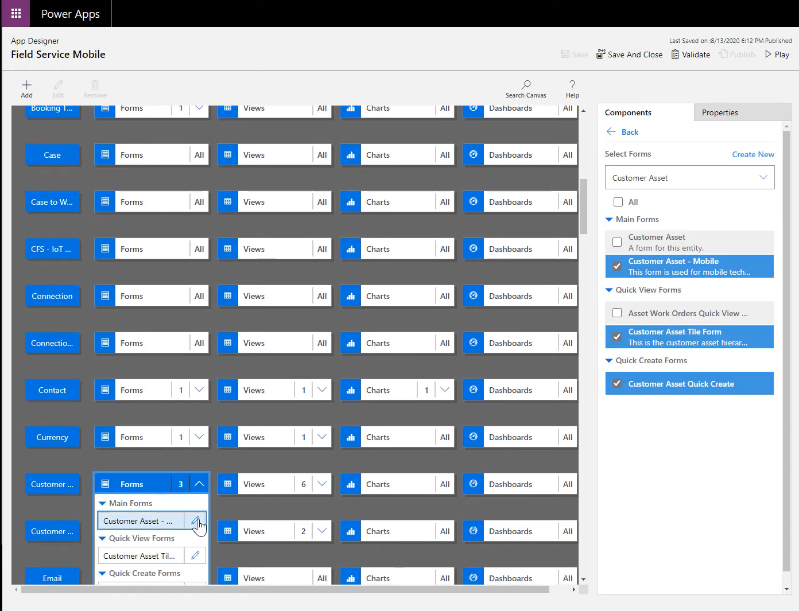

3. Add or select the field that you want to add barcode scanning to.

> [!div class="mx-imgBorder"]
> 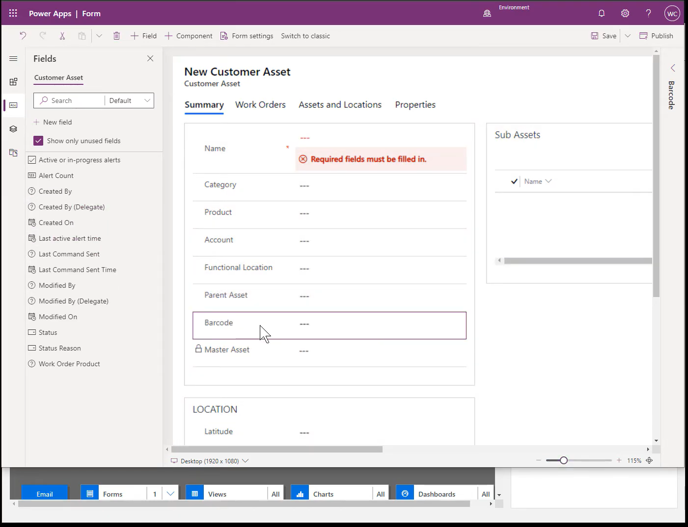

4. Save and publish all changes in the form and then switch to classic view.

> [!div class="mx-imgBorder"]
> 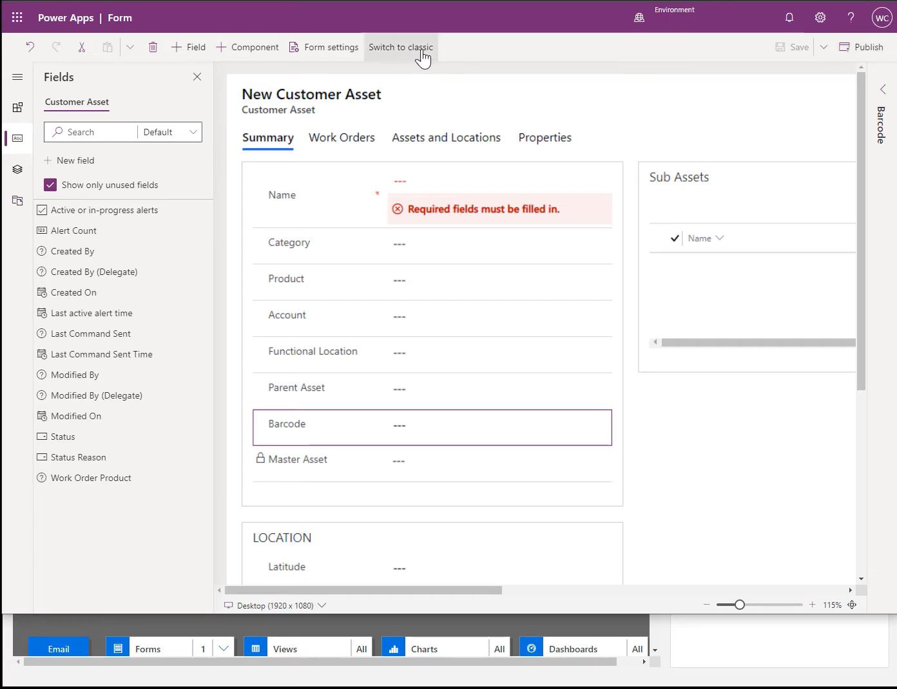

5. Select the required field and double-click on it.

> [!div class="mx-imgBorder"]
> 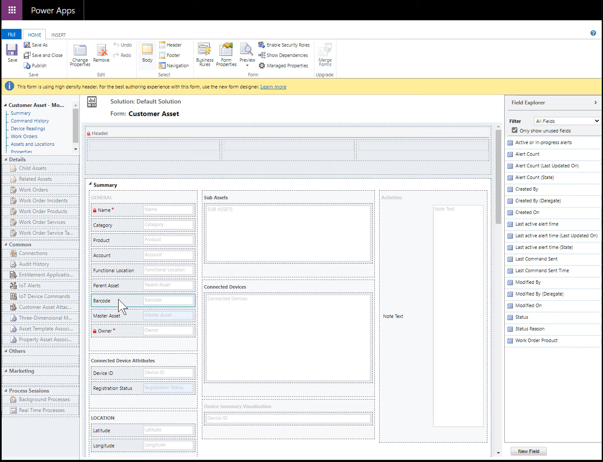

6. Go to the **Controls** tab and select **Add control**.

> [!div class="mx-imgBorder"]
> 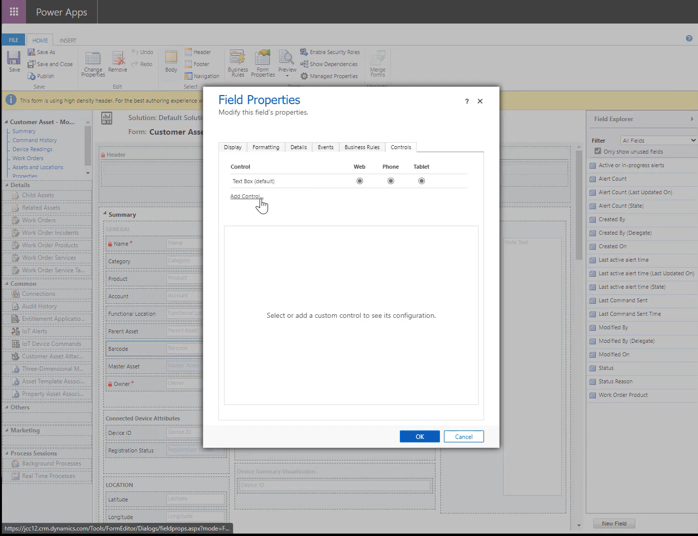

7. Select **Barcode Scanner** and add it.

> [!div class="mx-imgBorder"]
> 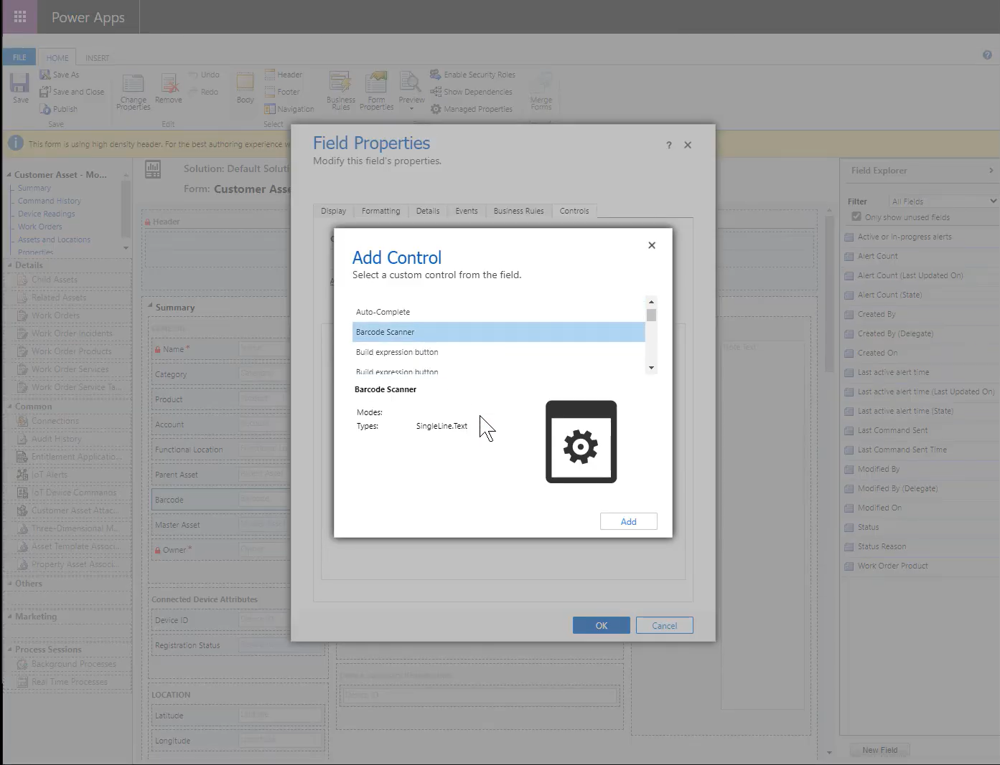

8. Enable the control for phones and tablets, then **save and publish** the changes.

> [!div class="mx-imgBorder"]
> 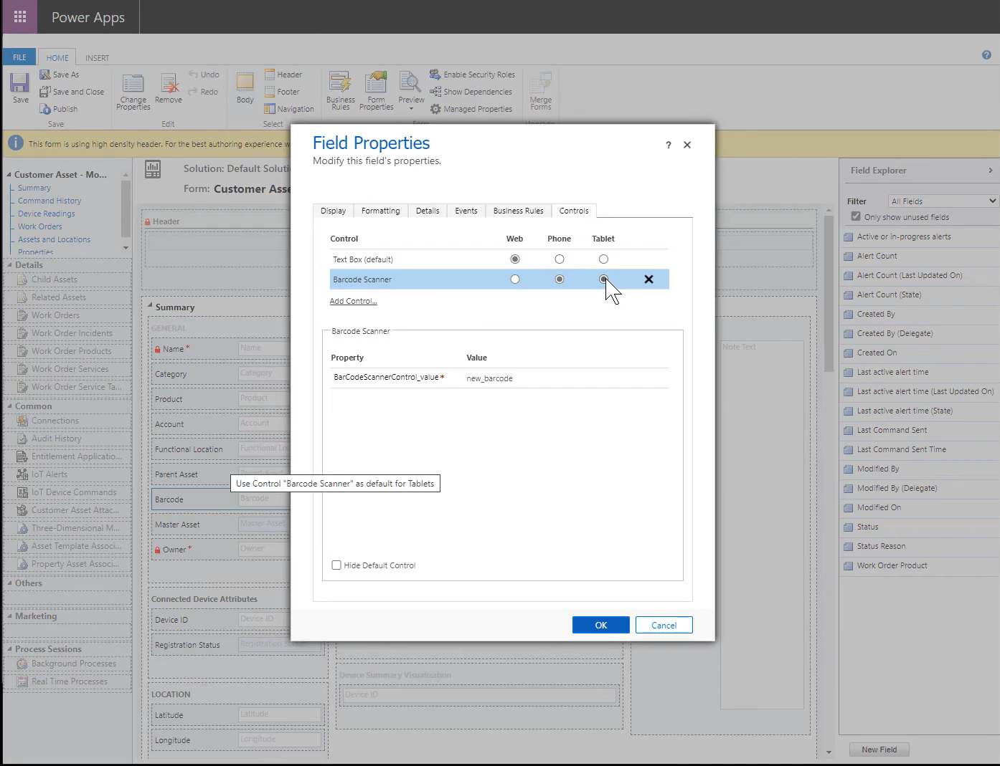

## Step 2: Test scanning a barcode to populate the field value

Back in the app, you will see the barcode enabled field as a barcode icon next to the field. Selecting the barcode icon will open the camera and read any barcode or QR code. After your device's camera successfully reads the QR code the barcode value will be populated into the field. The simply save the form. 

> [!div class="mx-imgBorder"]
> 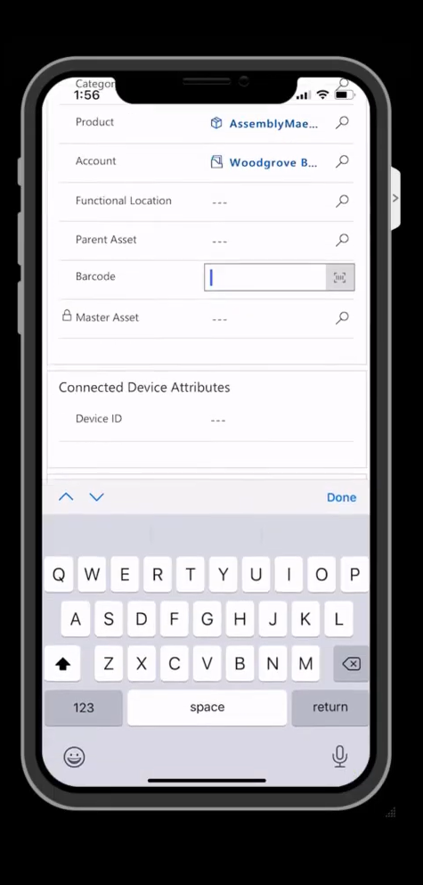

Within the mobile app you may need to go to Profile > Reconfigure to enable new published changes.

## Step 3: Enable search 

By default, Dynamics 365 Field Service is configured to search against account, contact, user, and activity. You can customize search to include additional entities, such as customer asset and product, which helps technicians search, find by keyword, and scan to search by barcode, UPC, or QR code.

You will need to:
1. Enable the entity your barcode is part of for relevance search (in our example the 'Customer Asset' entity). For more information, see [how to set up relevance search](https://docs.microsoft.com/power-platform/admin/configure-relevance-search-organization). 
2. Add the barcode-enabled field to the entities' quick find view as seen in the image below.

> [!div class="mx-imgBorder"]
> 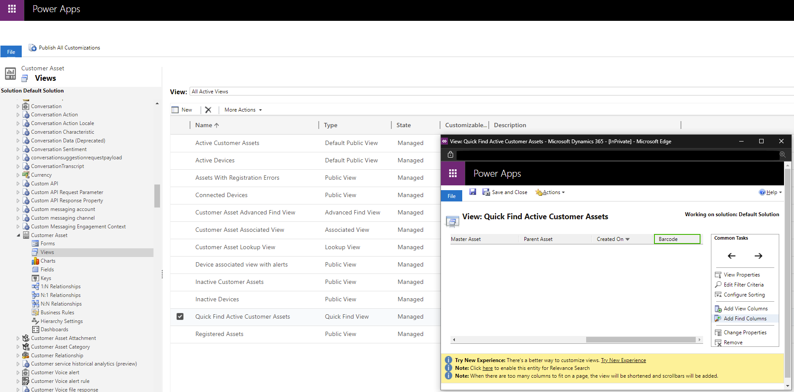

## Step 4: Test scanning a barcode to search for the record with the matching barcode

After enabling your entiity for relevance search and enabling the barcode field on the quick find view of the entity, save and publish your changes and test searching for the record via barcode.

Enter the barcode value into the barcode field.

Select the search icon at the top of the mobile app. 

Select Categorized Search then select the barcode scanning icon.

Scan the barcode and the system will search for records with a matching barcode. 

> [!div class="mx-imgBorder"]
> 

> [!Note]
> If you are using offline first the record will need to be included in your offline profile and downlaoded to the device to display in search results. 

[!INCLUDE[footer-include](../includes/footer-banner.md)]