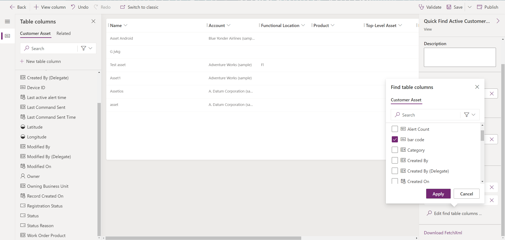

# Barcode scanning and global search

Technicians can use the Field Service (Dynamics 365) mobile app to scan barcodes.

By scanning barcodes, technicians can:

1. Enter a field with the barcode value to facilitate data entry
2. Search the database for records that match the barcode for easy lookup.

> [!div class="mx-imgBorder"]
> 

## Step 1: Add a barcode field to the form

First, make sure there is a barcode field on the record type you want to add the barcode information. A common example is adding a barcode field to the customer asset form, which we'll walk through in this article.

> [!Note]
> For another walkthrough, see this video: [Use and configure the Dynamics 365 Field Service mobile app](https://youtu.be/tcDt_vJ5csI?t=479).
).

1. Find **Field Service Mobile** in your list of Dynamics 365 apps and select **Open in App Designer**.

> [!div class="mx-imgBorder"]
> 

2. Go to **Edit form** and select the form you want to use barcode scanning for.

> [!div class="mx-imgBorder"]
> 

3. Add or select the field that you want to add barcode scanning to.

> [!div class="mx-imgBorder"]
> 

4. Save and publish all changes in the form and then switch to classic view.

> [!div class="mx-imgBorder"]
> 

5. Select the required field and double-click on it.

> [!div class="mx-imgBorder"]
> 

1. Go to the **Controls** tab and select **Add control**.

> [!div class="mx-imgBorder"]
> 

7. Select **Barcode Scanner** and add it.

> [!div class="mx-imgBorder"]
> 

8. Enable the control for phones and tablets, then **Save and Publish** the changes.

> [!div class="mx-imgBorder"]
> 

## Step 2: Test scanning a barcode to populate the field value

Back in the app, you'll see the barcode-enabled field as a barcode icon beside the field. Selecting the barcode icon will open the camera and read any barcode or QR code. After your device's camera successfully reads the QR code, the barcode value populates into the field. Then save the form. 

> [!div class="mx-imgBorder"]
> 

Within the mobile app you may need to go to **Profile** > **Reconfigure** to enable new published changes.

## Step 3: Enable search 

Field Service (D365) Mobile will use [Dataverse search](/powerapps/mobile/relevance-search-mobile) and include a bar code scanner option within the search view.   Dataverse search requires an active internet connection. If the device has no connectivity, the search experience will fall back to [categorized search](/powerapps/user/quick-find) experience.

> [!Note]
> Currently Dataverse search does not function on Tablet devices. If your organization uses Tablets it is recommended you [opt out](/power-platform/admin/configure-relevance-search-organization#enable-dataverse-search) of Dataverse search and use categorized search. 

By default, Dynamics 365 Field Service is configured to search against activity, contact, user, customer asset, incident type, work order, and IoT alert/device. You can customize search to include additional record types, such as products. Expanding search parameters can help technicians search, find by keyword, and scan to search by barcode, UPC, or QR code.

To enable a new bar code field for search within a table:

1. If the desired table is not enabled for search, [follow these steps](/power-platform/admin/configure-relevance-search-organization#select-tables-for-dataverse-search) to enable the table for search. 
2. Add the barcode-enabled field to the [table's quick-find view](/power-platform/admin/configure-relevance-search-organization#select-searchable-fields-and-filters-for-each-table).
3. Save and publish changes.

> [!div class="mx-imgBorder"]
> 

## Step 4: Test search by barcode

1. Enter the barcode value into the barcode field.

2. Select the search icon at the top of the mobile app. 

3. Select the barcode scan icon on the search screen.

4. Scan the barcode, and the system will search for records with a matching barcode. 

> [!div class="mx-imgBorder"]
> 

> [!Note]
> If you're using offline first the record will need to be included in your offline profile and downloaded to the device to display in search results.

## Other considerations

- Custom integration using barcode can be accomplished on mobile devices with [getBarcodeValue API](/power-apps/developer/model-driven-apps/clientapi/reference/xrm-device/getbarcodevalue).
- Currently, global search with barcode scanning is not available on tablet and Windows versions of the app.

[!INCLUDE[footer-include](../includes/footer-banner.md)]
