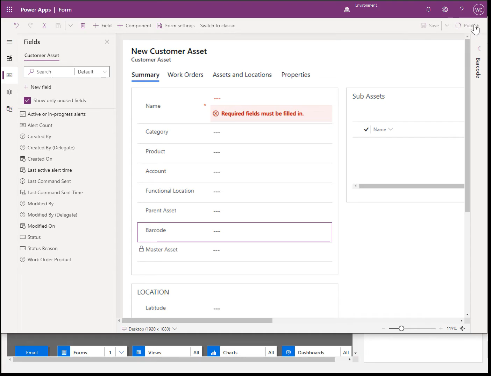
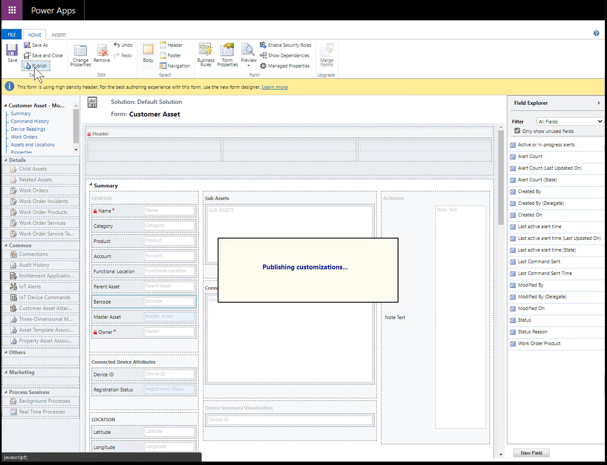

# Barcode scanning and global search

Technicians can use the Dynamics 365 Field Service mobile app to scan barcodes.

Technicians can scan barcodes to:
1. enter a field with the barcode value to speed up data entry
2. search the database for records that match the barcode for easy lookup.

> [!div class="mx-imgBorder"]
> 

## Step 1: Enable global search

By default, Dynamics 365 Field Service is configured to search against account, contact, user, and activity. You can customize global search to include additional entities, such as customer asset and product, which helps technicians search, find by keyword, and scan to search by barcode, UPC, or QR code.

For more information, see: [How to Setup Global Search](https://community.dynamics.com/crm/b/xrm/posts/how-to-set-up-global-search-in-microsoft-dynamics-365)

## Step 2: 
After enabling global search, ensure there is a barcode field on the entity you wish to search via barcode scan. A common example is adding a barcode field to the Customer Asset form. 

Follow the steps below or see the following video for more details [Use and configure the Dynamics 365 Field Service mobile app](https://youtu.be/tcDt_vJ5csI?t=479). 

1. Go to &#39;Field Service mobile&#39; model drive app and select &#39;Open in App Designer&#39;

> [!div class="mx-imgBorder"]
> 

2. Go to Edit form and select the form which have the field that you want to utilize for barcode scanning.

> [!div class="mx-imgBorder"]
> 

3. Add a field or select the field that you want to add &#39;Barcode scanning&#39; to

> [!div class="mx-imgBorder"]
> 

4. Save and Publish all changes in the form and then &#39;Switch to Classic&#39; view

> [!div class="mx-imgBorder"]
> 

> [!div class="mx-imgBorder"]
> 

5. Select the required field and double click on it

> [!div class="mx-imgBorder"]
> 

6. Go to &#39;Controls&#39; tab and click on &#39;Add control&#39;

> [!div class="mx-imgBorder"]
> 

7. Select &#39;Barcode scanner&#39; control and add it

> [!div class="mx-imgBorder"]
> 

8. Enable the control for mobile and tablet, Save and Publish the changes

> [!div class="mx-imgBorder"]
> 

> [!div class="mx-imgBorder"]
> 

9. Now open the App, the form will have the field with the barcode scanner option. Clicking on the Barcode icon will open the camera and read any barcode/QR code.

> [!div class="mx-imgBorder"]
> 

