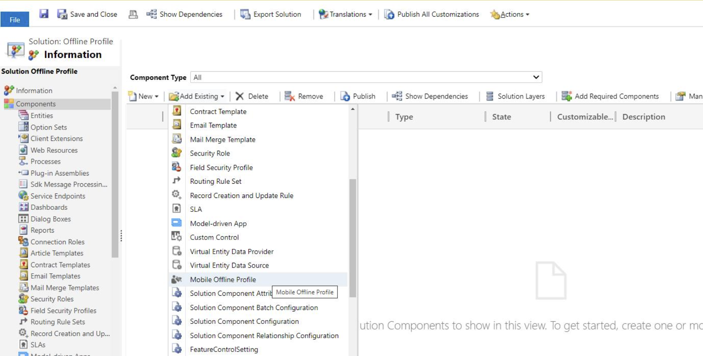

# Configure the mobile offline profile

Field Service provides an out-of-the-box offline profile called **Field Service Mobile - Offline Profile** with recommended default settings for Field Service record types. Learn more about [offline profile guidance](/power-apps/mobile/mobile-offline-guidelines).

Administrators control what data the Field Service mobile app downloads with the offline profile. Within the offline profile, you can:

- Define record types that are available offline and their sync interval.
- Define filters for each record type. For example, by default the offline profile downloads bookings that start within the next seven days to the device.
- Set up item association by creating relationships between tables. Item association saves time because not every record type needs a filter. You can associate related record types that follow filters set on the related record type.

## Prerequisites

- You have admin privileges in Dynamics 365 Field Service.
- You have access to Power Apps.

## Customize the default mobile offline profile

1. Review the [implementation guidance for the offline profile](mobile-power-app-system-offline.md#implementation-guidance-for-the-offline-profile).

1. Go to Power Apps at [https://make.powerapps.com/](https://make.powerapps.com/), and select your environment.

1. Select **Apps** > **Field Service Mobile**.

1. Select **Settings** and the **General** tab.

1. Scroll to **Select offline mode and profile**.

1. Choose which users should have access to the mobile app offline:

   - **Default (recommended)**: All your users who have access to the app can also use it in offline mode.
   - **Restricted to selected users**: Restrict access to the app in offline mode to certain users. [Add users and teams](/power-apps/mobile/setup-mobile-offline#add-users-to-an-offline-profile). You can only add a user or a team to one offline profile one at a time.

     The security role for users and teams needs read permission for the *UserMobileOfflineProfileMembership* and *TeamMobileOfflineProfileMembership* privileges.

1. Select the ellipsis next to the **Field Service Mobile - Offline Profile**, and then select **Edit selected profile**.

   :::image type="content" source="media/fs-mobile-power-apps-edit-offline-profile.png" alt-text="Power Apps screenshot showing Settings for the Field Service Mobile app and edit the offline profile":::

1. Review the **Data for offline use**. For each table:

   1. Select a table and select **Edit**.

      :::image type="content" source="media/fs-mobile-power-apps-offline-table-edit.png" alt-text="Power Apps screenshot showing Settings for the Field Service Mobile app and a table from the offline profile":::

   1. View the filters, relationships, and sync interval.

      For example, the **Bookable Resource Booking** table has a data download filter set to **custom data filter** that downloads resource bookings that start or end in the next seven days or today.

      :::image type="content" source="media/fs-mobile-power-apps-filter-logic.png" alt-text="Power Apps screenshot showing Settings for the Field Service Mobile app and filter logic from the offline profile":::

   1. If necessary, make changes.

   1. To add a table, see [Add a table to an offline profile](/power-apps/mobile/setup-mobile-offline#add-a-table-to-an-offline-profile-and-apply-filters).

      > [!NOTE]
      > The default offline profile is updated periodically as part of Field Service updates. If you edited the offline sync filter of a table, the table's sync filter won't receive updates; other table sync filters that haven't been edited will receive updates in an unpublished state. Administrators can review the updates and decide if they want to take the update or continue with the previous sync filters. This only applies to sync filters. Relationships will receive updates while keeping your specific changes.

1. Save the offline profile.

You can create additional [offline profiles](/power-apps/mobile/setup-mobile-offline#set-up-a-mobile-offline-profile) to enable scenarios where different user roles have different sync settings or tables available to them. For example, a Field Service manager may require seeing a broader scope of work orders that may not be assigned to the current operator of the mobile app. If you create a new offline profile, you'll need to add it to the Field Service mobile app in the app designer as well.

## Move a mobile offline profile between environments

To control changes and keep your offline profiles in sync, your organization might require making changes to your mobile offline profile in one environment and then moving that profile into other environments.

1. Go to Power Apps at [https://make.powerapps.com/](https://make.powerapps.com/), and select your environment.

1. Select **Apps** > **Field Service Mobile**.

1. Select **Settings** and the **General** tab.

1. Scroll to **Select offline mode and profile**.

1. Select the ellipsis next to the **Field Service Mobile - Offline Profile**, and then select **Copy selected profile**.

1. Modify your copied profile as needed.

1. Create a managed solution that includes the mobile offline profile.  
   - In Dynamics 365, go to **Settings** > **Solutions** > **Create a new solution**.
   - Within the new solution, **Add Existing** > **Mobile Offline Profile**.

1. Export the managed solution containing the mobile offline profile from the original environment.

1. Import the managed solution into the new environment.

> [!div class="mx-imgBorder"]
> 

[!INCLUDE[footer-include](../includes/footer-banner.md)]
