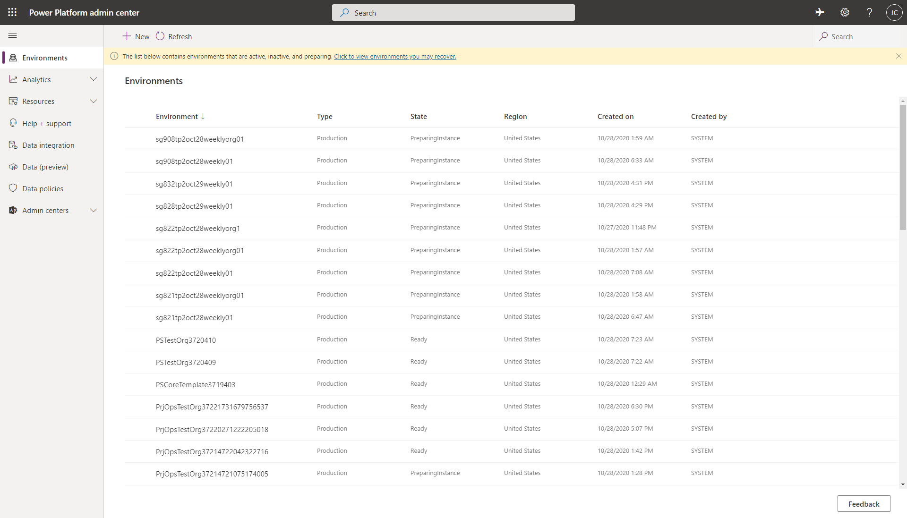
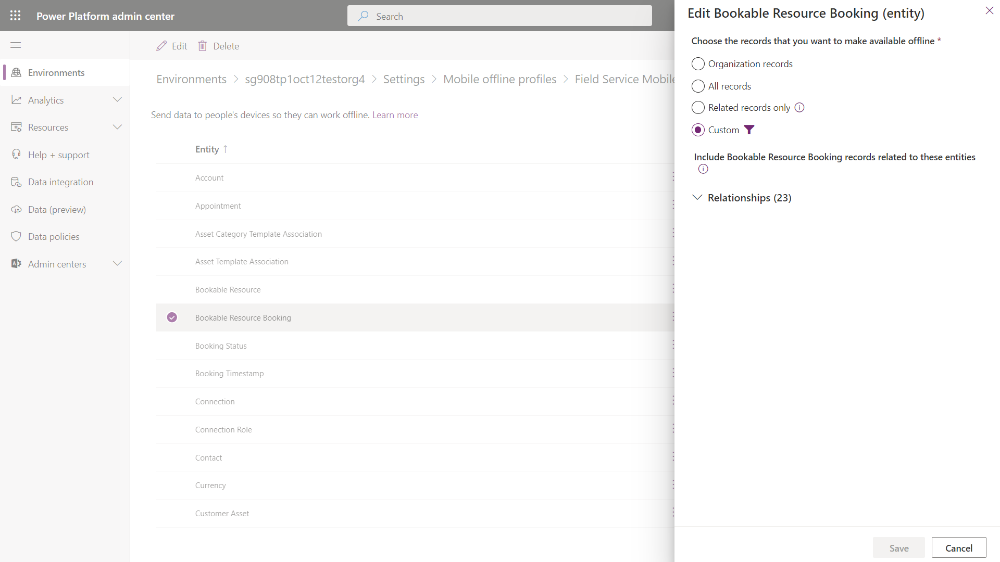

# Configure offline data and sync filters for the Field Service (Dynamics 365) mobile app

Administrators can control what data is downloaded to the Field Service (Dynamics 365) mobile app in offline mode when no internet access is available. Offline configuration is achieved by:

1. Setting up an offline profile (one exists by default).
2. Adding users to the offline profile.
3. Publishing the offline profile.
4. Adding the offline profile to the Field Service Mobile model-driven app. 

> [!div class="mx-imgBorder"]
> 

> [!Note]
> When the technician has internet connectivity, data on the device will automatically be refreshed at a minimum interval of five minutes.

For more information on offline profiles, see the article on [setting up mobile offline synchronization](https://docs.microsoft.com/dynamics365/mobile-app/preview-setup-mobile-offline).


For a guided walkthrough, check out the following video.

> [!VIDEO https://www.microsoft.com/videoplayer/embed/RE4J8no]

## Set up an offline profile

Go to the Power Platform admin center at [https://admin.powerplatform.microsoft.com/](https://admin.powerplatform.microsoft.com/), and find and select your environment.

> [!div class="mx-imgBorder"]
> 

Select **Settings** at the top.

> [!div class="mx-imgBorder"]
> 

Go to **Users + permissions section** > **Mobile configuration**.

> [!div class="mx-imgBorder"]
> 

Offline entities, relationships, and user assignment are managed through your **Offline Profile**. Field Service provides an out-of-the-box offline profile called **Field Service Mobile - Offline Profile** with recommended default settings for common Field Service entities. This profile can be updated based on unique business needs.

Within your offline profile you can:

- Define entities that are available offline.
- Define filters for each entity. For example, by default we set a filter to only get the bookings entity within a range of seven days before or after current date.
- Set up item association by creating relationships between entities. Item association saves time because you won't need to set filters for every entity; you can associate related entities that follow filters set on the related entity.

> [!div class="mx-imgBorder"]
> 

## Add users to the offline profile

Open the **Field Service Mobile - Offline Profile**.  

Add the users who need to work offline in the right **People with offline access** panel. Users must be added here in order to download data offline.

> [!div class="mx-imgBorder"]
> 


## Edit the offline profile

For each entity, you can choose a data download filter:

1. Download related data only.
2. All records.
3. Other data filter.
4. Custom data filter.

> [!div class="mx-imgBorder"]
> 

For example, the **Bookable Resource Booking** (in other words, the booking) entity has a data download filter set to **custom data filter** that downloads resource bookings that start or end in the next seven days or today.

> [!div class="mx-imgBorder"]
> 

**Save and Publish** the offline profile.

> [!Note]
> The default offline profile is updated periodically as part of Field Service updates. If you edited the offline sync filter of an entity, the entity's sync filter will not receive updates; other entity sync filters that have not been edited will receive updates in an unpublished state. Administrators can review the updates and decide if they want to take the update or continue with the previous sync filters. This only applies to sync filters and relationships will receive updates while keeping your specific changes.


For more information on offline profiles, see the article on [setting up mobile offline synchronization](https://docs.microsoft.com/dynamics365/mobile-app/preview-setup-mobile-offline).

## Sync filters

Define how often the app will automatically attempt to sync changes and download new records for each entity. By default, the mobile app will attempt to sync changes and download new records every five minutes.


> [!div class="mx-imgBorder"]
> 


## Add the offline profile to the app

Go to your Dynamics 365 apps by going to ```yourenvironment.crm.dynamics.com/apps```, then go to the app designer for Field Service Mobile.

> [!div class="mx-imgBorder"]
> 

Go to **Properties** and add the offline profile you published if it is not already there.

> [!div class="mx-imgBorder"]
> 

> [!Note]
> Field Service customers can create additional offline profiles to enable scenarios where different user roles have different sync settings or entities available to them. For example, a Field Service manager may require seeing a broader scope of work orders that may not be assigned to the current operator of the mobile app. If you create a new offline profile, you'll need to add it to the Field Service Mobile app in the app designer as well.

## Sync conflicts 

Sync conflicts can happen if there is a mismatch between data on the device and data on the server. For example, when a frontline worker edits a work order on their mobile app and a back-office dispatcher edits the same work order on their computer, neither of these modifications have yet been synchronized between them. Which modification should be applied to the record, both in the app and on the server, after the next synchronization takes place?

Conflict errors can be resolved based on the settings set by the administrator. A conflict is raised at the entity level and not per field.

To set conflict detection, go to **Settings** > **Mobile Offline** > **Mobile Offline Settings** and the **Mobile Client** tab.

> [!div class="mx-imgBorder"]
> 

### Set conflict detection for mobile offline synchronization

- **No**: Data on the client device (mobile app) wins and there will be no sync errors. This setting is the default.

- **Yes**: Data on the server wins. The technician using the app may see errors informing them of conflict. In this case, while syncing changes to the server, you might see some errors that are automatically resolved. Client changes are overwritten by server values. Data on the device may be overwritten by data from the server. In this case, while syncing changes to the server,

> [!div class="mx-imgBorder"]
> 


## Configuration considerations

#### Copy the offline profile 

While we recommend making changes directly to the default offline profile to receive updates, you can also copy the offline profile and make offline filter changes in the copy. The copy is considered unmanaged and will not receive any updates. If you make changes to the default offline profile and want to see the latest unadulterated offline profile, you can create a new trial of Field Service and view the included profile.

> [!div class="mx-imgBorder"]
> 


#### Known limitations

- Offline sync filters: If a record is created from the device while in offline mode, and that record does not meet filter conditions, then the record does not get resynchronized from the service until conditions are met.
- Offline sync filters: If commands or capabilities are set up to work with internet connectivity but not in offline mode, those capabilities should be reviewed to confirm they are calling correct APIs: ``` Xrm.WebApi.online```.


### See also

- [What are model-driven apps in Power Apps?](https://docs.microsoft.com/powerapps/maker/model-driven-apps/model-driven-app-overview)
- [Enable entities for mobile offline synchronization](https://docs.microsoft.com/dynamics365/mobile-app/setup-mobile-offline-for-admin#step-1-enable-entities-for-mobile-offline-synchronization)
