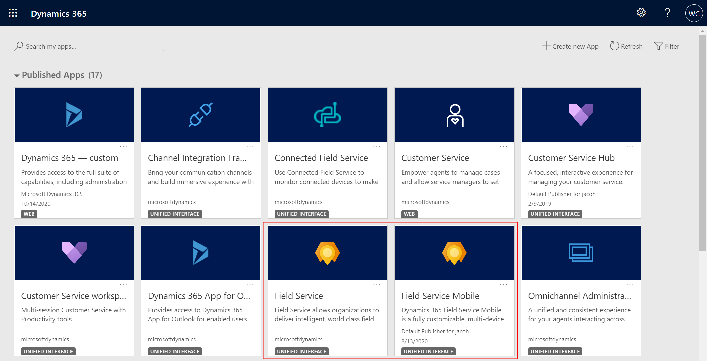

# System requirements for the Field Service (Dynamics 365) mobile app

## Field Service requirements

**Field Service v8.8.22+**

After installing or upgrading to **Field Service v8.8.22+**, the "Field Service" and "Field Service Mobile" apps will appear in the list of apps when you sign in. You can find these apps by going to:

```https://[your-environment-name].crm.dynamics.com/apps```
   
> [!div class="mx-imgBorder"]
> 

## Mobile device - supported platforms

Currently, the Field Service (Dynamics 365) mobile app is supported on the following mobile platforms.

| **Minimum required** | **Recommended** |
| --- | --- |
| iOS 13 or later | iOS 13 or later |
| Android 8 or later | Android 8 or later |

> [!NOTE]
> An important consideration before deploying the Field Service (Dynamics 365) mobile app is the hardware specification of the  device used, such as memory and processor. Modifying the app with enhancements such as custom configurations and offline javascript may place additional requirements on system memory and processor. Other factors, such as the amount of applications running on the device may also affect app performance.

[!INCLUDE[footer-include](../includes/footer-banner.md)]