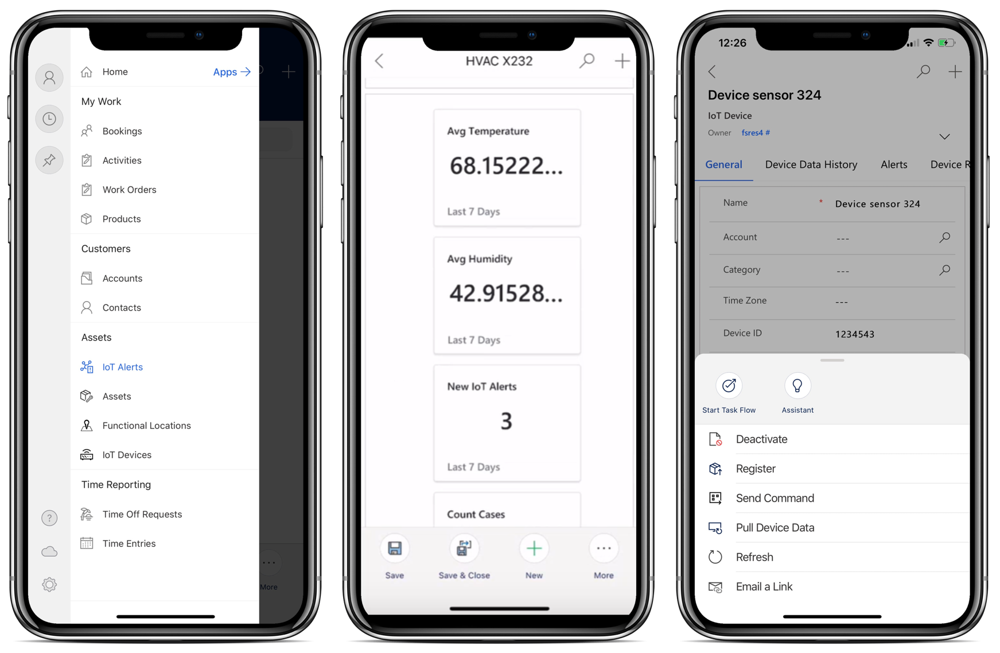
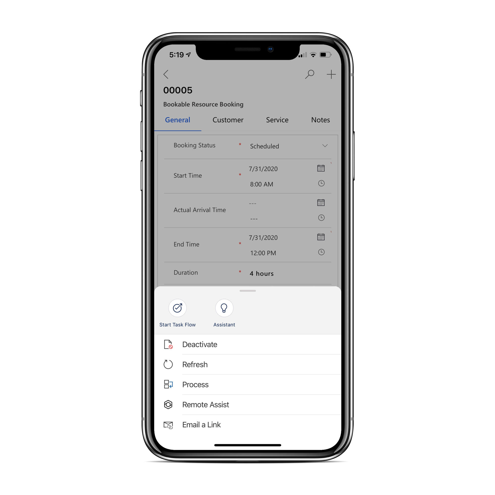

# Use the Field Service (Dynamics 365) mobile app to complete work orders

Available natively for Apple iOS and Google Android phones and tablets, as well as Windows laptops and tablets, the Field Service (Dynamics 365) mobile app offers technicians many capabilities they need to perform onsite customer service, such as:  

- A calendar view of assigned jobs.
- Support for picture, video, and asset barcode scanning.
- Customer signature capture.
- Offline capabilities so technicians can continue viewing and recording work in areas without internet.

For a guided walkthrough, check out the following video.

> [!VIDEO https://www.microsoft.com/videoplayer/embed/RE4HKRL]

## Prerequisites

Before using the mobile app, a system administrator must [install and set up the Field Service (Dynamics 365) mobile app](mobile-power-app-get-started.md) along with users and security roles.

## Download

Go to the app store on your iOS, Android, or Windows device and search for **Dynamics 365 Field Service**.

Download the app called **Field Service (Dynamics 365)**, as seen in the following screenshot.

> [!div class="mx-imgBorder"]
> 

## Sign in

Launch the app and sign in with your username and password. You can choose which region to connect to in the **Region settings**. 

Administrators should go to the articles on [setting up users and security roles](../field-service/view-user-accounts-security-roles.md) and [creating a Bookable Resource](set-up-bookable-resources.md) for help.

Upon sign-in, the app will download important Field Service information as defined by administrators.

> [!div class="mx-imgBorder"]
> 

## Home

To get to the sitemap, select the menu icon from the calendar view. From here, you can find other important information like accounts, contacts, customer assets, or to submit time entries.

> [!div class="mx-imgBorder"]
> 

## View scheduled work orders

The first screen you'll see is a calendar view of your scheduled work orders.

> [!div class="mx-imgBorder"]
> 

Select **More** > **Show as** > **Read-only Grid** to see the bookings as a list as shown on the right side of the screenshot.

## Travel to job location

Select a booking to see more details about the booking time and the work order. For example, you can update the status to **Traveling** to indicate you're driving to the customer location. ON the **Customer** tab, you can see the work order location on a map to launch turn-by-turn driving directions on your preferred maps app.

> [!div class="mx-imgBorder"]
> 

The functional location field above the address tells the technician exactly where to go within an address.

> [!div class="mx-imgBorder"]
> 

## Perform and record work

On the **Service tab**, you'll see work order details like work order service tasks, products, and services. Mark a service or service task as complete in include the products used. Adjust the product units and the service hours as needed. Selecting the service task, service, or product name will send you to the full details form.

> [!div class="mx-imgBorder"]
> 

## Take notes with attached pictures, videos and files

On the **Notes** tab, you can easily capture multiple text, photo, audio, and video notes and associate them with the booking. You can also attach files. These notes help you record and build relevant work history. Customer signatures can also be captured. The **Timeline** tab is available for other historical data connected to the booking.

> [!NOTE]
> Notes are only available when included with the Bookable Resource Booking form. The control doesn't support other entities.
> Notes taken in the Field Service mobile app are stored in the `msdyn_bookableresourcebookingquicknotes` table. The default **Field Service - Resource** security role includes permissions to this table. If your app users do not have the out-of-the-box **Field Service - Resource** security role, you may have to include access to this table for these users. Follow the best practices described in the [Field Service security roles documentation](/dynamics365/field-service/view-user-accounts-security-roles#q--a) to make sure your app users have access to this table.

> [!div class="mx-imgBorder"]
> 

## Service assets

> [!div class="mx-imgBorder"]
> 

Technicians can also view and interact with functional location and customer asset hierarchies on the mobile app.

> [!div class="mx-imgBorder"]
> 

> [!NOTE]
> Internet connectivity is required to view and interact with functional location and customer asset hierarchy trees on the Field Service mobile app.

For a guided walkthrough of functional locations on the Field Service mobile app, check out the following video.

> [!VIDEO https://www.microsoft.com/videoplayer/embed/RE4I2pU]

## Barcode scanning

Select the global search icon to search for records across accounts, contacts, work orders, customer assets, or any other entity. Technicians can also search by scanning a barcode with their phone's camera. The barcode scan will find records that have a matching barcode field.

> [!div class="mx-imgBorder"]
> 

For more information, see the article on [configuring global search](mobile-power-app-system-barcode-scanning.md).

## Work offline and update offline data

If you expect to be performing work in areas without internet access, you can download important information to your device to keep working.

Consider a scenario where a technician needs to work in the basement of an industrial complex. They'll often have limited or no internet connectivity. Working offline will download their work orders, notes, service tasks, and pictures for use without connectivity. Once connectivity is restored, new data is automatically synced back to the server. This process happens without interruption to the technician's experience.

Upon sign-in, the app will download important Field Service information as defined by system administrators.

> [!div class="mx-imgBorder"]
> 

When the **Status** is set to **Available**, you'll have all the data you need to work offline.

> [!NOTE]
> When the technician has internet connectivity, data on the device is automatically refreshed every five minutes or as configured in their mobile offline profile.

Technicians can also **Update offline data** manually by going to the home screen, selecting the offline icon in the bottom left, then selecting the **Update offline data** option.

> [!div class="mx-imgBorder"]
> 

Technicians may also want to sync specific views when they have internet connectivity. For instance:

- The technician wants to check for new bookings on their calendar before starting to drive.
- The technician wants to check for updates on a work order made by other crew members.

To sync specific views, select **Refresh** from the app's bottom menu. For example, you can refresh bookings by selecting the **Refresh** option, shown in the following screenshot.

> [!div class="mx-imgBorder"]
> 

For more information, see this article: [Offline data and Sync Filters](mobile-power-app-system-offline.md).

## Time entry

Time entry capabilities help field service organizations better track the time that technicians spend during work orders and other scenarios.

Time entries are useful for:

- reporting
- understanding utilization
- billing and invoicing for service

Technicians can view and create time entries in the mobile app.

From the main menu, go to **Time Entry**, then create a new one. In the **Type** field select whether the time entry relates to work, vacation, absence, break, and so on.  

> [!div class="mx-imgBorder"]
> 

For a guided walkthrough, check out the following video.

> [!VIDEO https://www.microsoft.com/videoplayer/embed/RE4J6mQ]

## IoT

Technicians can view and interact with IoT data and IoT actions like pulling live device data or registering new devices in the mobile app.

> [!div class="mx-imgBorder"]
> 

As seen in the following image, technicians can also view a chart of live IoT data from an IoT device, customer asset, or IoT alert record.

> [!div class="mx-imgBorder"]
> 

For more information, see the article on [Connected Field Service for the Field Service (Dynamics 365) mobile app](cfs-mobile-powerapp.md).

## Trigger Dynamics 365 Remote Assist for remote collaboration

Organizations using Dynamics 365 Remote Assist will see technicians can trigger a deep link from the work order to open the Dynamics 365 Remote Assist mobile app.

> [!div class="mx-imgBorder"]
> 

> [!div class="mx-imgBorder"]
> 

For more information, see the article: [Using Field Service with Dynamics 365 Remote Assist](remote-assist-hololens.md).

## Create follow-up work orders

While working on site, you may want to log work for another time. The Field Service (Dynamics 365) mobile app makes it easy to create follow-up work orders.

For a guided walkthrough, check out the following video.

> [!VIDEO https://www.microsoft.com/videoplayer/embed/RWyHY4]

To create a follow-up work order, select the **Follow up** option in the bottom app menu. This option is only available the user has **create** permissions for the work order table. For more information on the security roles, see [users and security roles](./view-user-accounts-security-roles.md).

> [!div class="mx-imgBorder"]
> 

The following fields are already filled in based on the current work order:

- Address
- Billing Account
- Service Account
- Service Territory
- Exchange Rate
- Tax Code
- Taxable
- Transaction Currency ID

Once the technician saves the work order, it's uploaded and available to be booked by the dispatcher.

## View work order and knowledge articles on the mobile app

Technicians find the knowledge articles on work orders in the Field Service mobile app.  Knowledge articles are available while the device has internet connectivity. They aren't available while in the [offline mode](mobile-power-app-system-offline.md).

> [!div class="mx-imgBorder"]
> 

## Home + settings

### Sign out and reconfigure

Reconfiguring the app is a good way to troubleshoot issues and remove all cached data.

Go to the main menu, then select the person icon in the top left.

Then select **Reconfigure**.

> [!div class="mx-imgBorder"]
> 

Reconfiguring deletes data and metadata for the current organization from the cache.

### Recent + pins

Use the **Recent** option in the main menu to quickly find things you recently viewed, like work orders, assets, time entries, and more. You can also "pin" important records for easy access.

> [!div class="mx-imgBorder"]
> 

### Change personal settings

You can change the time zone for the app right in the app settings. Select your account picture and select **Settings**. Choose the **Time Zone** you want the app to use. Close and restart the app for the changes to take effect.

To change the app language, use the [personalization options in Power Platform](/power-apps/user/set-personal-options#languages-tab-options). You can't change the language in the Field Service mobile app.

[!INCLUDE[footer-include](../includes/footer-banner.md)]
