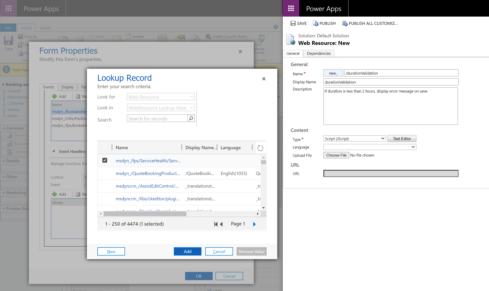
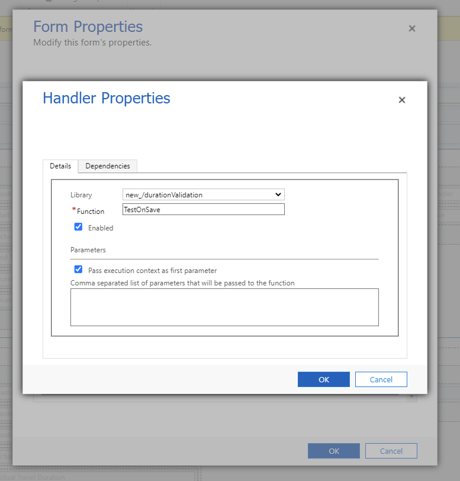

# Workflows and scripts for the Field Service (Dynamics 365) mobile app

Administrators can use processes like Dynamics 365 workflows, Power Automate flows, JavaScript, and business rules and actions to help frontline workers and automate business processes. Some processes will work when the mobile app is running in [offline first](mobile-power-app-system-offline.md) and others require internet connectivity. For more information, see this article: [Mobile offline capabilities and limitations](/power-apps/mobile/offline-capabilities).

## Dynamics 365 workflows and Power Automate flows

Workflows and flows are commonly used to run data validations and autopopulate data based on triggers and conditions. There are many things to consider when creating workflows and flows. Many Dynamics workflows are being replaced with Power Automate flows, so we recommend trying Power Automate flows first to be more future-proof. For more information, see this article: [Comparison of workflows and flow](/power-automate/replace-workflows-with-flows).

Workflows and flows only run with an internet connection. Workflows and flows run when the mobile app is online or in **Offline First** with internet connection. The mobile app can only run online when there's no offline profile configured. When the app is running in **Offline First** with an internet connection, the user can execute workflows and flows by first saving the record; when saved, the changes are synced to the server, which triggers the workflow or flow on the server. The user can then sync the offline data manually or wait for next sync cadence (5 minutes by default) to pull down the results of the workflow or flow.

## Business rules

You can create business rules and recommendations to apply form logic without writing JavaScript code or creating plugins. Business rules provide a simple interface to implement and maintain fast-changing and commonly used rules. They can be applied to main and quick create forms.

Business rules will run online, offline first with internet connection, and offline first without internet connection.

## Actions

With actions, you can perform operations, such as create, update, delete, assign, or perform action. Internally, an action creates a custom message. Developers refer to these actions as "messages". Each of these messages is based on actions taken on a record type. If the goal of a process is to create a record, then update it, and then assign it, there are three separate steps.

Actions will only run when the app is running online.

## Offline JavaScript

JavaScript web resources can be added to mobile forms and downloaded with Offline First for both iOS and Android apps.

JavaScript will run Online, Offline First with internet connection, and Offline First without internet connection (basically all the time).

> [!TIP]
>
> - Refer to [Mobile offline capabilities and limitations](/power-apps/mobile/offline-capabilities) for any potential limitations by platform for WebResources in offline mode.


## Offline JavaScript example

An organization may want to run validation on certain field values after a technician updates an entity. The example below ensures a work order booking lasts at least two hours once saved.

Validation can be done with the help of some JavaScript which works online and offline.

See the video on [Field Service (Dynamics 365) mobile app: Offline JavaScript](https://youtu.be/tUdL5YZA29A) for more details.

1. In Dynamics 365 Field Service, select **Advanced Settings**.

1. Go to **Customization** > **Customizations** and select **Customize the System**.

1. Expand **Entities** > **Bookable Resource Booking** > **Forms**.

1. Select the **Booking and Work Order** form.

1. Select **Form Properties** in the top ribbon.

> [!div class="mx-imgBorder"]
> 

1. **Add** and **Create** a new JavaScript web resource for the form.

1. Enter in the following code snippet:

    ```javascript
    
            function TestOnSave(executionContext) {
    
                var formContext = executionContext.getFormContext(); // get formContext
                var duration = formContext.getAttribute("duration").getValue();
    
                formContext.ui.clearFormNotification("DurationErrorMessageId");
    
                if (duration < 120) {
                    executionContext.getEventArgs().preventDefault(); // Stop the Save
                    formContext.ui.setFormNotification("Duration must be greater than 2 hours", "ERROR", "DurationErrorMessageId");
            }
        }
    
    ```

1. In the event handlers section, change the event from *onLoad* to *onSave* of the form.

   > [!div class="mx-imgBorder"]
   > )

1. Save and publish the customizations.

## Debugging the mobile app

You can debug custom code using the Windows or Android application:
- Debug JavaScript with the [Windows application](/power-apps/developer/model-driven-apps/clientapi/debug-javascript-code#debug-javascript-in-the-windows-desktop-app).
- Debug JavaScript with the [Android application](/power-apps/developer/model-driven-apps/clientapi/debug-javascript-code#debug-javascript-in-mobile-apps).

[!INCLUDE[footer-include](../includes/footer-banner.md)]
