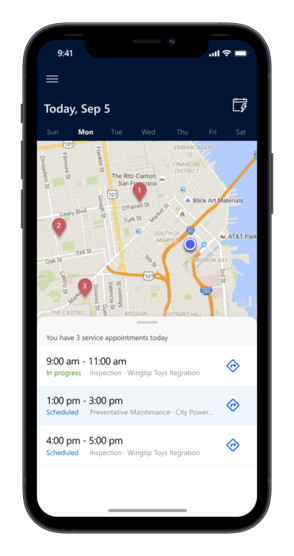
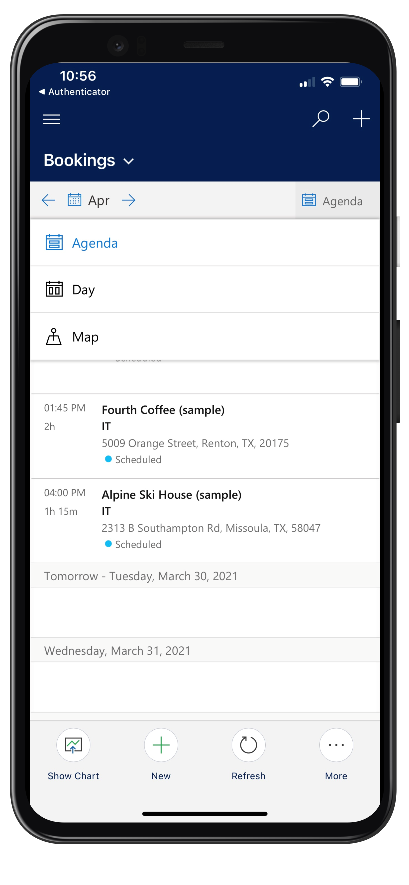
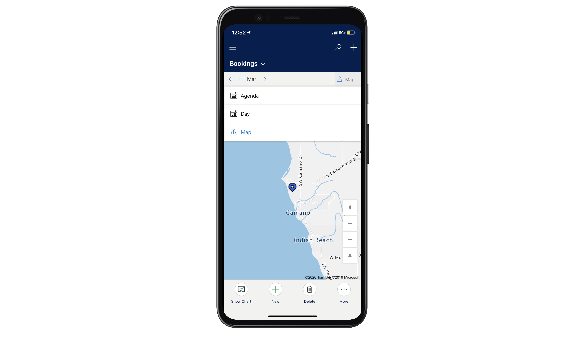
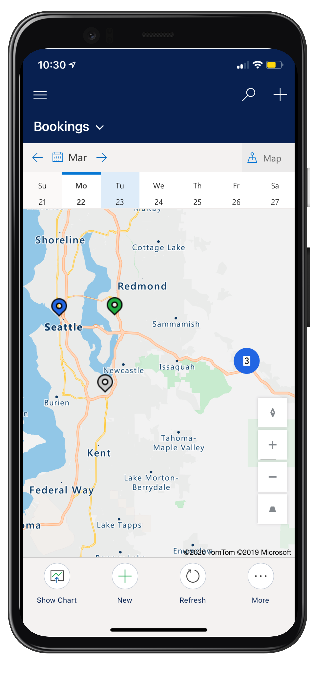
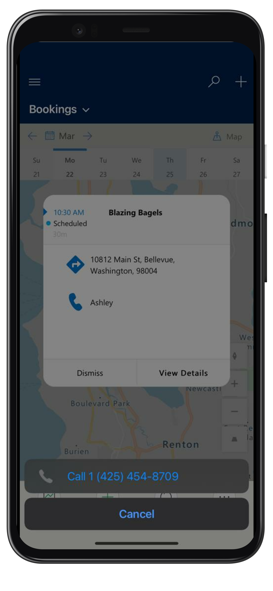
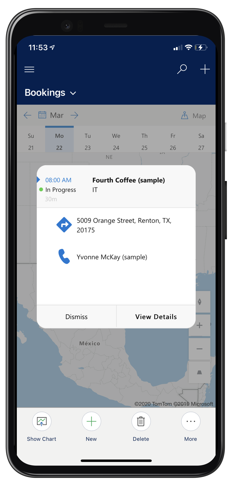
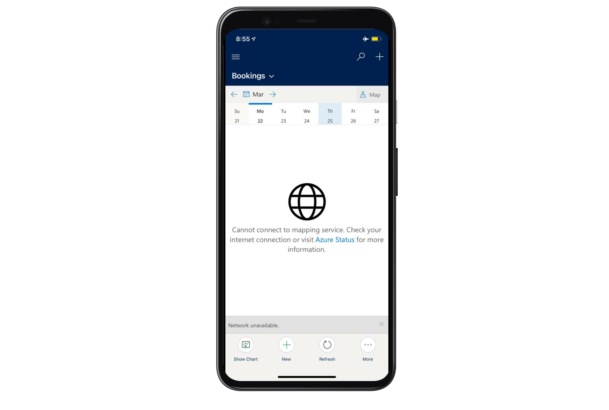

# Booking maps

Frontline workers can view their scheduled work orders on a map from the Field Service mobile app. This helps them plan their day and provides an easy way to trigger travel directions or contact the customer.  

> [!div class="mx-imgBorder"]
> 

## Prerequisites

To use Booking maps your administrator must **enable Geospatial services**. Go to [https://admin.powerplatform.microsoft.com/](https://admin.powerplatform.microsoft.com/) > select your environment > Settings > 
Product > Features. 

Set _Geospatial Services_ to **On**.

> [!div class="mx-imgBorder"]
> 

## Schedule work orders

To see bookings on a map you first need to schedule work orders.

Go to the schedule board and schedule work orders to a fronltine worker that has mobile access.

> [!Note]
> Booking maps only displays bookings related to work orders, and not bookings for other tables (entities).

## View booking map on mobile app

Log into the mobile app with the user for which work orders are scheduled to and go to Bookings from the site map. 

Select _Agenda_ in the top right of the bookings view and go to _Map_ view.

> [!div class="mx-imgBorder"]
> 

> [!div class="mx-imgBorder"]
> 

> [!div class="mx-imgBorder"]
> 

> [!div class="mx-imgBorder"]
> 

## Trigger directions or contact a customer

Tap a booking icon 

> [!div class="mx-imgBorder"]
> 

booking pin color is based on Field Service status : 

Gray : Completed/canceled
Green: Traveling, On Break, In Progress
Blue: Default or everything else

1) Verify that the Map is not enabled if the Geospatial Setting is not enabled in the PPAC. 
2) Able to switch the Day filter and users would only see the Pins (bookings) for the selected Day filter. 
3) Able to click on the Pin to show Info Card 
4) Able to see different Pin Colors based on Field Service Status (InProgress / Travelling / OnBreak = Green,  Canceled / Completed = Gray, the rest = Blue) 
5) On the popup Info Card, able to click on "View Details" to open the booking record 
6) On the popup Info Card, able to click on the Address to open the Driving Direction App 
7) If users are already on the Map view and navigate away then navigate back, users should still be on the Map View. 
8) Booking map should work in OBD (offline but with internet connection) 
9) Map view should only be visible on Mobile. 
10) Should be able to interact with the map (Zoom in/out, changing the pitch, rotating the map)

## Configuration considerations

- Booking maps will not show if mobile device is not connected to the Internet

> [!div class="mx-imgBorder"]
> 

- Booking locations are dervied from related work order address. 

## Additional Notes

### Known Issues
- If there are multiple bookings with the same address on a same day then out of the overlapped pins only the one with the latest start time can be clicked to view the info card.