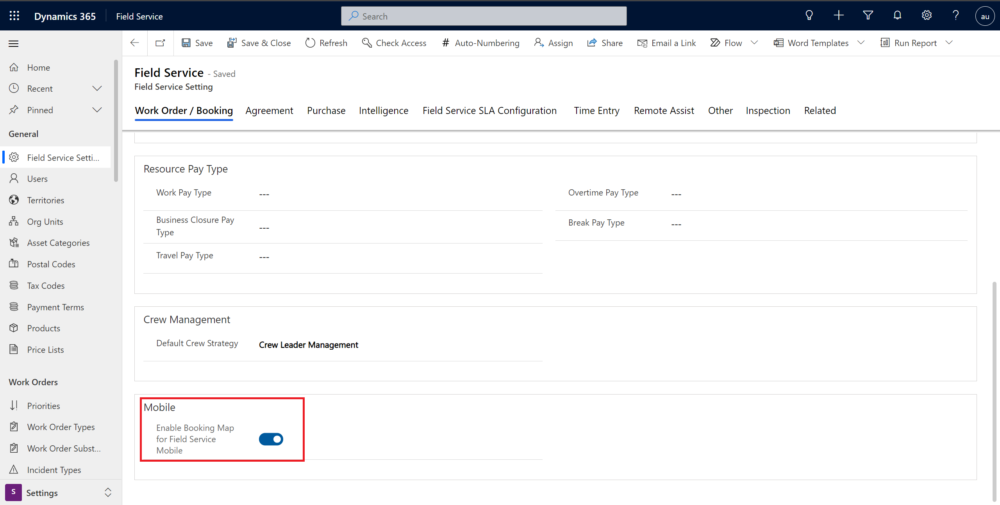

# Booking maps in Dynamics 365 Field Service 

Frontline workers can view their scheduled work orders on a map from the Field Service mobile app. Seeing their work on the map helps frontline workers plan their day and provides an easy way to trigger travel directions or contact the customer.  

> [!div class="mx-imgBorder"]
> 

## Prerequisites

To use booking maps, your administrator must enable booking maps for mobile in Field Service settings. Within the Field Service app module in Dynamics 365, go to **Settings** > **Field Service Settings** > **Work Order / Booking**. Scroll to find the toggle **Enable Booking Map for Field Service Mobile**. By switching this toggle **On**, you'll enable the booking maps feature for mobile users. 

> [!div class="mx-imgBorder"]
> 

## Schedule work orders

To see bookings on a map, you first need to schedule work orders.

Go to the schedule board and schedule work orders to a frontline worker that has mobile access.

> [!Note]
> Booking maps only display bookings related to work orders, and not bookings for other record types (entities).

## View booking map on mobile app

Sign into the mobile app as the user for which work orders are scheduled, and go to **Bookings** from the site map. 

> [!div class="mx-imgBorder"]
> 

Select **Agenda** in the top-right of the bookings view, and go to **Map** view.

> [!div class="mx-imgBorder"]
> 

For each day, the frontline worker will see a map view of their bookings. 

> [!div class="mx-imgBorder"]
> 

Pin colors represent the following statuses. 

- **Gray**: Completed or canceled
- **Green**: Traveling, on break, or in progress
- **Blue**: Scheduled and all other statuses

> [!Note]
> More specifically, the booking pin color is based on the Field Service status of the booking status. For more information, see the article on [work order and booking statuses](work-order-status-booking-status.md). 

Select a different day at the top of the view to see the bookings on a map for that day.  

## Tap booking for info card and trigger actions

Tap a booking pin to show the info card and take actions, including trigger directions or call customer. 

> [!div class="mx-imgBorder"]
> 

Select **View Details** to open the booking and work order. 

## Configuration considerations

- The booking map will not show if the mobile device is not connected to the internet. If you are connected to the internet and the booking map is still not showing, verify geospatial services are enabled as described in the prerequisites section of this article.

> [!div class="mx-imgBorder"]
> 

- Booking locations are derived from related work order address. 
- The contact in the info card is the primary contact field of the related work order.

## Additional notes

- The booking map will work when the mobile app is running offline _with_ internet access. In this case, the device is connected to the internet but is still using downloaded data. 
- The booking map is only available in the mobile app. 

### Known issues

- Field Service Mobile Boooking Maps uses Azure Maps as the map provider. Currently, Azure Maps has some coverage and localization gaps for some parts of Japan and South East Asia regions.
- If there are multiple bookings with the same address on the same day (as seen in the "3" icon in the following screenshot), tapping the cluster will bring the user to the info card of the booking with the latest start time. 

> [!div class="mx-imgBorder"]
> 

