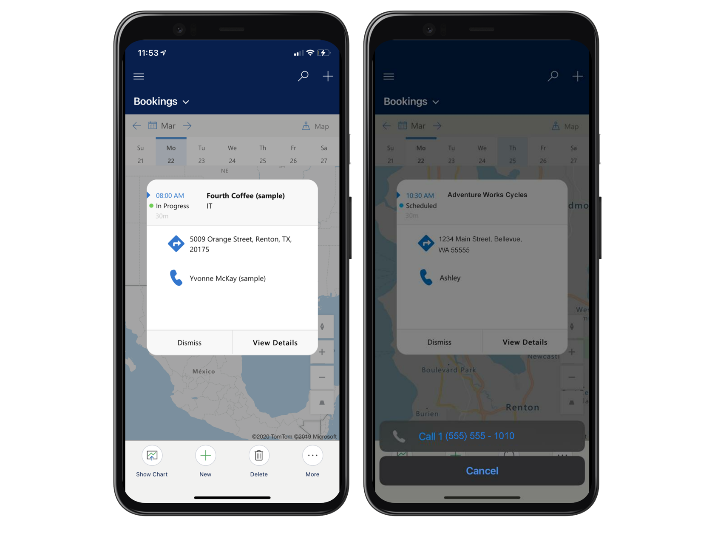

# Booking maps

Frontline workers can view their scheduled work orders on a map from the Field Service mobile app. This helps them plan their day and provides an easy way to trigger travel directions or contact the customer.  

> [!div class="mx-imgBorder"]
> 

## Prerequisites

To use Booking maps your administrator must **enable Geospatial services**. Go to [https://admin.powerplatform.microsoft.com/](https://admin.powerplatform.microsoft.com/) > select your environment > Settings > 
Product > Features. 

Set _Geospatial Services_ to **On**.

> [!div class="mx-imgBorder"]
> 

## Schedule work orders

To see bookings on a map you first need to schedule work orders.

Go to the schedule board and schedule work orders to a fronltine worker that has mobile access.

> [!Note]
> Booking maps only displays bookings related to work orders, and not bookings for other tables (entities).

## View booking map on mobile app

Log into the mobile app with the user for which work orders are scheduled to and go to Bookings from the site map. 

> [!div class="mx-imgBorder"]
> 

Select _Agenda_ in the top right of the bookings view and go to _Map_ view.

> [!div class="mx-imgBorder"]
> 

For each day, the frontline worker will see a map view of his or her bookings. 

> [!div class="mx-imgBorder"]
> 

Pin colors represent different statuses. 

**Gray** - Completed or Canceled
**Green** - Traveling, On Break, In Progress
**Blue** - Scheduled and all other statuses

> [!Note]
> Booking pin color is based on Field Service status: 

Select a different day at the top of the view to see the bookings on a map for that day.  

## Tap booking for info card and trigger actions

Tap a booking pin to show the info card and take actions including trigger directions or call customer. 

> [!div class="mx-imgBorder"]
> 

Select **View Details** to open the booking and work order. 

## Configuration considerations

- The Booking map will not show if the mobile device is not connected to the Internet. If you are connected to internet and the booking map is still not showing, verify Geospatial Services are enabled as described in the prerequsites section of this article.

> [!div class="mx-imgBorder"]
> 

- Booking locations are dervied from related work order address. 
- The contact in the info card is the primary contact field of the related work order.

## Additional Notes

- The booking map will work when the mobile app is running offline _with_ internet access. This means the device is connected to the internet but is still using downloaded data. 

### Known Issues
- If there are multiple bookings with the same address on the same day (as seen in the "3" icon in the image below) tapping the cluster will bring the user to the info card of the booking with the latest start time. 

> [!div class="mx-imgBorder"]
> 

> [!div class="mx-imgBorder"]
> 

> [!div class="mx-imgBorder"]
> 