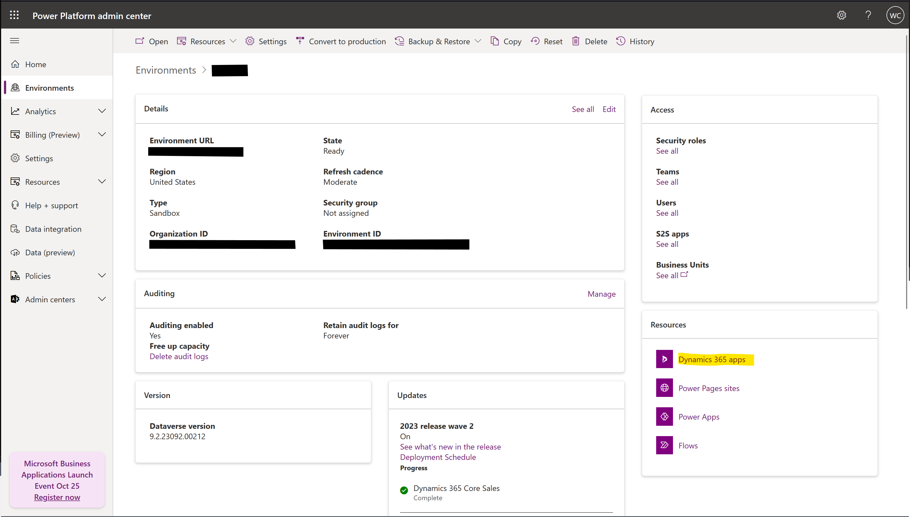
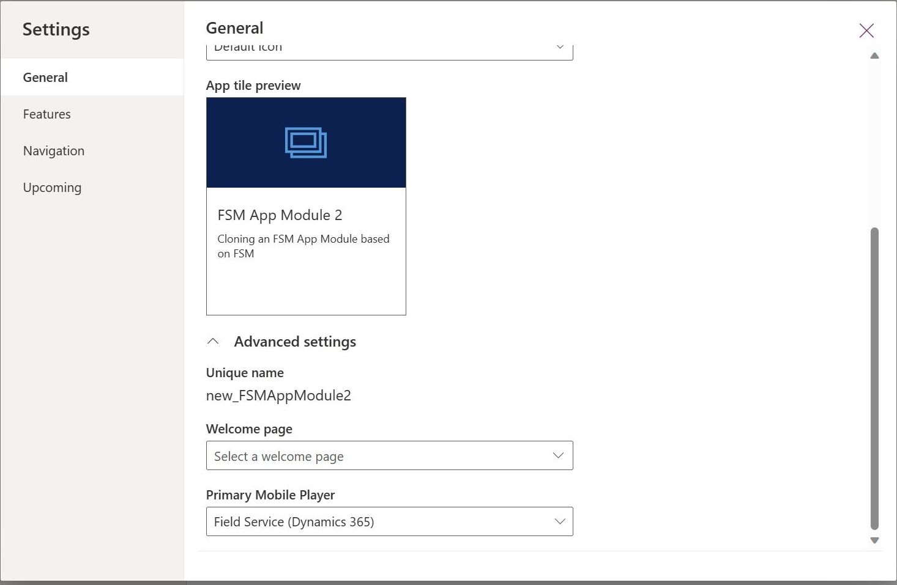

# Add a custom app module to the Field Service (Dynamics 365) mobile app

We recommend using the standard Field Service Mobile app module, in general. However, sometimes organization wants to give frontline workers access to another custom app module to enable other business use cases and processes.

In this article, you learn:

1. Creating a custom app module based on the Field Service Mobile app module.
2. Adding the custom app module to the Field Service Mobile app module.

> [!Note]
> At this time, custom app modules will not include booking travel calculations. Travel calculations must be implemented via customization if not using the standard Field Service mobile app module.

## Create a custom app module

Create a custom app module based on the Field Service Mobile app module. Reuse components and sitemap of the Field Service Mobile app, as a starting point from which you can customize your experience.

1. In Dynamics 365, go to the list of your app modules and select **+ Create New App**.

   

1. **Create a New App** opens the app designer. Enter the **Name** and other optional detail. Expand **Advanced** and **Use components from a custom solution**. Set *Field Service* as the solution *Field Service Mobile* as the sitemap. Select **Create**.

   

1. Your new app module contains all standard Field Service Mobile entities. You can now add items to the sitemap and customize your app module.

1. After adding items to the sitemap, **Publish** the app module.

## Make the custom app module available in Field Service Mobile

Once the custom app module is created, you need update the mobile app player that can access the app module.

To make the app module available to the Field Service mobile app:

1. In the App Designer, select **Settings**.

1. Under **General**, expand **Advanced settings**.

1. Set the value of **Primary Mobile Player** to *Field Service (Dynamics 365)*.

1. Close the settings dialog and **Save and Publish** your app module.

You can now find the custom app module in the app picker screen after signing in to the Field Service Mobile application.

> [!NOTE]
> If you don't see the app module:
>
> - Check the roles assigned to the app module and ensure the user accessing the app module has the same role.
> - In sandbox environments, ensure "Show non-production apps" is enabled in the mobile app.
