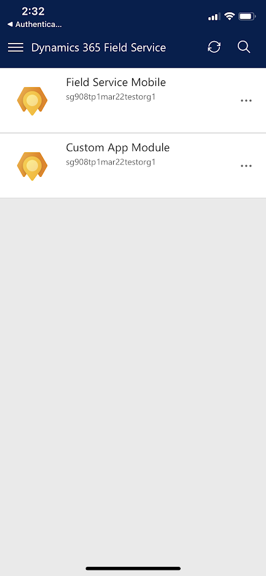
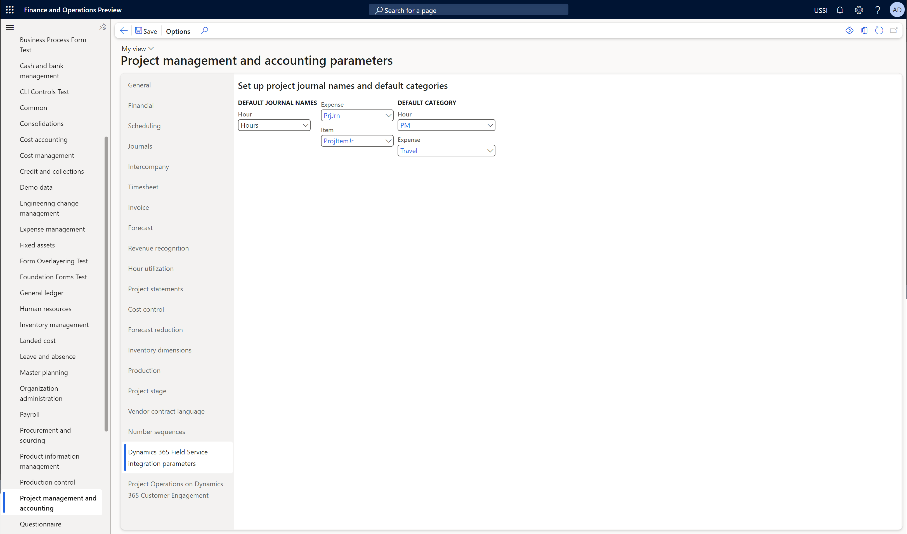
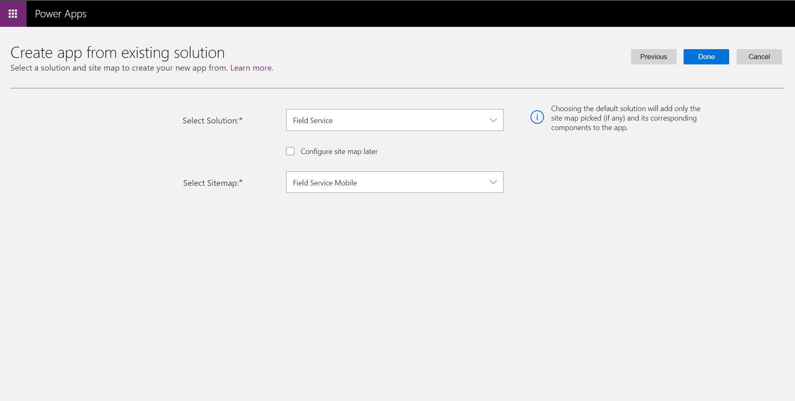
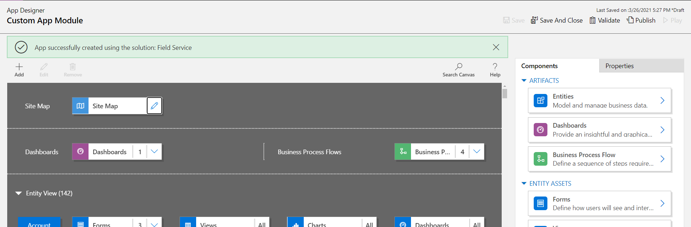
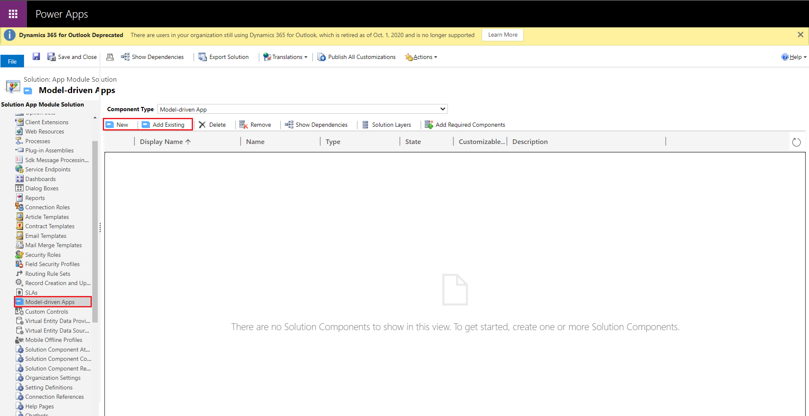

# Add a custom app module to the Field Service (Dynamics 365) mobile app

While we recommend using the standard "Field Service Mobile" app module, there may be times when an organization wants to give frontline workers access to an additional custom app module to assist in other business use cases and processes.

In this article, we'll describe how to make an additional Dynamics 365 model-driven app available to frontline workers from within the Field Service (Dynamics 365) mobile app. 

In this article, we will walk through:

1. Creating a custom app module based on the "Field Service Mobile" app module.
2. Adding the custom app module to the "Field Service Mobile" app module.

> [!Note]
> At this time, custom app modules will not include booking travel calculations. Travel calculations must be implemented via customization if not using the standard Field Service mobile app module.


## Create a custom app module based on "Field Service Mobile"

In this section, we'll create a custom app module based on the "Field Service Mobile" app module, as seen in the following screenshot. 



By leveraging the components and sitemap of the Field Service mobile app, you'll have a great starting point from which you can customize your experience.

To create a new "Field Service Mobile" app module:

1. In Dynamics 365, go to the list of your app modules and select the option to **+ Create New App**.


2.  From the **Create a New App** screen, enter your app name and other optional details. Check the option: "Use existing solution to create the App" and select **Next**.



3. The resulting screen allows you to select the solution and sitemap from which you will create the app module. For **Select Solution**, choose *Field Service* and for **Select Sitemap**, choose *Field Service Mobile*. When finished, select **Done**.



4. Your new app module will be created with all typical Field Service Mobile components. You can now begin customizing your app module. 



5. **Publish** the app module after making changes.

## Make the custom app module available in "Field Service Mobile" 

Once the custom app module is created, you'll need to tag the app module so that it's available to the Field Service mobile app and eligible for **Offline First**. 

To make the app module available to the Field Service mobile app:

1.  Associate your app module to a solution: In Dynamics 365, go to **Settings** > **Solutions** > **New**. Enter required details in the resulting screen, then save and close.

2.  After saving, you'll return to solutions. Open your new solution and scroll down to **Model-driven Apps**.

    1.  If you have already created your app module, select **Add Existing** and select your desired app module.

    2.  If you haven't yet created the app module, you can start the creation process by selecting **New**.



3.  Once the app is added to the solution, **Save and Close**, which will add your app module to the solution you created.

4.  After adding your add module to a solution, export the solution. From the solutions list, select the solution you created and **Export** from the command bar. Follow on-screen steps to export the solution package.

5.  Open the exported solution (.zip) and edit the file ```Customizations.xml```.

6.  Within ```Customizations.xml```, locate the XML node for ```< AppModule >```.

7.  Within ```< AppModule >```, insert two nodes for ```< appsettings >``` as shown below.

    1.  The first is to allow tagging the app module for the Field Service Mobile application.

        1.  ***uniquename** is ```ChannelAvailability```. The name of your new app module, which follows the format of ```[publisher prefix]_[app module unique name]_[app settings unique name]```. Or ```new_CustomAppModule_ChannelAvailability``` in our example.

        2.  **value** is set to ```FieldServiceMobile```.


    2.  The second makes the app eligible to run in **Offline First**.

        1.  **uniquename** is the name of your new app module, which follows the format of ```[publisher prefix]_[app module unique name]_[app settings unique name]```. Or ```new_CustomAppModule_ServerMode``` in our example.

        2.  **value** is the application ```ServerMode```.

```
                <appsettings>
                <appsetting uniquename="new_CustomAppModule_ChannelAvailability">
                <value>FieldServiceMobile</value>
                <iscustomizable>1</iscustomizable>
                <settingdefinitionid>
                <uniquename>ChannelAvailability</uniquename>
                </settingdefinitionid>
                </appsetting>
                
                <appsetting uniquename="new_CustomAppModule_ServerMode">
                <value>false</value>
                <iscustomizable>1</iscustomizable>
                <settingdefinitionid>
                <uniquename>ServerMode</uniquename>
                </settingdefinitionid>
                </appsetting>
                </appsettings>

```

8.  Save the updated XML file and readd to the .zip file of your solution.

9.  Import the solution .zip back into your Dynamics 365 organization.

10. After successfully tagging your application for Field Service mobile, you should now see the app module in the app picker screen when after signing into to the app.


