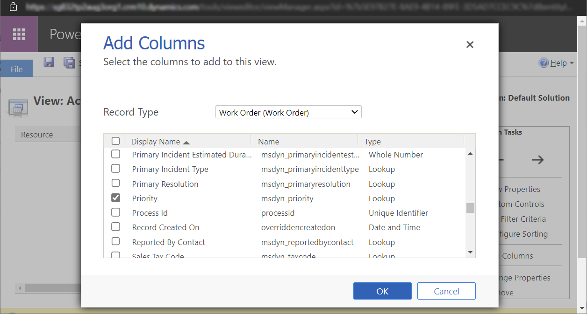
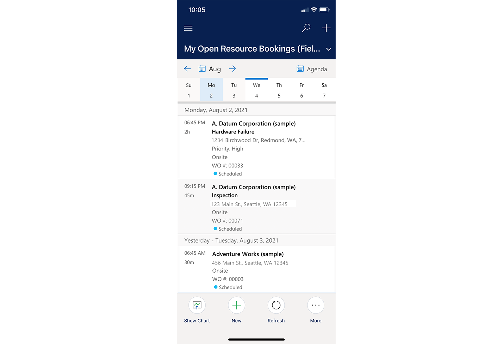
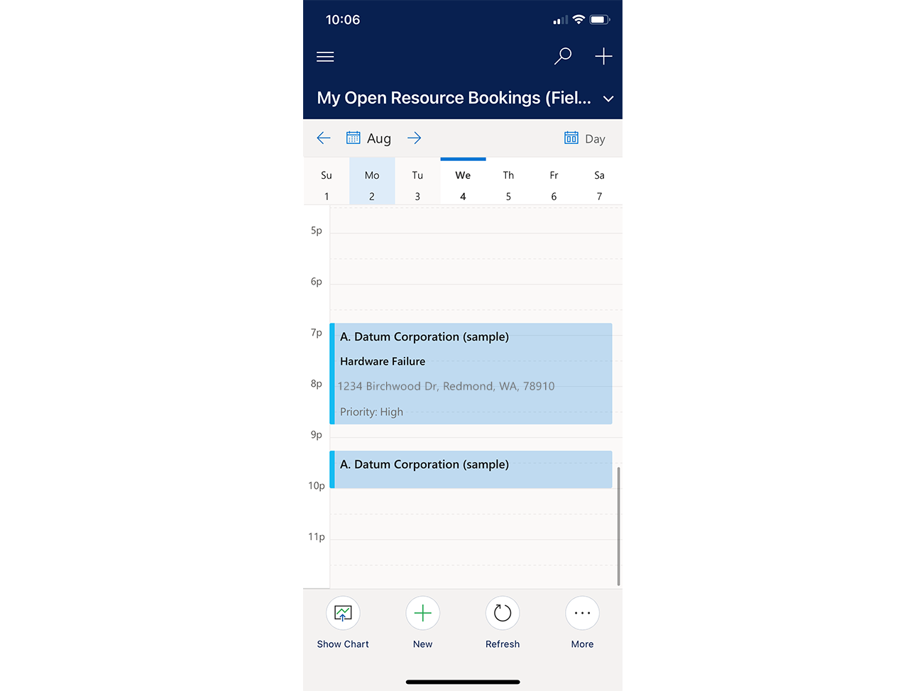
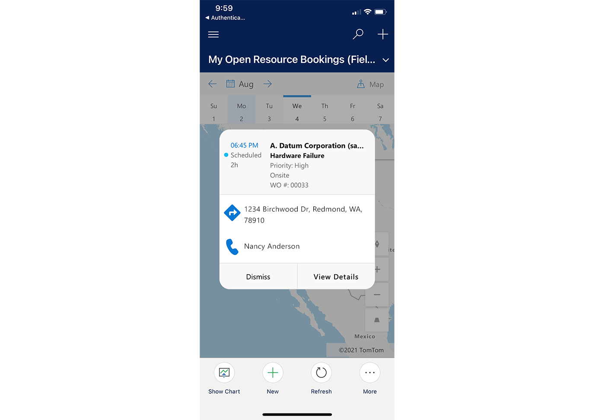

# Edit the bookings calendar columns on the Dynamics 365 Field Service mobile app

By default, the booking calendar control shows the following details associated with the booking:

- **Account**
- **Incident Type**
- **Address**
- **Booking Status**
- **Start Time and Duration**

You can customize this control to include up to three more fields with optional labels, in addition to changing the incident type, which is referred to as "Primary Custom Field." The new fields can be modified to show data from any column in a view of the **Bookable Resource Booking**.

For a guided walkthrough, check out the following video.

> [!VIDEO https://www.microsoft.com/videoplayer/embed/RWJJdl]

> [!Note]
> If you're using the mobile app offline, be sure the record types from which attributes are included on the calendar are also included in your mobile offline profile.

To customize the control, edit your view associated with the mobile application with data you want to expose on the booking calendar control.

To setup your view, go to **Field Service** > **Settings** > **Customization** > **Customize the System** > **Entities** and select **Bookable Resource Booking**.

Select **Views**, then select the view for mobile. By default, this is typically the **Bookings** view, but it can be customized by the administrator. 

From the view, you can then add any column from tables (Entities) that have a relationship to the bookable resource booking. For example, if you wanted to show **Work Order Priority**, select **Work Order**, then add the **Priority** column to the view. Note the name of the column, as the name will be used later when customizing the field. In our example, the name is *msdyn_priority*.

> [!Note]
> If using fields from a different entity, you must create a relationship between the bookable resource booking and that entity. When referencing the relationship in the control, be sure to reference the full lookup field name as `fieldName.Attribute`. 

> [!div class="mx-imgBorder"]
> 

Once the view has desired columns, return to **Customizations**. Select the bookable resource booking, then select **Controls** and **Booking Calendar Control**. Here you'll see the control properties that can be configured.

> [!div class="mx-imgBorder"]
> 

To configure fields, select the **Edit icon** next to the field. Input the reference to the field as an attribute of bookable resource booking, or as `linkedEntity.attribute`. In this example, we added the work order priority (`msdyn_workorder.msdyn_priority`) as **Custom Field 1**.

You can also configure the optional custom field label associated with the custom field. This label is displayed as entered, with an added colon after the field and before the value. In our example, we entered *Priority*.

If a field has no data, it is hidden. For example, in following screenshot, the first booking has a set **Priority**, and the second booking does not. In our example, the control is configured with:

- Custom field 1: Work order priority
- Custom label 1: *Priority*
- Custom field 2: Work location
- Custom label 2: empty
- Custom field 3: Work order number
- Custom label 3: *WO #*

> [!div class="mx-imgBorder"]
> 

Custom fields are also shown on the calendar's day view when the booking duration is long enough to support the extra text. Custom data is also shown when opening booking details from the map view.

> [!div class="mx-imgBorder"]
> 

> [!div class="mx-imgBorder"]
> 

> [!Note]
> If you have configured multiple views for the mobile app, it is recommended you include the new fields into each view that can be accessed from the mobile app.
