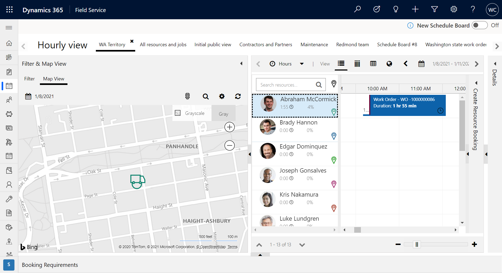
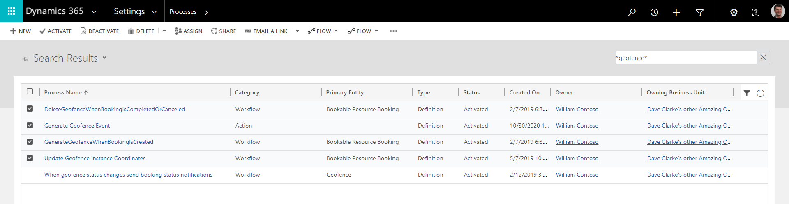
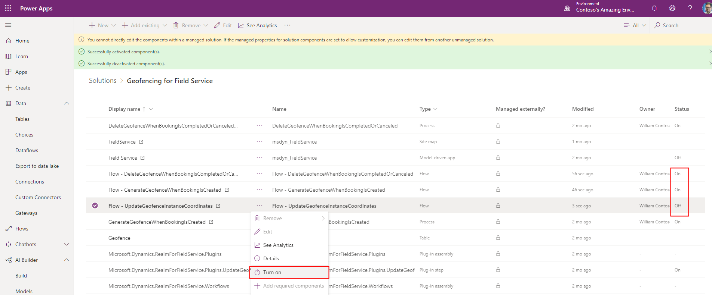
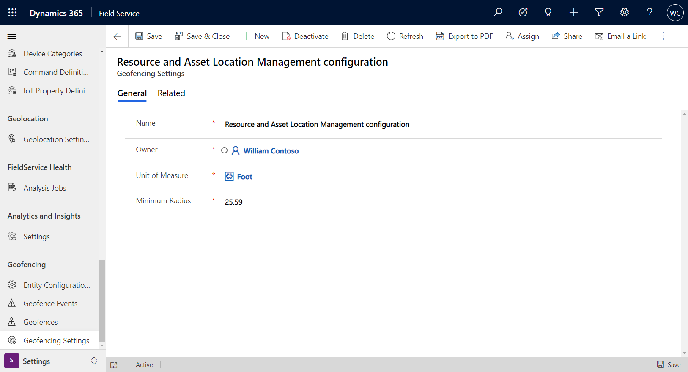
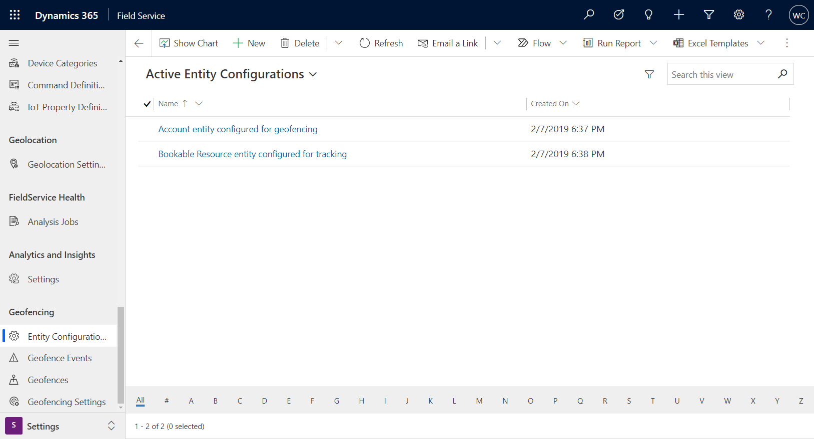
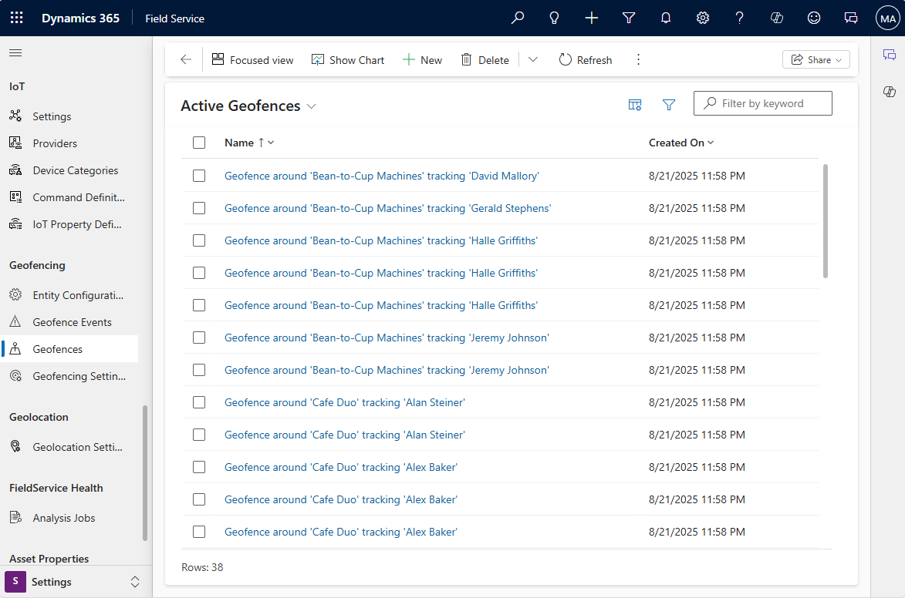
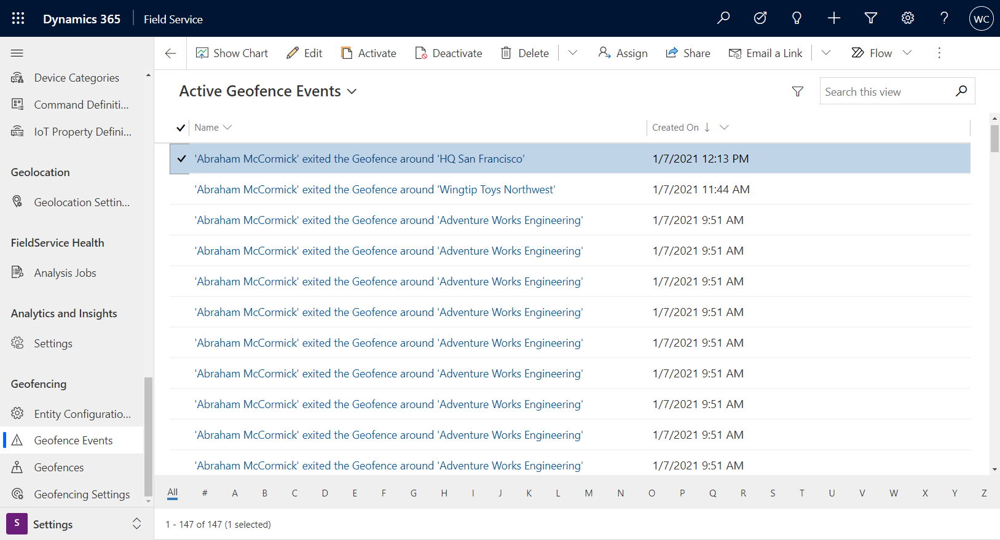
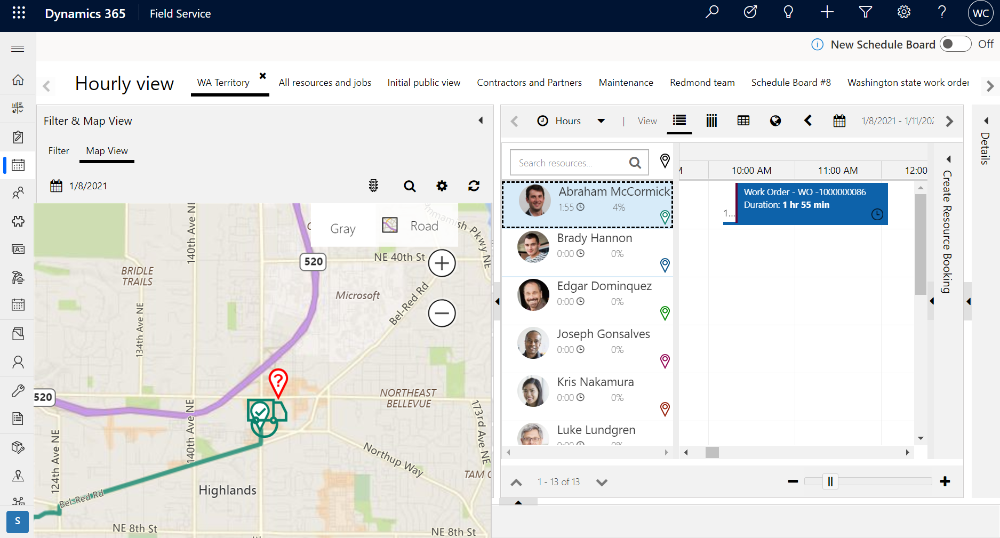
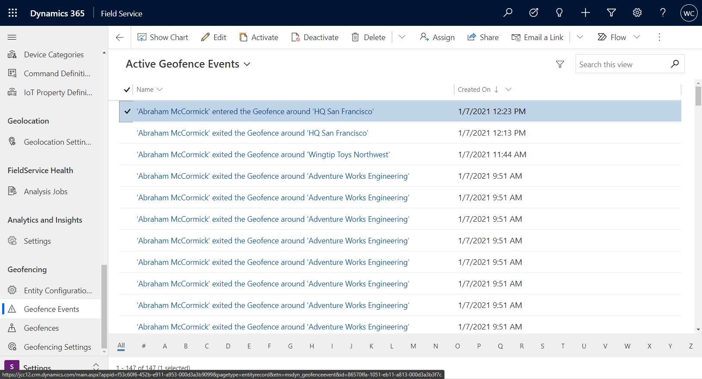

# Geofencing for the Dynamics 365 Field Service mobile app

A geofence is a virtual perimeter around a specific location. Geofencing allows users to draw zones around places of work, customer sites, and secure areas. You can configure the system to trigger various actions when geofences are crossed by a person or an equipped vehicle.

In Dynamics 365 Field Service, the default use case for geofencing is to create a circular geofence around a work order's location and compare it to the changing location of field technicians as measured by their mobile devices running the Field Service mobile app. When a work order geofence is crossed by a field technician, a **geofence event** record is created and the geofence status is changed from **outside** to **inside**, indicating the field technician is inside the geofence. Another geofence event is created as the field technician leaves the geofenced area. Based on entering or leaving a geofenced area, a mobile push notification or custom workflow can be triggered.

In this article, we look at how to configure and use geofences by:

- Setting distance radius.
- Booking a work order to automatically create a geofence around it.
- Testing geofence events, as field technicians enter and leave geofenced areas.


## Prerequisites

- **Field Service v8.8.32+**.

- Verify geofence solutions are installed. Go to **Settings** > **Solutions** and make sure the following geofence solutions are there. Upgrade to Field Service 8.8.32+ if these solutions are not present.

  - **Geofence Alerts**
  - **Geofence Management**
  - **Geofence for Field Service**

> [!div class="mx-imgBorder"]
> 

- [Connect to Bing Maps](https://docs.microsoft.com/dynamics365/customer-engagement/field-service/perform-initial-configurations-setup#step-1-resource-scheduling) in order to locate service accounts and work orders to later place geofences around.
   
- [Set auto geocode addresses to **yes**](https://docs.microsoft.com/dynamics365/customer-engagement/field-service/perform-initial-configurations-setup#step-2-field-service-settings) in order to automatically geocode accounts and work orders when addresses are entered. Geocoding an account or work order record populates latitude and longitude values, which are required in order to place geofences.

- [Enable location tracking, sharing, and auditing](mobile-powerapp-location-auditing.md) and test location tracking.

- This article applies to geofencing for the [Field Service mobile app, built on Microsoft Power Platform](mobile-power-app-overview.md).

## Step 1. Enable and test location tracking, sharing, and auditing

First, [enable location tracking, sharing, and auditing](mobile-powerapp-location-auditing.md) and verify each technician's location is being tracked in Field Service. You will know location tracking is working if the technician's location appears on the schedule board map and in location records in the geolocation tracking record type.

> [!div class="mx-imgBorder"]
> 

## Step 2. Activate geofence processes

Go to **Settings** > **Processes** and **Activate** the following processes. These processes are installed in a draft state with the geofence solutions:

- ```DeleteGeofenceWhenBookingIsCompletedOrCanceled```
- ```GenerateGeofenceWhenBookingIsCreated```
- ```Update Resource Location from Resco Audit```


> [!div class="mx-imgBorder"]
> 

If you have **Enhanced Background Processing** set to _Yes_ in [Field Service Settings](https://docs.microsoft.com/dynamics365/field-service/configure-default-settings#other-settings), enable the geofence Power Automate flows.

1. Go to https://make.powerapps.com/ and select your environment.
2. Go to **Solutions** > **Geofencing for Field Service**.
3. Enable the following flows:
   - **Flow – DeleteGeofenceWhenBookingIsCompletedOrClosed**
   - **Flow – GenerateGeofenceWhenBookingIsCreated**
   - **Flow – UpdateGeofenceInstanceCoordinates**

> [!div class="mx-imgBorder"]
> 

> [!Note]
> If you choose to use enhanced background process Power Automate flows instead of processes, you don't need to deactivate the Processes.

## Step 3. Configure geofencing settings

Go to **Field Service** > **Settings** > **Geofencing Settings**.

Enter a **Unit of Measure** and **Minimum Radius**. As demonstrated in the following screenshot, the smallest geofence we can create is a circle around a service account, with a radius of 25.59 feet.


> [!div class="mx-imgBorder"]
> 

## Step 4. Configure geofence entities

Go to **Field Service** > **Settings** > **Entity Configurations**.

Then select the account configuration, included by default with the geofence solutions.

> [!div class="mx-imgBorder"]
> 

Enter the following information:

- **Entity:** Select **Account** because work order locations are inherited from the related service account.

- **Latitude / Longitude:** Choose the latitude and longitude fields on the account entity that holds the geo coded location; this setting will determine the center of the geofence.

- **Enabled As:** Select **Geofence** because the account serves as a static location that a geofence will surround.

- **Default Radius:** Enter a number to represent the radius of the geofence around the latitude and longitude of the account location. The unit of measure will be the unit chosen in the geofence settings in the previous step. In this example, the default radius is 328.08399 feet.
   
> [!div class="mx-imgBorder"]
> 
 
Next, go to the bookable resource configuration and enter the following:

- **Entity:** Select **Bookable Resource** to compare the location of field technicians relative to work orders and service accounts.

- **Latitude / Longitude:** Choose the latitude and longitude fields on the bookable resource entity that hold the most recent coordinates of the location.

- **Enabled As:** Select **Geo tracked** because the bookable resource has a variable location that is compared against defined geofences.

> [!div class="mx-imgBorder"]
> 

## Step 5. Book a work order

Next, book a work order using your preferred method. In this example, a work order is manually dragged and dropped to a field technician bookable resource. This resource has been designated as a **User** type, and has access to the Field Service Mobile app. 

> [!div class="mx-imgBorder"]
> 

Booking a work order will trigger an asynchronous workflow that creates a geofence as long as the appropriate process was activated in earlier steps.

Go to **Field Service** > **Settings** > **Geofences** to view the newly created geofence.

> [!div class="mx-imgBorder"]
> 

The **Geo tracked Record Status** is set to **Outside**, meaning the bookable resource is outside of the geofence area.


## Step 6. Enter and exit a geofence

Before traveling to the work order location, the technician is outside the geofence and an "exit" geofence event is created.

> [!div class="mx-imgBorder"]
> 

When a technician arrives at the work order location and interacts with the Field Service mobile app, an "enter" geofence event is created. 

> [!div class="mx-imgBorder"]
> 

> [!div class="mx-imgBorder"]
> 

Additionally, this will change the related geofence **Geo tracked Record Status** to **Inside**.

When the technician leaves the geofence, another "exit" event will be created.

> [!Note]
> If you want to test entering a geofence but cannot physically travel to the location, you can expand the geofence radius to include your current location. 

## Configuration considerations

- Custom geofences using entities other than accounts and bookable resources are supported.
- You can configure how far back in time a geolocation is valid. This is important for scenarios when a bookable resource synchronizes a geolocation to the server and then loses internet connection, making dispatchers unaware of the true location. The time threshold can be configured in **Resource Scheduling** > **Settings** > **Scheduling Parameter** > **Geo Data** > **Geo Location Expires After X Minutes**.

> [!div class="mx-imgBorder"]
> 
  
## Additional notes

- Only circular-shaped geofences are currently supported.

### See also

- [Geofencing for Field Service Mobile (Xamarin) app](field-service-mobile-overview.md)