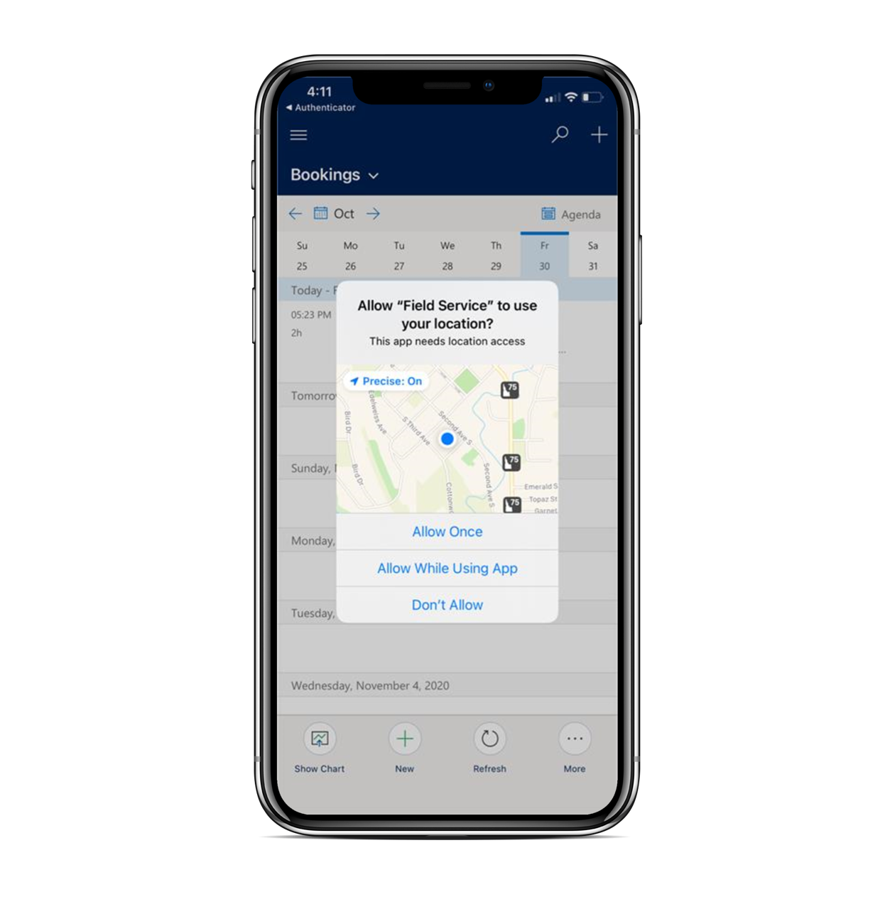

# title

## Prerequisites
> [!Note]
>

> [!div class="mx-imgBorder"]
> 

## Section 1

> [!div class="mx-imgBorder"]
> 

> [!div class="mx-imgBorder"]
> 

> [!div class="mx-imgBorder"]
> 

> [!div class="mx-imgBorder"]
> 

## Section 2

## Configuration considerations
## Additional Notes