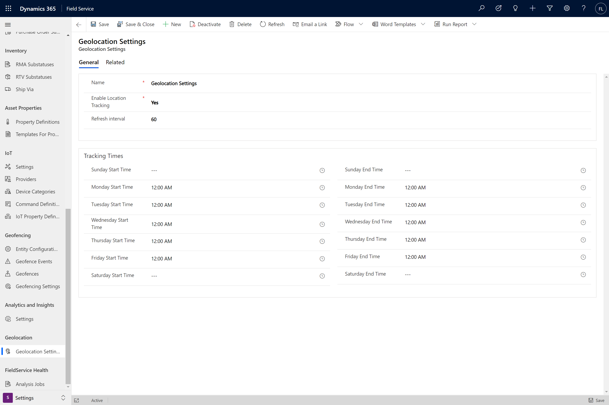
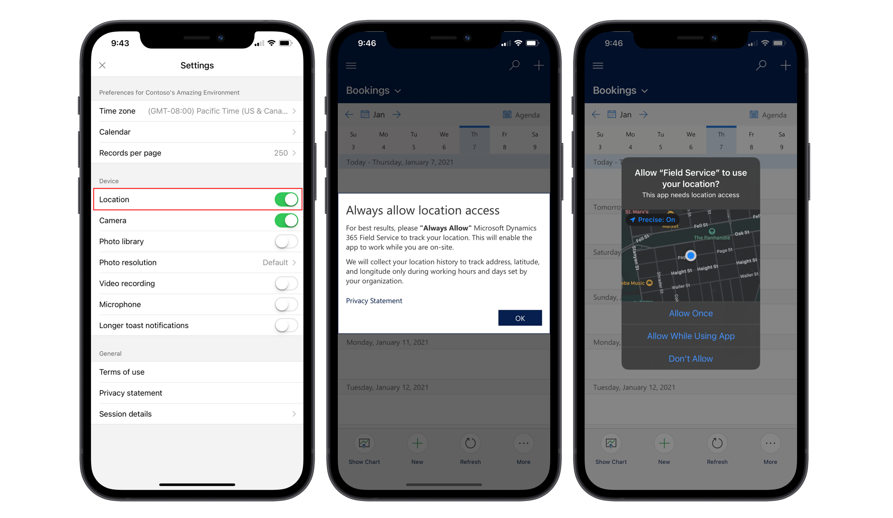
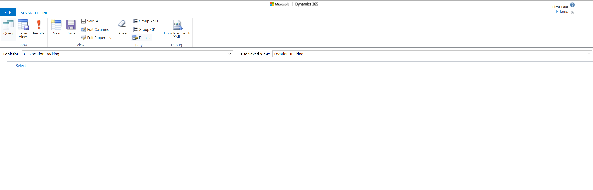
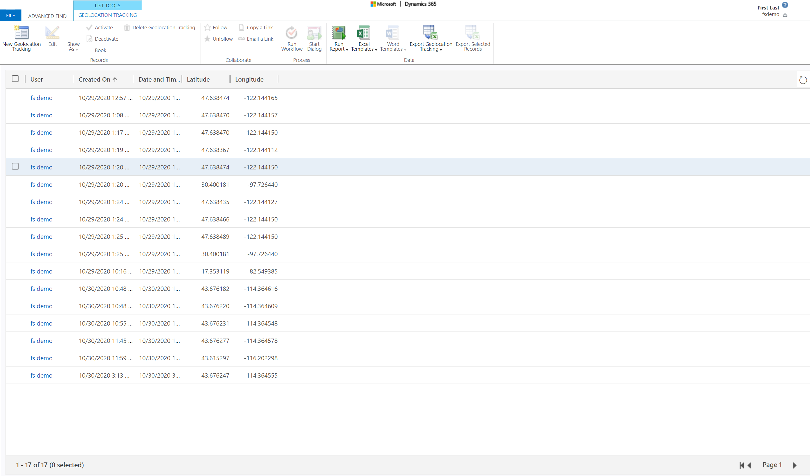

# Location auditing for the Dynamics 365 Field Service mobile app

Field technicians often travel to various locations throughout their work day, and it's helpful for schedulers to know where technicians are at any given time.

> [!div class="mx-imgBorder"]
> 

Technicians using the Field Service (Dynamics 365) mobile app can enable location sharing from the app, allowing schedulers to visualize their location on the schedule board, and also audit a list showing a technician's location history.

In this article, we'll look at how to enable location tracking, and how to access location audits in Field Service.

For a guided walkthrough, check out the following video.

> [!VIDEO https://www.microsoft.com/videoplayer/embed/RE4J6mZ]

## Prerequisites

- Administrator access to Dynamics 365 Field Service
- Field Service mobile app

## Step 1. Enable location tracking

First, we need to make sure location tracking is enabled in Field Service. These settings allow a technician's location data to be sent to Dynamics 365 Field Service, which surfaces a technician’s location on the schedule board. The technician’s location data is stored in the geolocation tracking entity.

In Field Service, go to **Geolocation Settings**.

1. Set **Enable Location Tracking**  to **Yes**.
2. Enter a Refresh Interval (seconds)
3. Configure tracking times to meet your business needs. In the screenshot example, we have it configured so that tracking happens 24 hours a day, every day.

> [!div class="mx-imgBorder"]
> 

On the Geolocation Settings we configure two values:
1.	The Refresh Interval
2.	The tracking time Start and End
The Refresh Interval will indicate how frequent the system checks the user’s location, however it doesn’t indicate that “Geolocation Tracking” records will be created.

The Geolocation Tracking records will be created in the following scenarios:
1.	When a user logs-in to the Field Service Power Apps App, few records are created as it figures out where the user is, and then it stops as the user hasn’t moved.
2.	If the user moves away from his location more than 800 meters, it will create tracking records every 60 seconds until he stops moving.
3.	When the user comes in a still position after moving, it will create a few more tracking records as it settles and then it stops.
4.	It won’t create records till the location is changed again
All of this is withing the track start and End time, and the frequency of checking the location is per the “Refresh Interval”.

## Step 2. Allow Field Service mobile to access your location

After enabling location tracking on the scheduler's side, make sure it's enabled and working on the mobile device side.

On a mobile device, sign into the Dynamics 365 Field Service mobile app. When prompted, allow the Field Service app to access your location while using the app. You may need to launch and sign into the app again to be prompted for location. Ensure Location is toggled to Yes in Settings in the mobile app.

> [!div class="mx-imgBorder"]
> 

## Step 3. Verify location tracking

Back in Dynamics 365 Field Service, the bookable resource's current location appears on the schedule board map. Select the map pin icon next to the bookable resource's name, and the map will display the location with a Truck icon instead of a pin icon.

> [!div class="mx-imgBorder"]
> 

## Step 4. Location audit

By using the **Geolocation Tracking** entity and advanced find in Field Service, you can query to run audits on technician locations.

> [!div class="mx-imgBorder"]
> 

Here you see a list of locations throughout the day, listed by user.

> [!div class="mx-imgBorder"]
> 

> [!Note]
> If you want to correlate technician location with other Field Service entity updates, such as booking resource bookings, see this [auditing overview](https://docs.microsoft.com/power-platform/admin/audit-data-user-activity) to find instructions.  

## Additional notes

> [!Note]
> Dispatchers can use current locations for schedule assistant travel time calculations by selecting **Real time mode** in the schedule assistant filter pane. See more details in the topic on [Advanced filters for the schedule assistant](schedule-assistant-advanced-filters.md).

> [!div class="mx-imgBorder"]
> 

### See also

[Geofencing](mobile-powerapp-geofence.md)