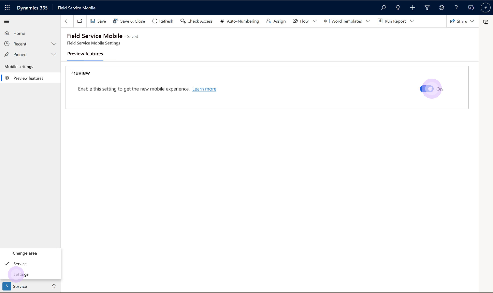

# New UX for the Field Service (Dynamics 365) Mobile app (preview)

## Preview availability

This article contains information about the new user experience features in the Field Service (Dynamics 365) Mobile app. The improved UX aims to help service technicians swiftly access all the information they need on the go. This modern user experience supports familiar mobile navigation, gestures, and controls to manage work orders, tasks, services, and products.

Technicians save valuable time for daily work by quickly updating the status of a booking or accessing driving directions to a customer site. They can easily select, change, or complete work order details and also add notes with multiple images.

Detailed information for the immediate task is now readily available with embedded Dynamics 365 Guides. [Embedded guides in Field Service (Dynamics 365) Mobile](embedded-guides.md) provide technicians with step-by-step guided instructions, pictures, and videos that provide more details.

<!--
> [Add link to video]
-->

## Preview content in the documentation

Once [an administrator enables](#enable-the-preview-features) the preview features, they're available directly in the existing Field Service (Dynamics 365) Mobile app from the app stores. Technicians don't need to download a new app and organizations don't need to perform any migration. However, make sure you updated the mobile app to the latest version.

To learn more about these new features, review documentation articles and find content for preview features alongside the current content in dedicated tabs.

Here's a list of documents that contain specific preview content:

[Download the mobile app and get started](download-get-started-mobile-app.md)
[Complete work orders on the mobile app](get-work-done-mobile-app.md)
[Access related apps form the Field Service mobile app](access-related-apps-mobile-app.md)
[Embedded Guides in Field Service (Dynamics 365) Mobile (preview)](embedded-guides.md)

## Enable the preview features

To enable the preview features for your organization, sign in as a **Field Service Administrator** to Dynamics 365 in a web browser. Select the **Field Service Mobile** app from the list of all installed apps in your organizations.

In the Field Service (Dynamics 365) Mobile app, select bottom left menu and change the area to **Settings**. Set the toggle to enable or disable the preview features for all users within the organization.

> [!div class="mx-imgBorder"]
> 

## Limitations of preview features

The preview features currently have the following limitations:

- Offline mode isn't supported. Users enabled for offline don't see the new features and see the existing Unified Interface experiences. To properly experience the new preview features, disable the offline profile.
- In preview, the new UX is currently not customizable. [Field Service Mobile customizations](field-service-customizations.md) aren't supported and don't work in the new UX. However, the customized model-driven app experiences (such as custom forms and business logic) continue to be accessible through an icon on the top right of the new UX, allowing users to switch back and forth.
- The new preview features respect the mobile device language settings, while the current app respects the language settings in the user profile. You might see a mixed language experience if the two settings are out of sync.

## Preview Support

During the preview period, there's limited support for this feature and we don't recommend it for production usage. If you run into issues with this preview, select **Send feedback** in the left navigation menu of the mobile app to send an email to our team with logs attached to it.

## Next steps

- [Install and set up the Field Service (Dynamics 365) Mobile app](mobile-power-app-get-started.md)

[!INCLUDE[footer-include](../includes/footer-banner.md)]
