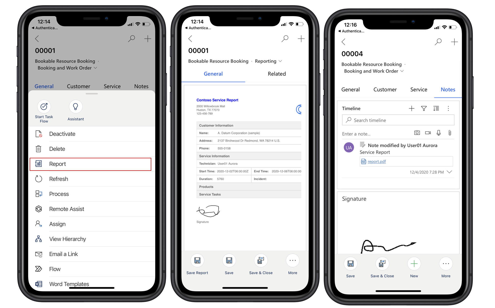
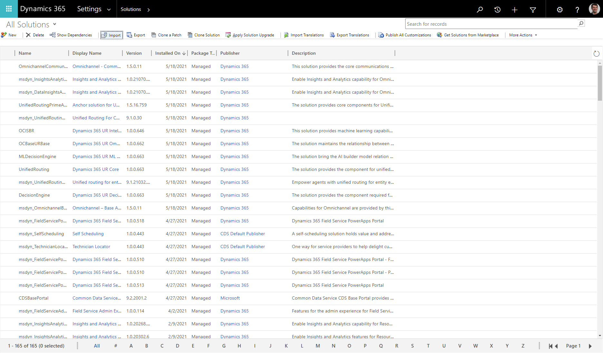
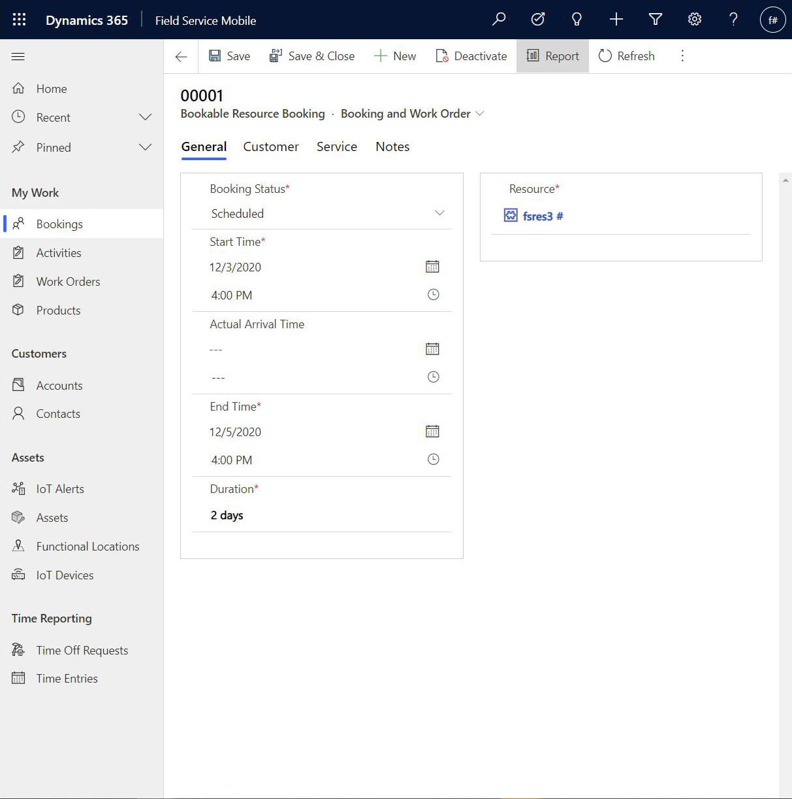
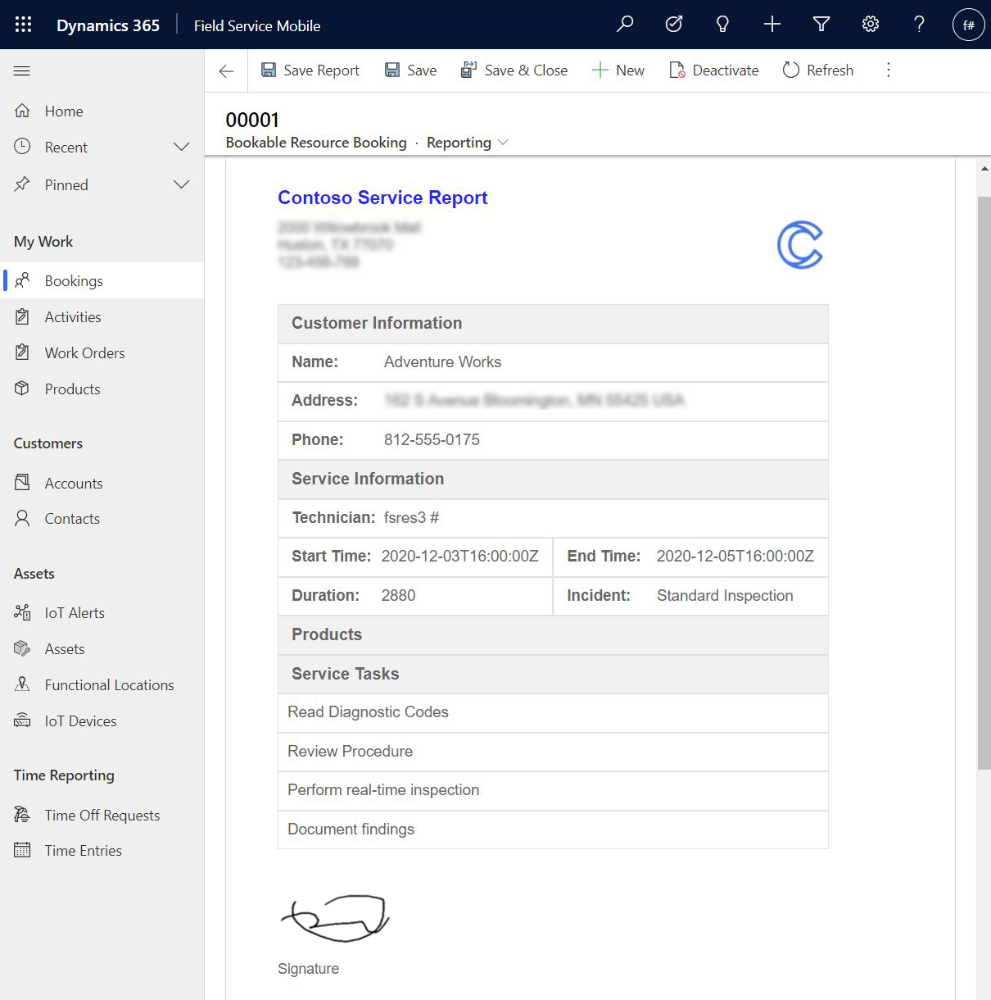

# Field Service technician service reports

Field Service technicians often create service reports summarizing work done during a customer visit. These reports can carry details such as tasks completed, and products or parts used during the service. Service reports must often be delivered to the customer in the form of a PDF.

> [!div class="mx-imgBorder"]
> 

This article outlines how to use the Power Apps Component Framework (PCF) to build a service report for the Field Service mobile application. This article also provides a sample report and PCF control that will serve as a guide for developers to design and import the control for their environments.

Features of the technician reporting PCF control:

- Generate service reports while your mobile app is online or offline.
- Command option on the bookable resource booking form to launch the report.
- Sample report layout with API calls to fetch offline data.
- In-app report preview and signature experience.
- Save the report back to service timeline as a note.
- Accessibility-compliant preview and output report.


For a guided walkthrough, check out the following video.

> [!VIDEO https://www.microsoft.com/videoplayer/embed/RWyFjo]

## Import the reporting solution

1. Download the [reporting solution](https://aka.ms/fsmreporting-solution). 
2. Import the reporting solution into your environment. The import will install a reporting form, ribbon command, and includes a sample report so you can execute functionality within your environment. We recommend that the solution is imported as a managed solution.

> [!div class="mx-imgBorder"]
> 

3. After importing the reporting solution, open your Field Service mobile app module in the app designer and enable the reporting form for the bookable resource booking entity. Save and publish your changes. 

> [!div class="mx-imgBorder"]
> 

4. At this point you'll be able to view functionality of the report in your mobile app and evaluate changes necessary for your organization.

## Create your custom report

1. Download the sample [reporting PCF control](https://aka.ms/fsmreporting-pcf) source code. 
2. Use your favorite IDE to edit the sample reporting PCF control. Modify this control to change layout, add more branding, updated data, or other updates necessary to meet your reporting requirements. Be sure to rename the report to something descriptive for your organization by updating report name in ```ControlManifest``` and ```index.ts```. Refer to ```ReadMe.pdf``` included with the sample source code for additional details on making customizations. 
3. Import the modified PCF control into your environment. For more information, see this article: [Steps to import a PCF control](/power-apps/developer/component-framework/import-custom-controls)
4. Update customizations to point to your new PCF template by going to **Customize the System** > **Bookable Resource Booking** > **Forms** > **Reporting** > **ReportView**. Under **Properties**, you'll see your newly named report, which should be enabled for web, phone, and tablet. 

> [!NOTE]
> The PCF Report control includes resource files for multiple languages but only declares English (1033). For other languages, update the ControlManifest to declare the desired language for localization.

## Generate reports from mobile

Launch the Field Service mobile app and go to the bookable resource booking.

Go to **More** > **Report**.

> [!div class="mx-imgBorder"]
> 

## Generate reports from web

Administrators and dispatchers can also generate reports when viewing a booking in the web browser.

From the bookable resource booking, select **Report**.

> [!div class="mx-imgBorder"]
> 

> [!div class="mx-imgBorder"]
> 


[!INCLUDE[footer-include](../includes/footer-banner.md)]
