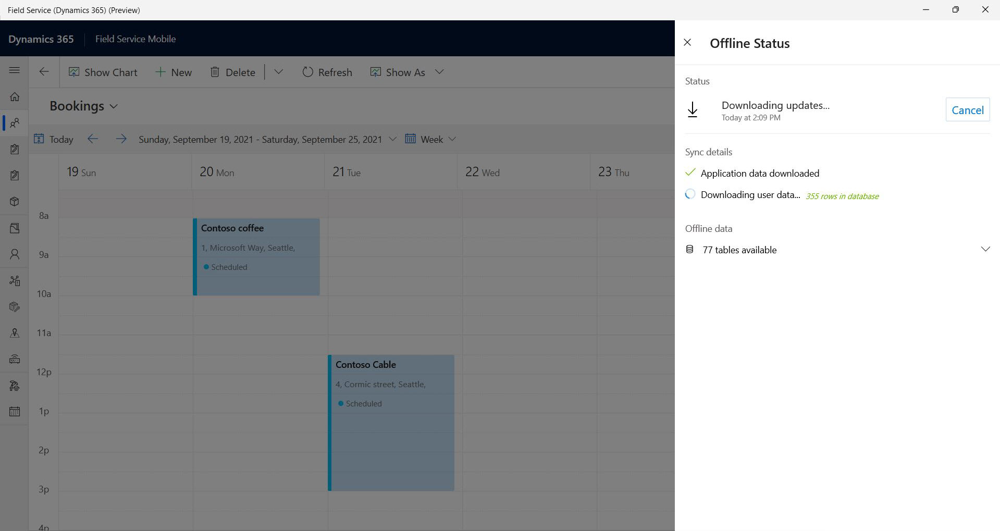

# Field Service (Dynamics 365) app for Windows 10+ devices

The Field Service (Dynamics 365) Windows app is built on Microsoft Power Platform as a model-driven app. It's intended frontline workers using Windows devices running Windows 10 or Windows 11.

The Field Service (Dynamics 365) Windows app supports most common features as iOS & Android versions, including [offline mode](mobile-power-app-system-offline.md), for a consistent cross-platform experience.

For a guided walkthrough, check out the following video.

> [!VIDEO https://www.microsoft.com/videoplayer/embed/RWNWjN]

> [!NOTE]
> The following capabilities *aren't* available at this time. These capabilities *are* available in the [iOS and Android apps](mobile-power-app-use.md).
>
> - Quick notes photos and videos
> - Access to GCC High or China cloud environment
> - Search with barcode via global search
> - Location Tracking

## Prerequisites

Device requirements:

- Windows 10 or 11

Also, be sure to [review installation and set up of the Field Service (Dynamics 365) mobile app](mobile-power-app-get-started.md).

## Download the app

[Download from Windows store](https://aka.ms/fsmobile-windows10).

The app is called **Field Service (Dynamics 365)**.

Open the app and sign in with your username and password. The user account needs the *Field Service - Resource* security role.

> [!NOTE]
> To access non-production environments, enable non-production apps from settings.

## View bookings

You can access your bookings from the **Home** screen or **Bookings** screen. On the bookings screen, you can see bookings on an agenda, day, week, month, or [map view](mobile-powerapp-booking-maps.md). You can [customize the agenda view](mobile-powerapp-customize-booking-calendar.md) in the same way as iOS and Android apps.

> [!div class="mx-imgBorder"]
> 

Select a booking to open it. You can change the status, complete service tasks, inspections, and attach notes to the timeline.

## Capture pictures

When adding a note to the timeline, you can also attach a picture by selecting the camera icon, which opens the device camera app.

> [!div class="mx-imgBorder"]
> 

## Scan a barcode

You can use the device camera to scan a barcode either for global search or to fill any field of the barcode type.

> [!div class="mx-imgBorder"]
> 

## Download data for offline use

When enabled for [offline mode](mobile-power-app-system-offline.md), the app will automatically download offline data after you sign in. You can also force an update of the offline data from the **Offline Status** page by selecting **Update date**.

> [!div class="mx-imgBorder"]
> 

>[!NOTE]
> Offline data works on devices running Windows OS 20H2 (19042.1348) and greater.

## Download logs

Open the following directory on your device to find the logs related to a Windows session for Field Service:

`%LocalAppData%\Packages\MicrosoftCorporationII.FieldServiceDynamics365_8wekyb3d8bbwe\LocalState`

## Install from app center

If you don't have access to install Field Service Mobile for Windows from the Microsoft Store, you can install it from the [app center](https://install.appcenter.ms/orgs/dynamics365-mobile/apps/field-service-windows-store-signed-builds/distribution_groups/public%20release).

An administrator can also download the package from the [app center](https://install.appcenter.ms/orgs/dynamics365-mobile/apps/field-service-windows-store-signed-builds/distribution_groups/public%20release) and distribute it to users with Intune.

[!INCLUDE[footer-include](../includes/footer-banner.md)]
