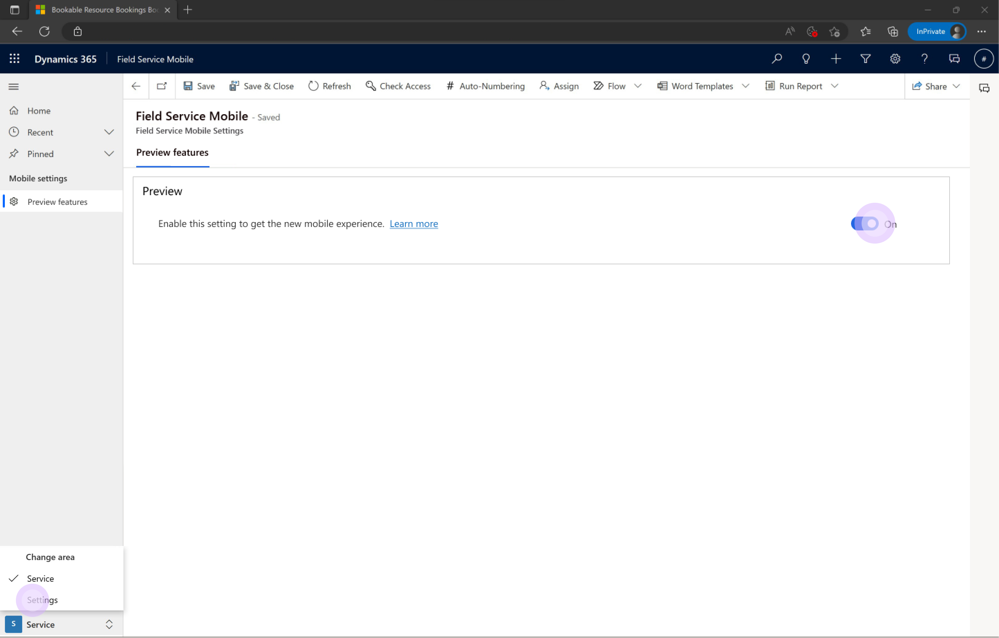

# Field Service (Dynamics 365) mobile app Public Preview

## Public Preview availability
In July 2023, we’re introducing the public preview of a **new Dynamics 365 Field Service mobile experience for frontline technicians** to swiftly access all the information they need on the go. This modern user experience supports familiar mobile navigation, gestures and controls to streamline managing work order Tasks, Services, and Products. 

From changing the status of a booking with a quick swipe to accessing driving directions to a customer site with one tap, the redesign saves valuable technician time for daily work. Technicians can not only easily pick, change, or complete work order details, but also add notes with multiple inline images. 

In addition, to help improve first-time fix rates, **Dynamics 365 Guides in 2D mode** can now be embedded for step-by-step instructions with pictures and branching flow.  

> [Add link to this video](https://microsoft-my.sharepoint.com/:v:/p/marewa/EaKlFvr-Pt1BiLOJiy0ylM8Bv1AaRnCv-vCt0-JfZJQEvA?e=ATavzi)

## Public Preview content in the docs
Once enabled by your administrator, the Public Preview features are accessible directly in the GA app, you don't need to download a different app. To learn more about these new features you can navigate these docs and find the specific Public Preview content alongside the current content in dedicated tabs.

> [!div class="mx-imgBorder"]
> Screenshot of tabs?

Here's a list of documents that contain specific Public Preview content.

| Document | 
| --- | 
| [Download the mobile app and get started)](download-get-started-mobile-app.md) | 
| [Complete work orders on the mobile app](get-work-done-mobile-app.md) |
| [Access related apps form the Field Service mobile app](access-related-apps-mobile-app.md) |

## Enabling the Public Preview features (admin)
To enable the Field Service Mobile Public Preview features for your organization's technicians, you need to log in as an administrator to Dynamics 365 and then select the **Field Service Mobile** app from the list of all installed apps in your organizations.

Once the Filed Service Mobile app screen loads, click on the bottom left menu and select **Settings**. Finally use the toggle to enable or disable the Public Preview features for all users within the organization.

> [!div class="mx-imgBorder"]
> 

## Public Preview features limitations
The public preview features currently have the following limitations:
- Offline is not supported. In order to properly experience the new Public Preview features, please disable the offline profile.
- Customizations are not supported. All customizations are currenlty not supported and will not work in Public Preview.
- Language. The new Public Preview features respect the mobile device language settings, while the current app respects the language settings in the user profile. This might cause a mixed language experience if the two settings are out of sync.

## Next steps

- [Install and set up the Field Service (Dynamics 365) mobile app](mobile-power-app-get-started.md)

[!INCLUDE[footer-include](../includes/footer-banner.md)]
