# Push notifications in Field Service Mobile

In Field Service Mobile, push notifications allow you to send updates to field technicians through their mobile phones or tablets. Push notifications utilize the Dynamics 365 workflow engine and can be triggered by many scenarios. 

Push notifications can be used to:

- notify field technicians they have been assigned a booking
- remind field technicians to enter important business data

In this article, we'll show you how to create and customize push notifications to notify technicians on their mobile devices. 

## Prerequisites

To use Field Service Mobile push notifications, you'll need:

- Field Service legacy web app v 7.5+ and Unified Interface framework app v8.3+. 
- The [mobile configuration tool (Woodford solution)](https://aka.ms/fsmobile-configurator) must be downloaded and imported as a solution in your environment (minimum version 11.1).
- Field Service Mobile v11.1+ for Windows, iOS, or Android devices. Visit the app's **About** section to check which version you have.
- Consent for notifications in your device's settings for the **Field Service Mobile** app.
- Review the [privacy notes for Field Service Mobile push notifications](mobile-push-notifications-privacy.md). **PLEASE NOTE:** Google Cloud Messaging, Apple Push Notification, and Windows Push Notification services are not provisioned in a dedicated data center for exclusive use by you and does not provide data segregation, such as for the Government Community Cloud. Your use of Google Cloud Messaging, Apple Push Notification, and Windows Push Notification services shall not be subject to any product-specific terms and conditions applicable to Dynamics 365 online for Government. If you do not wish to use the push notification, then you must ensure that your administrator keeps the feature turned off.

## Notify a user about a booking

In our first example, let's say a field service organization wants to notify field technicians on their mobile devices when they have been booked for a work order.

### Verify push notifications are activated

1. Go to **Settings > Solutions** and verify the **Field Service Mobile Push Notifications** solution is installed. The push notification capability is included with Field Service v8.3 or later. If it is not installed, you'll need to upgrade. 

> [!div class="mx-imgBorder"]
> 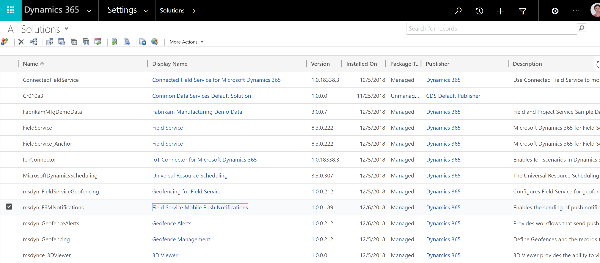

1. **Activate** the **Notify user about booking** workflow. Its status will be set to **Draft** initially and no push notifications are enabled out-of-the-box. This indicates that the workflow push notification action will not be enabled and there will be no flow of data to the aforementioned external services. To verify, go to **Settings > Customizations > Customize the system > Processes** and activate it if it's deactivated. 

> [!div class="mx-imgBorder"]
> 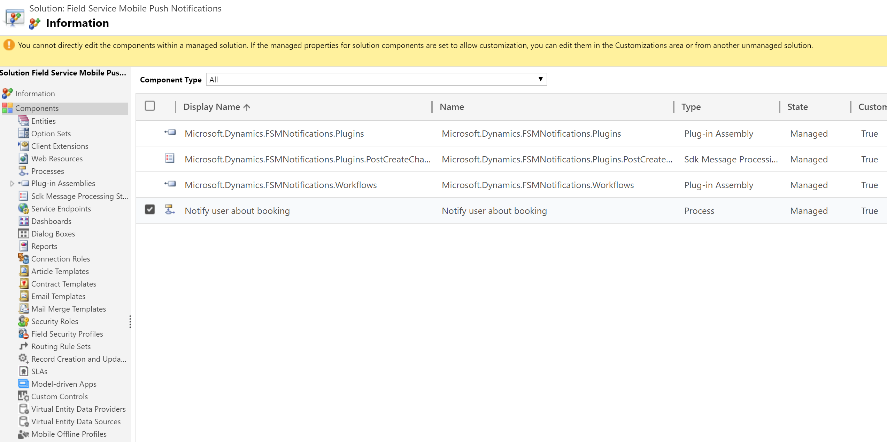

### Schedule a work order and view push notifications

1. Create a bookable resource to schedule work orders to and receive push notifications by going to **Field Service > Resources**.

2. Set the **Resource Type** for this bookable resource to **User**.

3. Verify you can log into the Field Service Mobile app with the user record and credentials related to the bookable resource.

> [!div class="mx-imgBorder"]
> 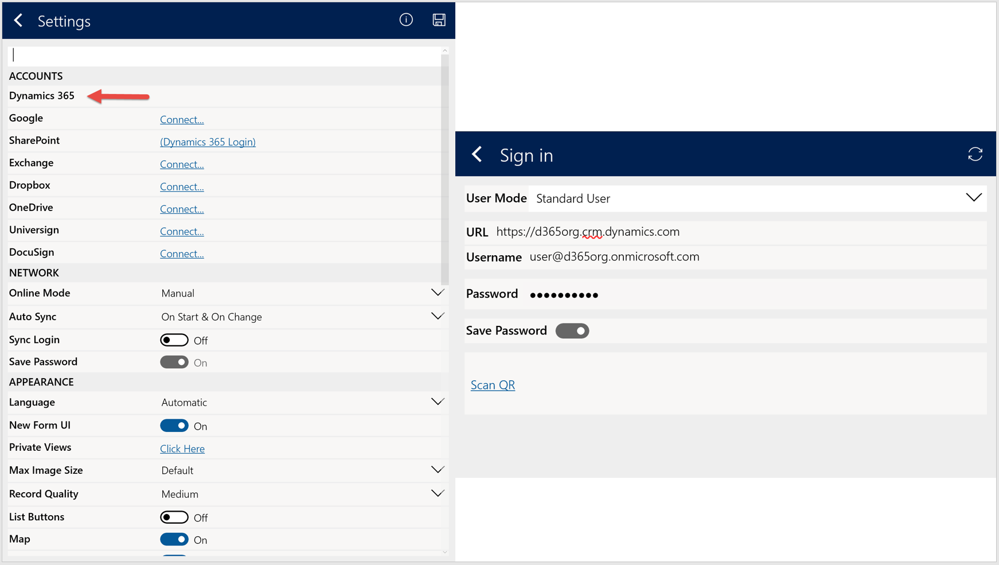

4. Schedule a work order to your bookable resource.

> [!div class="mx-imgBorder"]
> 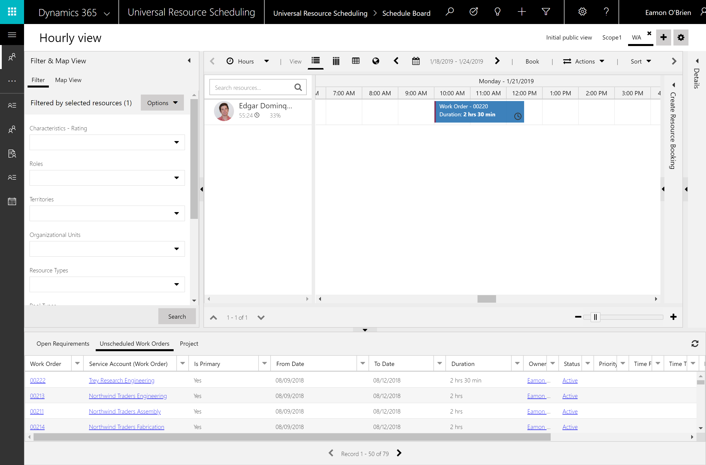

Soon, a push notification will display on your device. In the following screenshot, you can see a banner notification on our Windows device. Selecting or tapping the notification will open the booking record.

> [!div class="mx-imgBorder"]
> 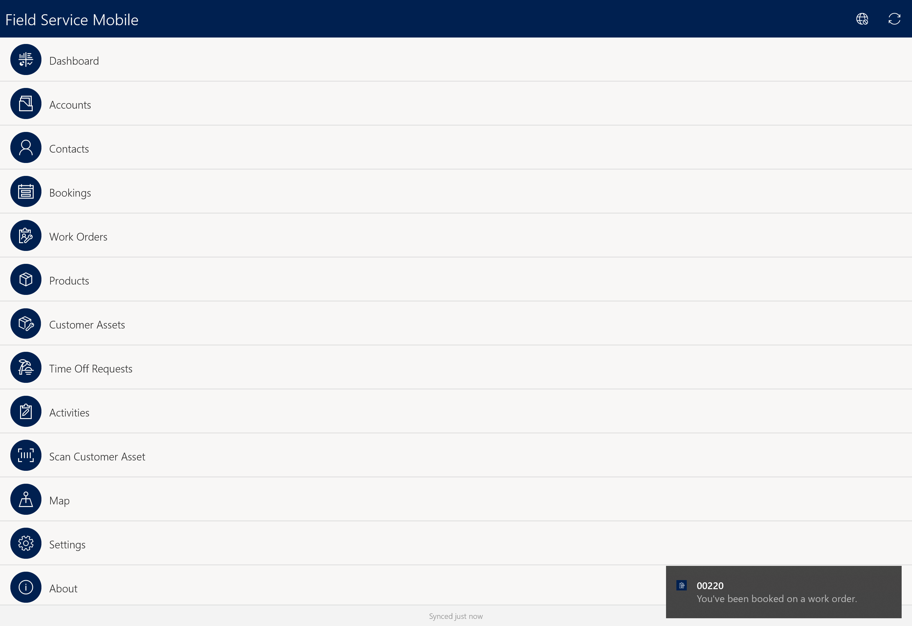

The push notification will also show up in Windows, iOS, and Android notification centers, as seen in the following Windows device screenshot.

> [!div class="mx-imgBorder"]
> 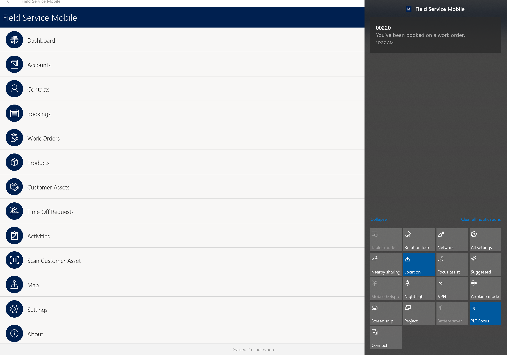

## Create a custom push notification

The Field Service Mobile push notification feature also lets you create custom push notifications that display a different message, or that relates to an entity other than bookable resource booking.

> [!Note]
> Do not edit the out of the box **Notify user about booking** process. Deactivate it and create a new one using it as a template.

To send these push notifications, the customer data detailed below must flow to the Google Cloud Messaging, Apple Push Notification, and Windows Push Notification services to enable push notifications to be received on devices running the Android, iOS, and Windows operating systems, respectively.

1. Go to **Settings > Customizations > Customize the system > Processes > +New**.

2. Set **Category** to **Workflow**.

3. For **Entity**, select the entity that will trigger the push notification and should be opened when the push notification is selected.

> [!div class="mx-imgBorder"]
> 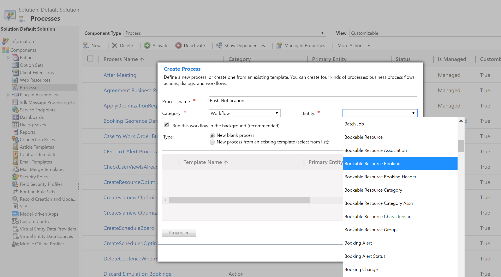

4. To add push notifications into your workflow, select **Add Step > Field Service Mobile > Entity Push Notification**.

> [!div class="mx-imgBorder"]
> 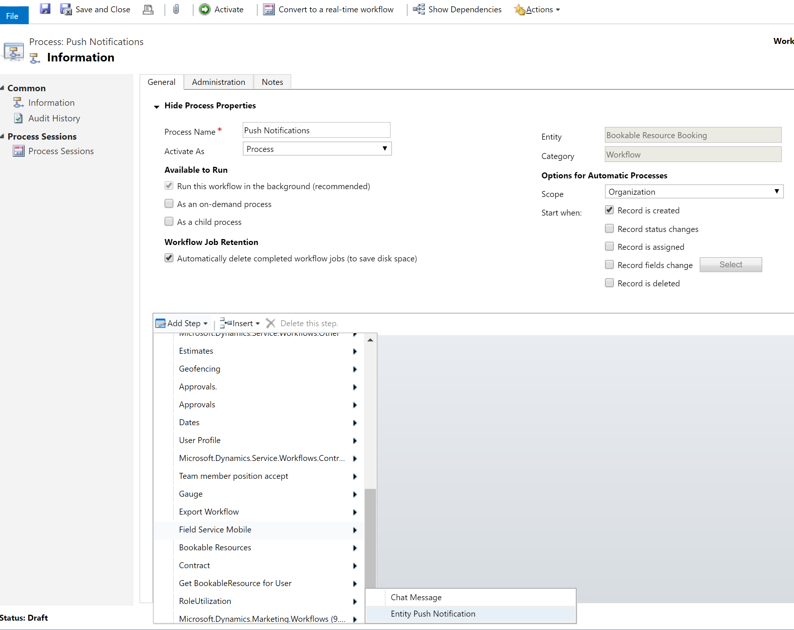

5. Select **Set Properties**. 
   1. The properties dialog details what values (customer data) will be used for sending the push notification and necessarily flow to the aforementioned third-party services.  
> [!div class="mx-imgBorder"]
> 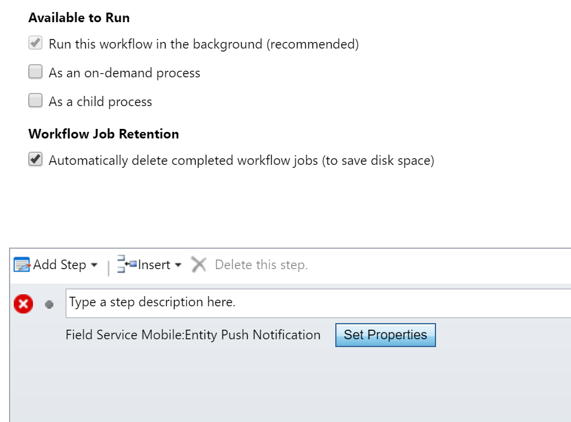

6. Enter the details of the push notification message.

  - **Message:** enter the message displayed in the push notification. 
  - **Category:** set to **ViewRecord**.
  - **User:** enter the user the push notification will be sent to. For example, enter the following for push notifications related to bookable resource bookings: **(User(Resource)(Bookable Resource))**.
  - **Team:** enter the team the push notification will be sent to.

  > [!div class="mx-imgBorder"]
> 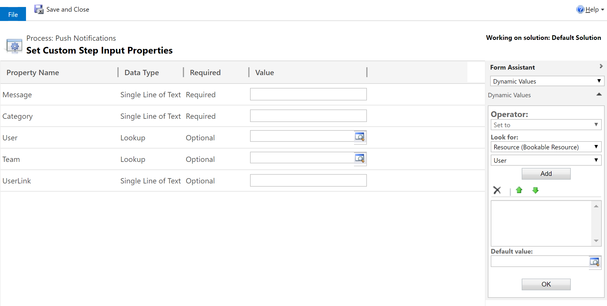

> [!Note]
> You can use the out of the box workflow process as a reference. See the following screenshot.

> [!div class="mx-imgBorder"]
> 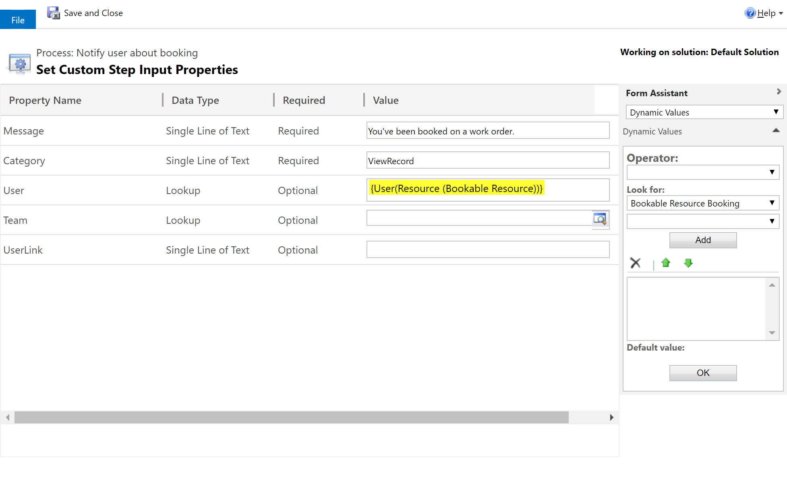

## Configuration considerations

- Sometimes after selecting a push notification and opening the Field Service Mobile app, you may be prompted with the **Entity not Found!** message seen in the screenshot at the end of this section. This means you're in offline mode and the particular record you're trying to open is not on the device.
  - By selecting **Go Online**, you can connect directly to the server to view the push notification record.
  - By selecting **Sync**, you can remain offline but pull new updates locally to the device. However, this does not guarantee the record of the push notification will become available; it could be outside the sync filters defined for that entity.

> [!div class="mx-imgBorder"]
> 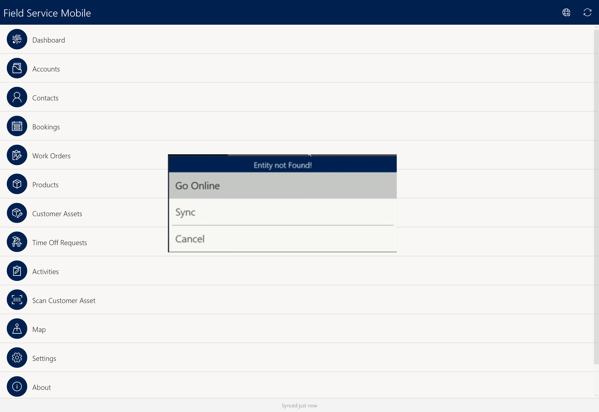

## Additional notes

- Field technicians do not need to be in the app or using their device to receive push notifications.
- The title of a push notification is the **Name** field of the entity. In our previous example, the title of the push notification was 0222, which corresponds to the **Name** field of the assigned bookable resource booking.
- Any workflow that sends a push notification can be deactivated by going to **Settings > Processes** and selecting the workflow that you want to deactivate. The status of an active workflow will read **Activated**. Select a workflow and then select **Deactivate** from the command bar. This will deactivate the workflow and, in turn, the push notification action, meaning that there will be no flow of data to the aforementioned external services. 
- Push notifications require an online environment and will not work with on-premises deployments.

### See also

- For more information on sync filters, see the [Woodford guide (PDF)](https://www.resco.net/downloads/Woodford_Guide.pdf).

[!INCLUDE[footer-include](../includes/footer-banner.md)]