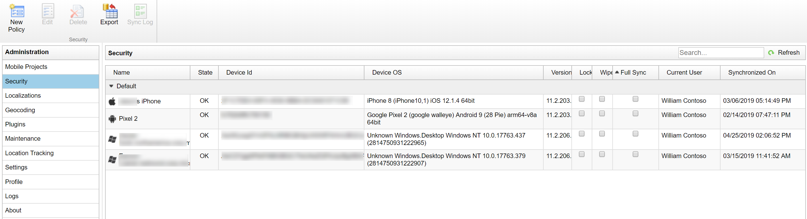
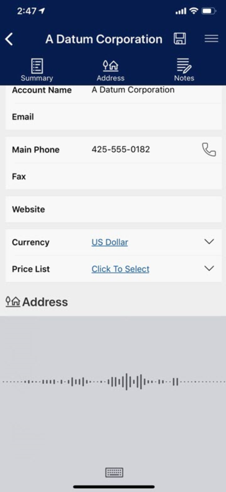

# Learn the basics of Field Service Mobile

The Field Service Mobile app is what field technicians use to view their schedules, work orders, equipment details, and more as they travel to various customer locations each day. Here are some of the basic details of the application.

## Supported platforms and minimum OS

- Windows 10, desktop + tablet
- iOS 8.0+, phones + tablets
- Android 5.0+, phones + tablets

## Device requirements

**Available Space:** how much space required on the phone depends on how much DB space is needed based on the quantity of records that an organization is having sync for mobile. You can connect to your organization with the app and go to the app's settings on your phone to see how much space the app is utilizing. Note: this amount can and will change based on how much data the app has to sync from the organization. Also note that you should account for how much data will be needed outside of Field Service Mobile (e.g. photos, texts, other apps). 

**RAM:** Minimum 512MB, 1GB is highly recommended, particularly for organizations with lots of records and customizations. That said, how much RAM is required really depends on how many apps a user will be using. For example, organizations that are using mobile device management (MDM) solutions, requiring their users to switch between multiple applications, and so on, should provide mobile devices that have a minimum of 2 GB of RAM.

**Processor:** a common recommendation is to have a clock speed of ~1.4 GHz at a minimum. Again, what other apps will be running should be taken into consideration. 

**Camera:** autofocus is required for both QR and barcode scanning. 

**GPS:** GPS is required if wanting to use any GPS/location functionalities such as navigating, utilizing maps, or location auditing.

## Install

Installing Field Service Mobile involves downloading the "Field Service Mobile" app from the relevant app store and setting up the mobile configuration tool. Instructions for both can be found in the [Field Service installation (web + mobile) doc](https://docs.microsoft.com/en-us/dynamics365/customer-engagement/field-service/install-field-service#download-the-field-service-mobile-app-on-a-phone-or-tablet).

## Upgrade

New versions of the Field Service Mobile app are released in similar cadences to Dynamics 365 for Field Service and can be downloaded and applied to your mobile phone or tablet the same as any other app via your app store. In some cases such as with Windows 10, downloading the app from the Windows Store allows for automatic upgrades as new versions are released.

The mobile configuration tool is also upgraded periodically and new releases can enable you to configure and customize the Field Service Mobile app in new ways.

## Authentication

### OAuth2
The main security token for the application is the application master password. The application uses this master password to encrypt the application database and other sensitive information stored in Field Service Mobile app.

In case of legacy authentication methods which require the app to submit the user’s password to the server (standard user, external user), the server password is used for encrypting the application master password for user’s convenience. With the OAuth2 authentication, the user must provide a dedicated password used for encrypting the application master password. 

Regarding password storage, the app can be configured to either:

- Require the user to enter the password each time the application is launched (or resumed from background), or
- Store the password in the device's secure storage so that the user does not need to type it in repeatedly

### Multi-factor authentication (MFA)
Multi-factor authentication based on the related Office 365 tenant Azure Active Directory can be enabled for Field Service Mobile. This adds a second layer of security with a phone call or text message to user sign-ins and transactions.  

## Security

### Data encryption

Data encryption is based on an application key. The application key is randomly generated and protected by the user password. The key is used to encrypt all local Field Service data. The details of this procedure are explained below.

The application generates the random application key when it creates its local database. Afterwards, it is stored in an encrypted form on the device file system and the application decrypts it when needed. The application key AES256 is used together with the user password (PBKDF2), a random IV and salt for encryption/decryption.

The following explains how the application key is used to secure application data. Remember, there are two data stores: the database and the blob store (attachments).

For encrypting the SQLite database, the application key is passed to the SQLite database driver.

The driver uses the application key and IV to encrypt/decrypt individual database pages using AES128 in CFB mode. Each page (1024 bytes) is encrypted separately. The IV is the page header (contains variable/unpredictable data).

Each file in the blob store (attachment store) contains a header with random IV (16 bytes) and encrypted data. The blob data is encrypted with AES256 in CBC mode using the application key, file header IV. PKCS7 is used for data alignment.

### Synchronization

Synchronization is when the Field Service Mobile app calls the server for new or updated data. As an example, the app will need to synchronize to the server for a field technician to see a new work order booking scheduled by the dispatcher. 

> [!div class="mx-imgBorder"]
> 

The app can perform a synchronization manually, timed, or on available connection.

- If password stored, sync is automatic​
- If password isn’t stored, requires password entry to sync

The system also tracks a **synchronization log** that tracks when users last synced and on what devices.

### Mobile device management (MDM)

**Application sessions** - Require Login after X minutes of inactivity – after defined time in minutes Field Service Mobile asks for the password to continue using it.

> [!div class="mx-imgBorder"]
> 

**Lock** - If a device is stolen or there are concerns about the security of offline data, the administrator is able to lock the application remotely on a single device, or a whole group of devices, in just one click and block the user from opening the application.

**Wipe** - In the worst-case scenario you can completely wipe out the data from the application. All is done remotely just by one click and regardless the synchronization. This means that you delete the data remotely from the mobile device and nobody will be longer available to see them.

**Force Full Sync** - By just one click, you can force the application to perform a full synchronization of the data during the next synchronization of the app.

> [!div class="mx-imgBorder"]
> 

### Auditing

Keep an audit record of when specific entities are edited, application state events, and GPS location

> [!div class="mx-imgBorder"]
> 

#### Dynamics security

For accessing Dynamics 365 for Field Service entities and fields, the Field Service Mobile app utilizes the Dynamics 365 security role and field security profile framework. In addition, entities and fields can be further restricted at the mobile app level, but a user cannot access any entity or field that could not be accessed in Dynamics 365.

## Key capabilities

**Native application** - Field Service Mobile is a native application on the Windows, iOS, and Android platforms. Because a native app is built for use on a particular device and its OS, it has the ability to better use device-specific hardware and software such as the camera and microphone.

**Offline capabilities** - Field Service Mobile has full offline capabilities when the mobile app is in "offline mode". This means work order details and other valuable data can be downloaded locally to the field technicians' phones and tablets to use when internet connectivity is not available. When a field technician is working in "online mode" then the data on the mobile app reflects the server data. The mobile app can be put into online mode at all times, only when the device is connected to Wifi, when the field technician manually toggles to online mode, or never. In addition, **sync filters** allow administrators yo decide which entities and records should be downloaded locally for offline mode. As an example, an administrator can filter for only this week's work orders to be downloaded.

| Online | Offline |
| --- | --- |
| Server data in real time | Data stored on device |
| No data stored locally | All data encrypted by default 1) File storage encrypted to AES 256 2) Data storage encrypted to AES 128 |
| Requires internet connection | Data sent to device can be limited to records necessary for time, user or role |
| Any and all entities can be forced to “Online” only mode | Can schedule server syncs at intervals |

**GPS** - The phone or tablet's GPS used for location services is extremely valuable for field service scenarios allowing an organization to schedule work orders to the closest available field technician, calculating arrival times to customer locations, and geofencing. 

**Camera** - Utilize the devices camera for pictures and videos. This can allow field technicians to take a picture of completed work to include with an invoice or to help with resolution tracking for training purposes later on.

**Barcode scanning** - Triggering the devices camera to scan barcodes helps field technicians in multiple scenarios including:

  1. Scan a barcode on a new piece of equipment (Customer Asset) that was recently installed for a customer to automatically enter the barcode number, saving the technician time from manually entering data. 
  2. Scan the barcode of an existing asset to automatically locate the asset record in the database. This ensures that new data is entered on the correct asset record for accurate service history.

> [!div class="mx-imgBorder"]
> 

**Dictation** - Allow field technicians to enter notes and important work order data using the device's speech-to-text capabilities. Particularly helpful for field technicians who wear protective gloves and cannot type information into mobile forms, but would rather simply select a field and talk.

> [!div class="mx-imgBorder"]
> 

**Signature** - Capture a digital signature from a customer in the mobile form often as approval of completed work. For more comprehensive and legally binding requirements, digital signature service providers can be integrated with.

**Email integration** - Access emails, calendar, events and contacts by enabling Exchange and other email providers on the mobile app without having to toggle to another mobile app.

**Access documents** - Beyond attaching documents as notes within work orders, you can integrate with document storage services such as SharePoint and other cloud storage locations to give field technicians access to product manuals and instructions offline. Field Service Mobile also supports 3D file formats that display 3D models of equipment, tools, parts, etc.

**Push notifications** - Trigger push notifications to the field technician's device reminding him or her to perform actions or enter data. As one example, notify field technicians with a push notification when he or she has been booked to a new work order. Selecting a push notification can take the user to specific booking, work order, or other records. 

> [!div class="mx-imgBorder"]
> 

### See also

[Mobile configurations and customizations](../field-service/mobile-app-configuration-customization.md)
[Push notifications](../field-service/mobile-push-notifications.md)
