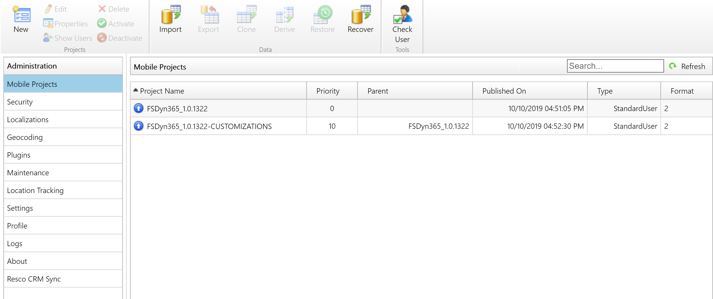
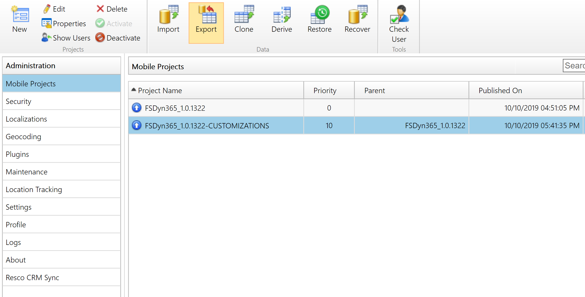
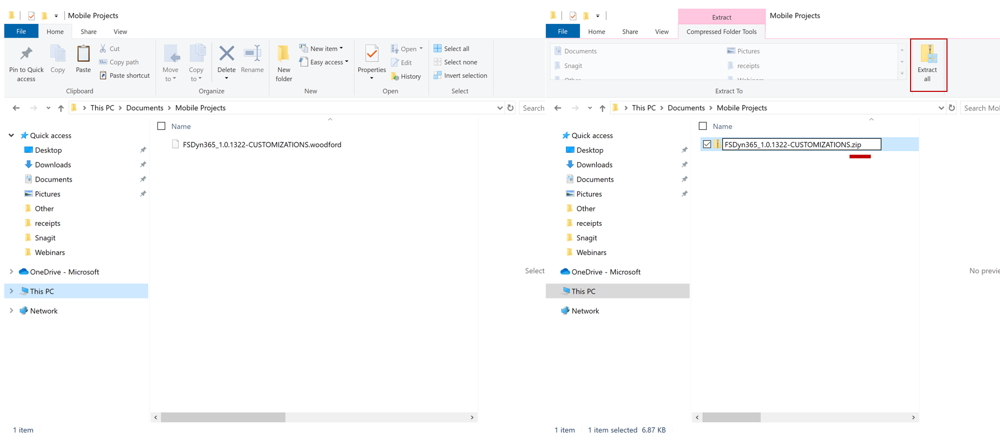
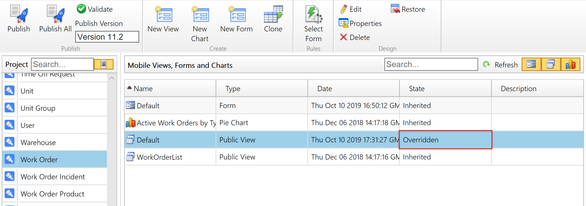

# Upgrade the Field Service Mobile project template

Dynamics 365 Field Service comes with a mobile project template that can determine how the Field Service Mobile app should look and function. For example, it has default views and forms for work orders, as well as logic that runs when a work order is saved. It also has customizations for various Field Service entities like bookings, customer assets, and so on. You can build on top of the mobile project template to edit the mobile app for your specific business needs. For more information, see the article on [common Field Service Mobile customizations](./mobile-app-configuration-customization.md).

Periodically, Microsoft releases a new mobile project template when the Field Service Mobile app is updated.

## Starting a new mobile project

If you have a new Field Service environment and want to set up the mobile app, follow these steps:

1. [Download the latest Field Service Mobile project template](https://aka.ms/fsmobile-project). 
2. Follow the instructions to [import and derive it in the mobile configuration tool (Woodford)](https://docs.microsoft.com/dynamics365/field-service/install-field-service#import-the-mobile-project-template).

## Upgrading an existing mobile project

If you are using and customizing a Field Service Mobile project template when Microsoft releases a new template, you can use the new template while keeping your customizations.

This applies to customers using any version of Field Service Mobile. For example, you may have Field Service Mobile version 9 and want to upgrade to version 11+, which requires a new project template, or you may have Field Service Mobile 11.1 and want to upgrade to 11.3 and utilize a new mobile project. 

Here is an example:

1. You imported a Field Service Mobile project template from Microsoft and published it.
2. You derived that project and made customizations for your organization.


> [!div class="mx-imgBorder"]
> 

Now Microsoft has released a new mobile project template (Example: FSDyn_1.0.2735).

You have two options:

1. Import the new project template from Microsoft, derive the template and create a child project, and manually recreate your customizations in the derived child.
2. Use GitHub to understand the difference between the new project template and your customized project template and copy and paste the changes. 

The following are steps for option 2:

1. Determine which Microsoft project template you customized. View the [version history](https://docs.microsoft.com/dynamics365/field-service/version-history#mobile-project-file-library) to find and download if you do not have the template.
2. Once you have the project determined, download your customized project on your desktop along with the original Microsoft project that you started customizing. Select and highlight your project and choose **Export**.


> [!div class="mx-imgBorder"]
> 

3. Download GitHub Desktop. 
4. Open GitHub Desktop and initialize a repo in a folder of your choosing. 
5. Rename the ```.woodford``` files of your customized project and Microsoft's template to ```.zip```. Extract it and drag the Microsoft project files from the extraction into the folder where you initialized the Git repo. 


> [!div class="mx-imgBorder"]
> 


6. Commit this to the main branch in GitHub desktop. 
7. Create a new branch in GitHub Desktop and call it "customizations." 
8. Drag the extracted files from *your* customized project files into the same folder where you initialized the Git repo and placed the files before. 
9. Open GitHub desktop, select refresh, and ensure you are on the "customizations" branch. You should then see the diff of your project compared to the Microsoft project. 
10. [Download](https://aka.ms/fsmobile-project) and import the latest Field Service Mobile project and then go to the Mobile Configuration Tool (Woodford). Create a child project off of the Microsoft project by selecting **Derive**. Export the derived child project, rename the downloaded project extension from ```.woodford``` to ```.zip```, and extract it as above. 
11. For any files that are called out as being a diff from our original, you will need to copy those files or folders into the *new* derived child project.

> [!Note]
> In many cases, simply understanding which files are different is not enough; you may actually want to understand and copy over the specific XML lines within the file instead of the entire file. For example, say the Microsoft project had a booking form with no form rules, and your customized project changed fields on the booking form. You'll see your booking form file as a diff in GitHub. Then say Microsoft's new project adds a form rule to the booking form. If you copy over your entire booking file in your customized project rather than the specific XML lines of the field changes, you will not get Microsoft's new form rule.

12. Zip the *new* derived child project and rename the project extension from ```.zip``` to ```.woodford```.
13. Go into the Mobile Configuration Tool (Woodford) and highlight the *new* derived child project that was exported a few steps ago. Select the **Import** button and upload your *new* child project that contains the diff customizations. When prompted to **Overwrite** the derived child project, choose **Yes**.
14. Now publish your new child project and begin testing.


## Configuration considerations

### Upgrading Offline HTML files

If you created or updated offline HTML files, typically for offline JavaScript workflows, you must copy over Microsoft's offline HTML files in addition to yours into the child mobile project. Woodford treats any change to offline HTML as an entire override of the offline HTML of the parent project. It doesn’t merge files. If you are going to include any offline HTML in the child project, you must copy all the offline files from the parent, too.

If you make changes to a mobile entity, it will show as **Overridden**. 

> [!div class="mx-imgBorder"]
> 

### See also

- [GitHub integration into Mobile Configurator Woodford](https://www.resco.net/github-integration-into-woodford/)
- [Version history](https://docs.microsoft.com/dynamics365/field-service/version-history#mobile-project-file-library)
- [Set up Field Service Mobile](https://docs.microsoft.com/dynamics365/field-service/install-field-service#download-the-field-service-mobile-app-on-a-phone-or-tablet)
- [Common Field Service Mobile customizations](./mobile-app-configuration-customization.md)


[!INCLUDE[footer-include](../includes/footer-banner.md)]