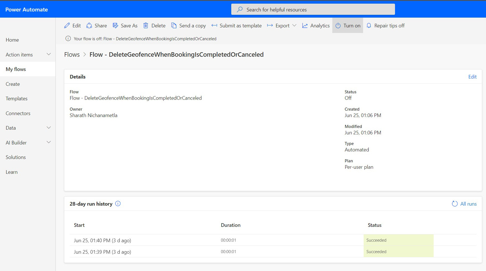

# Use Power Automate flow with Field Service Mobile

Administrators can begin using Power Automate flow in replacement of Dynamics 365 workflows for Field Service Mobile processes like Geofencing, Geofence alerts, and push notifications.

Power Automate has many benefits, including the ability to connect and run workflows within Dynamics 365 and between other outside applications, the ability to delete records and schedule jobs, and robust approvals, among others. For a comparison of Workflow vs Power Automate features please see [https://docs.microsoft.com/en-us/power-automate/replace-workflows-with-flows](https://docs.microsoft.com/en-us/power-automate/replace-workflows-with-flows).

## Enable Power Automate flows in Field Service settings

To switch from Workflow to Power Automate navigate to Field Service Settings in CRM and switch “Use Enhanced Background Processing” to “Yes”. This will move background processing from Work Flow to Power Automate and any enabled Power Automate flows would execute.  Please note this change is at Field Service level, so by making this change all Field Service Workflows would be moved to Power automate.

> [!div class="mx-imgBorder"]
> 

## Turn on each flow

By default, Power Automate which are shipped out of box are se in a “Off” state.  These Flows include:
•	Mobile Audit Logging
•	Geofencing
•	Push Notifications

Power Automate is accessed by navigating to https://make.powerapps.com/ and select your environment. From there you will select the appropriate solution and Flow you wish to enable.
To enable a flow simply click into the Flow and then select “Turn On”.

To enable Geofencing Flow via Power Automate:

Steps:
1.	Navigate to https://make.powerapps.com/ and select your environment.
2.	Navigate to “Solutions” then “Geofencing for Field Service”
3.	Enable Geofencing events for CRM enable the following Flows:
a.	Flow – DeleteGeofenceWhenBookingIsCompletedOrClosed
b.	Flow – GenerateGeofenceWhenBookingIsCreated
c.	Flow – UpdateGeofenceInstanceCoordinates

> [!div class="mx-imgBorder"]
> 

To enable Geofence Alerts via Power Automate Flow:

Steps:
1.	Navigate to https://make.powerapps.com/ and select your environment.
2.	Navigate to “Solutions” then “Geofence Alerts”
3.	To enable GeoFence Alerts and related Push Notifications to Field Service Mobile turn the following flows “ON”.
    a.	Flow – Remind To Change Status Upon Arrival <enabled by default>
b.	Flow – Remind To Change Status Upon Leaving <enabled by default>
c.	Flow – Update Resource Location from Resco Audit <need to turn on>-checks for update on audit log to check resource lat/long
d.	Flow – When Geofence Status Changes Send Booking Status Notifications <need to turn on>-calls a or b depending on scenario.

To enable Push Notifications via Power Automate Flow:

Steps:
1.	Navigate to https://make.powerapps.com/ and select your environment.
2.	Navigate to “Solutions” then “Field Service Mobile Push Notifications”
3.	To enable Push Notifications to remind user of a new booking, turn the following flow “ON”.
a.	Notify user about booking

> [!div class="mx-imgBorder"]
> 

## Deactivate workflows

After switching to Power Automate, the previously used workflows in Dynamics 365 will continue to execute but not complete. It is recommended to deactivate the active Workflows for each flow you turned on for performance reasons. 

## Customizing managed Field Service Power Automaten flows

Flows which are shipped "out of the box" are Managed and cannot be changed. If you wish to make updates to the default flows, such as altering the text of a Push Notification message, you will need to create a clone of the Power Automate flow. From this point it will be an un-managed flow which will no longer receive updates.

Mobile Push Notification
Any custom Push Notifications which were setup as a custom Workflow activity would need to be re-created in Power Automate Flow. There is a new custom action “msdyn_SendEntityNotification” which can be included in your flow to call Push Notifications for Field Service Mobile.

> [!div class="mx-imgBorder"]
> 

> [!Note]
> If you have custom Workflows and plan to migrate to Power Automate, you will need to re-create the functionality in Power Automate. Power Automate offers a variety of connectors to accomplish your customized capabilities.

## Additional Notes

Creating custom Power Automate flows will require appropriate licensing for Power Automate. See [Power Automate Pricing](https://preview.flow.microsoft.com/en-us/pricing/).

