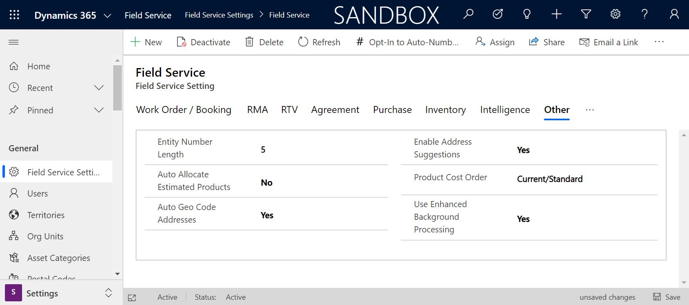
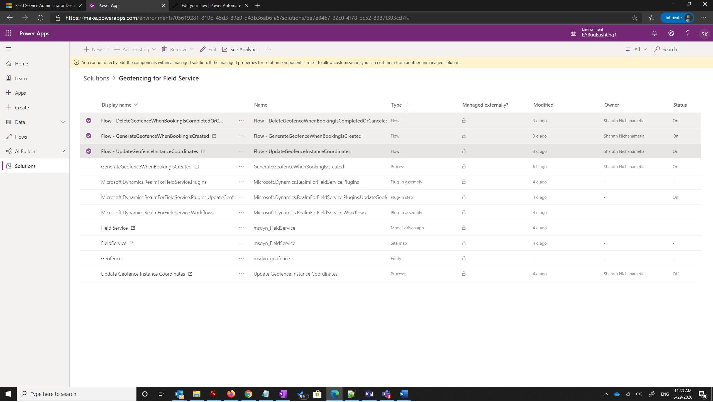
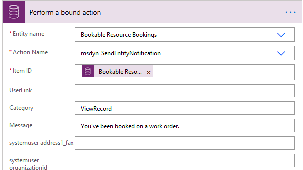

# Use Microsoft Power Automate flows with Field Service Mobile

Administrators can replace Dynamics 365 workflows with Power Automate flows for Field Service Mobile processes like geofencing, geofence alerts, and push notifications.

By using Power Automate for Field Service Mobile processes, you can:

- Connect and run workflows within Dynamics 365 and between other outside applications.
- Delete records and schedule jobs. 
- Perform robust approvals. 

For a comparison of features between Dynamics 365 workflows versus Power Automate flows, see [this feature comparison table.](https://docs.microsoft.com/power-automate/replace-workflows-with-flows).

For more information, see the following video.

> [!VIDEO https://www.microsoft.com/videoplayer/embed/RE4FlUS]

## Enable Power Automate flows in Field Service settings

To switch from workflow to Power Automate, go to **Field Service Settings** and toggle **Use Enhanced Background Processing** to **Yes**. This action will move background processing from workflow to Power Automate; any enabled Power Automate flows will execute.

> [!Note]
> Making this change in **Field Service Settings** means that all Field Service workflows will move to Power Automate.

> [!div class="mx-imgBorder"]
> 

## Turn on each flow

Power Automate flows for Field Service Mobile are set to **Off** by default. These flows include:

- Mobile audit logging
- Geofencing
- Push notifications

To access Power Automate, go to https://make.powerapps.com/ and select your environment. From there, select the appropriate solution and the flow you want to enable.

Select the flow, and then **Turn On**.

Use the following steps to turn on the geofencing flow via Power Automate:

1. Go to https://make.powerapps.com/ and select your environment.
2. Go to **Solutions** > **Geofencing for Field Service**.
3. Enable the following flows:
   - **Flow – DeleteGeofenceWhenBookingIsCompletedOrClosed**
   - **Flow – GenerateGeofenceWhenBookingIsCreated**
   - **Flow – UpdateGeofenceInstanceCoordinates**

> [!div class="mx-imgBorder"]
> 

Use the following steps to turn on geofence alerts via Power Automate:

1. Go to https://make.powerapps.com/ and select your environment.
2. Go to **Solutions** > **Geofence Alerts**.
3. To enable geofence alerts and related push notifications to Field Service Mobile, turn on the following flows:
   - **Flow – Remind To Change Status Upon Arrival** (*enabled by default*)
   - **Flow – Remind To Change Status Upon Leaving** (*enabled by default*)
   - **Flow – Update Resource Location from Resco Audit** (*need to turn on*)
   - **Flow – When Geofence Status Changes Send Booking Status Notifications** (*need to turn on*)

Use the following steps to turn on push notifications via Power Automate:

1. Go to https://make.powerapps.com/ and select your environment.
2. Go to **Solutions** > **Field Service Mobile Push Notifications**.
3. To enable push notifications to remind technicians of a new booking, turn on the following flow:
   - **Notify user about booking**

## Deactivate workflows

After switching to Power Automate, the previously used workflows in Dynamics 365 will continue to execute, but not complete. For better performance, deactivate the active workflows no longer in use.

## Customizing managed Field Service Power Automate flows

Flows that are shipped out-of-the-box are managed and cannot be changed. If you wish edit the default flows (for instance, to change the text of a push notification message), create a copy of the Power Automate flow. The copied flow can be edited.

>[!Note]
> Once you've copied a flow, it will no longer receive updates, as it is un-managed.

## Configuration considerations

- Any custom push notifications that were set up as a custom workflow activity must be recreated in Power Automate. There is a new custom action ```msdyn_SendEntityNotification``` that you can include in your flow to call push notifications for Field Service Mobile.
- If you have custom workflows and plan to migrate to Power Automate, you'll need to recreate the functionality in Power Automate. Power Automate offers a variety of connectors to accomplish your customized capabilities.

> [!div class="mx-imgBorder"]
> 

## Additional notes

- Creating custom Power Automate flows will require appropriate licensing for Power Automate. For more information, see [Power Automate pricing](https://preview.flow.microsoft.com/en-us/pricing/).


[!INCLUDE[footer-include](../includes/footer-banner.md)]