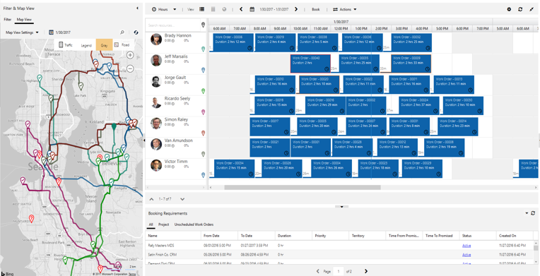

---

title: Overview of Resource Scheduling Optimization (RSO) 
author: shellyhaverkamp
manager: shellyha
ms.date: 06/08/2018
ms.topic: article
ms.custom:
  - dyn365-fieldservice
ms.service: dynamics-365-customerservice
ms.author: shellha

---

Overview of Resource Scheduling Optimization (RSO) 
===================================================

What is Resource Scheduling Optimization?
-----------------------------------------

Resource Scheduling Optimization (RSO) is an add-on capability for the Dynamics
365 for Field Service application that enables you to automatically schedule
work orders for the most appropriate resources, by optimizing bookings for the
shortest travel time, available work hours, and many other constraints.

>   RSO is one of three ways to schedule with Dynamics 365 for Field Service:

1.  **Manual scheduling**: Drag and drop work order requirements from the bottom
    panel to the resource’s calendar above.

1.  **Scheduling Assistant**: This allows you to filter resources on the left
    panel by travel range, skills, dates, roles, territories, and more. The
    system recommends available resources on the right and displays estimated
    travel times.

1.  **Resource Scheduling Optimization**: This add-on evaluates routes and
    automatically schedules bookable records to minimize travel time and
    maximize working hours and more, based on your configured objectives, such
    as “minimize travel time” and “maximize working hours.”

Benefits of using the RSO add-on 
---------------------------------

>   **Automated scheduling**: Automatically scheduling the majority of
>   requirements saves time and empowers dispatchers to focus on exceptions and
>   billing.

>   **Achieve scale**: Allows dispatchers to manage more resources, enabling the
>   business to scale.

>   **Customer satisfaction**: Improved efficiency drives more predictable
>   arrival and completion times and seamlessly schedules alternate technicians
>   for urgent situations.

>   **Technician efficiencies and reduced cost**:** **

-   Fitting more appointments into working hours drives revenue and reduces
    overtime costs.

-   Matching work orders and technician skillsets reduces the cost of lost
    appointments.

>   **Reduced travel time**:

-   Ensuring your technicians are taking the shortest possible route with
    turn-by-turn directions from Bing Maps or your custom mapping provider
    reduces fuel consumption and wear and tear on vehicles.

-   If each field technician saves one tank of gas a month, the savings
    generally will surpass the cost of RSO. 

>   **Improved customer retention**: Giving preference to higher-priority work
>   orders helps avoid service level agreement (SLA) penalties and meet customer
>   service commitments.
