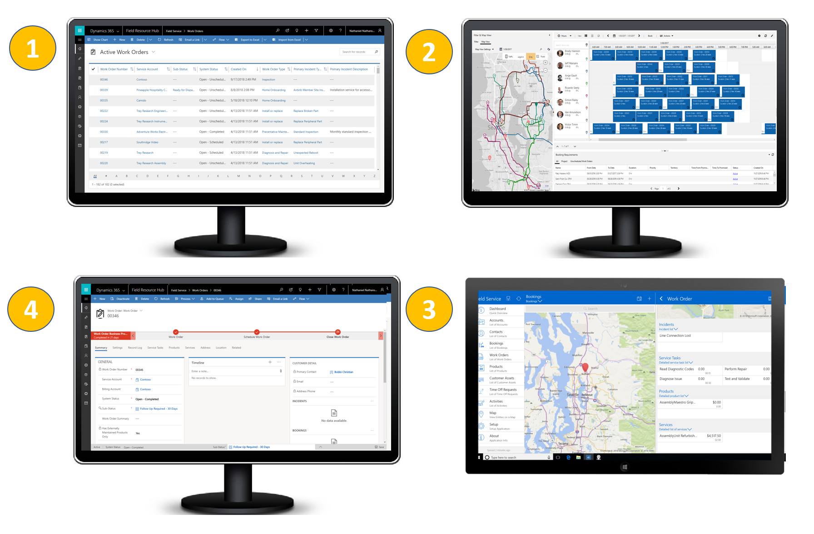

# Overview of Dynamics 365 for Field Service 

[!INCLUDE[cc-applies-to-update-9-0-0](../includes/cc_applies_to_update_9_0_0.md)]

The Dynamics 365 for Field Service business application helps you deliver onsite support at customer locations. The Field Service application provides the tools you need to manage work orders, scheduling, your mobile workforce, and more. 

The Field Service application anables you to:

- Improve first time fix rate.
- Complete more service calls per technician per week.
- Manage follow-up work and take advantage of upsell and cross sell opportunities.
- Reduce travel time, mileage, and vehicle wear and tear.
- Organize and track resolution of customer issues.
- Communicate an accurate arrival time to customers.
- Provide accurate account and equipment history to the field technician.
- Keep customers updated with the status of their service call and when it's resolved.
- Schedule onsite visits when it's convenient for the customer.
- Avoid equipment downtime through preventative maintenance.

Here are some examples of the types of organizations that use the application to manage their field service:

- **Manufacturing** -  A medical device manufacturer sells machines to hospitals and clinics, and uses the application to manage maintenance services over the lifetime of the machines.
- **Utilities** -  A fiber optic cable utility company uses the appliation to respond to outages by dispatching technicians to problem areas.
- **Health care**  - An  in-home health care service service provider uses the application to schedule and dispatch healthcare workers to administer medicine and other care to multiple patients.
- **Equipment maintenance** -  A facilities manager uses the application to deliver maintenance and repair services for heating and cooling equipment.

## What's included in Field Service

Field service capabilities include: 

- **Work orders** define service work to be performed primarily (but not exclusively) at customer locations.

- **Scheduling and dispatch** tools to manage resources and equipment needed for customer service, visualize onsite appointments, and optimize service schedules with efficient routing, resource skill matching, and reduced travel time.

- **Communication and notifications** to enhance collaboration between customer service agents, dispatchers, field technicians, customers, and other stakeholders.

- **An easy-to-use mobile application** that guides technicians through schedule changes and service work.

- **Asset management** capabilities for keeping track of customer equipment and service history.

- **Preventive maintenance** by automatically generating recurring maintenance appointments for equipment.

- **Inventory, purchasing, and returns** capabilities to manage truck stock, purchase order requests and fulfillment, and product returns.

- **Billing** capabilities to generate invoices based on products and services delivered to customers.

- **Time tracking** to help you track how resources are spending their time, whether they're traveling, on break, or working.

- **Analytics** for reporting on key indicators for manageing work orders, scheduling activities, and interacting with customers.

## Field service roles

The Field Service application provides tools for these key roles on your service team:

- **Customer service agents** triage incoming requests and determine when to create work orders for onsite visits. Agents primarily use the application through a web browser.

- **Service managers** track performance metrics and oversee service delivery, finding ways to increase efficiency and standardize processes. Service managers primarily use the application through a web browser.

- **Dispatchers** review and schedule work orders, and assign them to resources on the schedule board, through resource availability search, and through a fully automated resource scheduling optimization add-in. Dispatchers primarily use the application through a web browser.

- **Field technicians** manage their assigned work orders using the mobile app on a phone or tablet, and perform maintenance and repairs onsite at customer locations.

- **Inventory managers** ensure field technicians have what they need to complete their service calls. Inventory managers also handle product returns and purchase new inventory. Inventory managers primarily use the application through a web browser.

## Work order management
Work orders describe in detail the work that a technician is to perform at a customer location. Work orders are created from service cases, sales orders, emails, phone calls, service agreements, web portals, Internet of Things (IoT) telemetry,  and more.

An interactive schedule board helps dispatchers assign work orders to the best resources based on location, availability, skill set, priority, and more.

An easy-to-use mobile app guides field technicians through the process of resolving work orders.

As technicians submit completed work orders, equipment service history and inventory levels are updated automatically.

 >  

## Scenarios supported by Field Service

Field Service supports scenarios where you need to manage resources satisfy work requirements. 

The Field Service application enables you to:
- Maintain customer billing accounts and service accounts
- Automatically build and manage customer scopes of work with many potential variations:
- Manage work done by a single resource, within a given day.
- Manage work done by a group of resources (human or equipment) over one or more days.
- Define parameters to ensure that certain types of work can only be done by certain resources (characteristics) and can define resources who should not be considered to do the work (excluded resources).
- Define work that must be performed at a specified geographic location, at a service depot, or work that can be done remotely, regardless of location.
- Define a required set of skills and characteristics that a resource needs to be qualified to perform the work.
- Determine estimated duration to complete tasks and work.
- Include estimated parts and labor line items, as well as a list of tasks a technician is expected to complete.
- Define a set of resources (human or non-human) with specific working hours, skills, and a starting and ending location.
- Schedule resources based on defined work orders, matching availability, territory, location, distance, and  skills.
- Manage and track inventory needed for work orders, and the movement of parts from order to inventory to installation at a site.
- Enable field technicians to interact with key data in real-time using a mobile application, across any form factor or operating system, and whether connected or offline.

### Scenarios not supported 

The Field Service application doesn’t support the following business scenarios:
- Logistics management (for example, scheduling freight delivery).
- Multi-day projects with multiple resources and task dependencies. (Instead, check out Dynamics 365 for Project Service Automation.)

## Watch an overview video
In this video, see how the interactive schedule board and other tools help a service team resolve a customer service issue.

  

