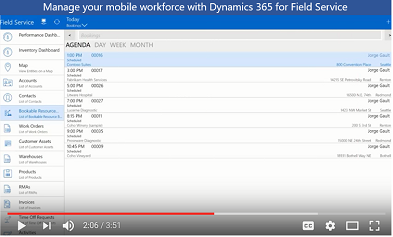

# Overview of Field Service

[!INCLUDE[cc-applies-to-update-9-0-0](../includes/cc_applies_to_update_9_0_0.md)]

 

## Overview

[!INCLUDE[pn_field_service](../includes/pn-field-service.md)] capabilities extend [!INCLUDE[pn_CRM_Online](../includes/pn-crm-online.md)] to provide a complete [!INCLUDE[pn_field_service](../includes/pn-field-service.md)] management solution, including service locations, customer assets, preventative maintenance, work order management, resource management, product inventory, scheduling and dispatch, mobility, collaboration, customer billing, and analytics. 

[!INCLUDE[pn_dyn_365_field_service](../includes/pn-dyn-365-field-service.md)] helps you:  
  
-   Optimize your service schedule with efficient routing, resource skill matching, and reduced travel time.  
  
-   Increase first time fix rates and on-time delivery performance.  
  
-   Enhance real-time communication and collaboration between customer service, dispatch, field agents, and customers.  
  
> [!NOTE]
> [!INCLUDE[cc_capabilities_require_online_8_1_0](../includes/cc-capabilities-require-online-8-1-0.md)]  
  
 **Work order management**  
  
 Quickly generate work orders, encompassing all of the information you need to dispatch field agents to service locations.  
  
 **Schedule board and dispatch**  
  
 A flexible drag-and-drop schedule board lets dispatchers assign resources and set up schedules for multiple work orders using a list or map view.  
  
 **Resource management**  
  
 Configure resource information to allow [!INCLUDE[pn_field_service](../includes/pn-field-service.md)] to efficiently match the best field agent to a work order based on availability, proximity to service location, and required skills.  
  
 **Service locations and customer assets**  
  
 Store and manage information about your customers’ service locations and serviceable customer assets.  
  
 **Preventative maintenance**  
  
 Configure service agreements for your customers that will automatically generate recurring work orders to ensure equipment is properly maintained before issues occur.  
  
 **Inventory management**  
  
 Extend the [!INCLUDE[pn_crm_shortest](../includes/pn-crm-shortest.md)] product catalog with an inventory management system that tracks real-time inventory levels by warehouse, including mobile truck stock.  
  
 **Customer billing**  
  
 Completed work orders can be turned into customer invoices for customer billing.  
  
 **Mobile app**  
  
 The mobile app gives field techs quick and easy access to everything they need to execute a work order, including schedule information, customer contact information, turn by directions, and more.  
 
## Available anywhere, on any device

There are two flavors of [!INCLUDE[pn_dyn_365_field_service](../includes/pn-dyn-365-field-service.md)]: 

- If you’re using a desktop browser, you’ll use the Field Service app. [!INCLUDE[proc_more_information](.../includes/proc-more-information.md)] [User Guide (Field Service)](../field-service/user-guide.md).

- If you’re a field tech using a smartphone or tablet, you’ll use the Field Resource Hub app which is a subset of the Field Service app. The Field Resource Hub app is built on the Unified Interface framework, which uses responsive web design principles to provide an optimal viewing and interaction experience for any screen size, device, or orientation. [!INCLUDE[proc_more_information](.../includes/proc-more-information.md)] [User Guide (Field Resource Hub)](../field-service/field-resource-hub-users-guide.md).

> [!NOTE] 
> If you're looking for the full-featured Field Service mobile app, it’s a different mobile app called Field Service Mobile. [!INCLUDE[proc_more_information](.../includes/proc-more-information.md)] [Field Service Mobile App User Guide](../field-service/field-service-mobile-app-user-guide.md).
  
### See also  
 [Install](../field-service/install-field-service.md)   
 [View user accounts and security roles](../field-service/view-user-accounts-security-roles.md)   
 [Configure default settings](../field-service/configure-default-settings.md)   
 [Turn on auto geocoding](../field-service/turn-on-auto-geocoding.md) 
 [Dynamics 365 Basics Guide](../basics/basics-guide.md)
