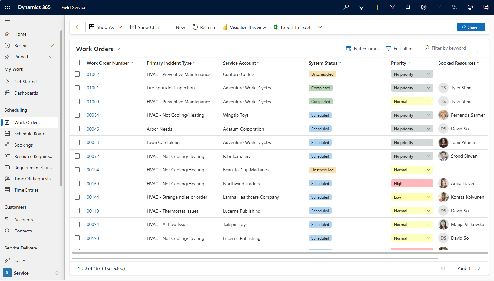
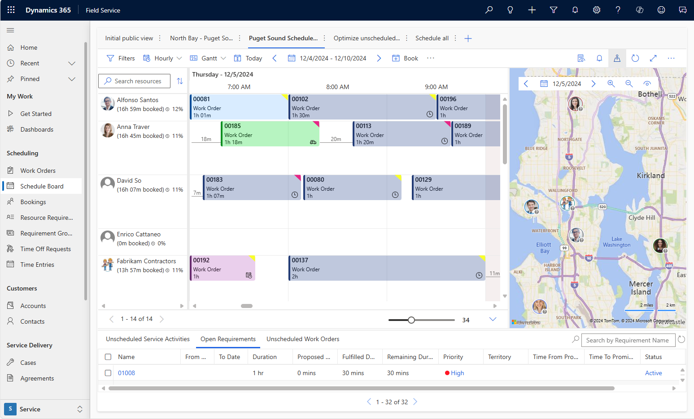
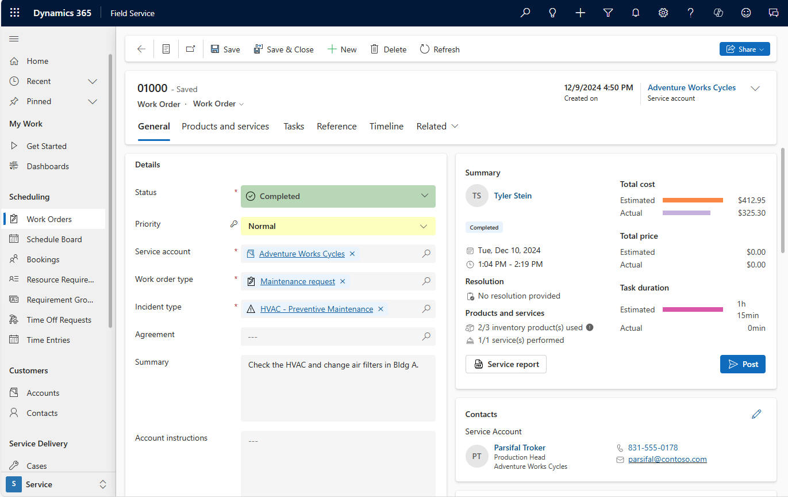

# Overview of Dynamics 365 Field Service

The Dynamics 365 Field Service business application helps organizations deliver onsite service to customer locations. The application combines workflow automation, scheduling algorithms, and mobility to set up mobile workers for success when they're onsite with customers fixing issues.

The Field Service application enables you to:

- Improve first-time fix rate
- Complete more service calls per technician per week
- Manage follow-up work and take advantage of upsell and cross sell opportunities
- Reduce travel time, mileage, and vehicle wear and tear
- Organize and track resolution of customer issues
- Communicate an accurate arrival time to customers
- Provide accurate account and equipment history to the field technician
- Keep customers updated with the status of their service call and when it's resolved
- Schedule onsite visits when it's convenient for the customer
- Avoid equipment downtime through preventative maintenance

Here are some examples of the types of organizations that use the application to manage their field service:

- **Manufacturing** -  A medical device manufacturer sells machines to hospitals and clinics, and uses the application to manage maintenance services over the lifetime of the machines.
- **Utilities** -  A fiber optic cable utility company uses the application to respond to outages by dispatching technicians to problem areas.
- **Health care**  - An  in-home health care service provider uses the application to schedule and dispatch healthcare workers to administer medicine and other care to multiple patients.
- **Equipment maintenance** -  A facilities manager uses the application to deliver maintenance and repair services for heating and cooling equipment.

## Key capabilities

Field service capabilities include:

- **Work orders** to define the service work needed primarily (but not exclusively) at customer locations.
- **Scheduling and dispatch tools** to manage resources and equipment needed for customer service, visualize onsite appointments, and optimize service schedules with efficient routing and resource skill matching.
- **Communication tools** to enhance collaboration between customer service agents, dispatchers, field technicians, customers, and other stakeholders.
- **An easy-to-use mobile application** that guides technicians through schedule changes and service work.
- **Asset management** capabilities to keep track of customer equipment and service history.
- **Preventive maintenance** by automatically generating recurring maintenance appointments for equipment.
- **Inventory, purchasing, and returns capabilities** to manage truck stock, purchase order requests and fulfillment, and product returns.
- **Billing capabilities** to generate invoices based on products and services delivered to customers.
- **Time tracking** to help you track how resources are spending their time, whether they're traveling, on break, or working.
- **Analytics for reporting** on key performance indicators for managing work orders, scheduling activities, and interacting with customers.

## Customer Stories

-  [Sodexo – Facilities Management](https://youtu.be/awSwCtgZvXE)

-  [DMS Health Technologies – Health Services](https://www.youtube.com/watch?v=-H4wwuOfdOg&feature=youtu.be)

-  [Yougenio Italy – Facilities Management](https://www.youtube.com/watch?v=URZueU-eFvo)

-  [Sandvik Coromant](https://www.youtube.com/watch?v=Oq6z3UALoYI)

-  [Nurse Maude](https://www.youtube.com/watch?v=q0aZsdokOv8)

- [RASCO](https://customers.microsoft.com/story/828538-rasco-discrete-manufacturing-dynamics365-en-croatia?_lrsc=28be62af-daf6-4315-9dc7-845eb10f60a1)

- [Toyota](https://customers.microsoft.com/en-us/story/toyota-industries-corporation)

- [Real Estate & Facilities (within Microsoft)](https://www.microsoft.com/itshowcase/blog/microsoft-field-technicians-get-their-mobility-back-with-dynamics-365-app/?elevate-lv&_lrsc=80ec2291-74e8-4a9f-ab2b-4edf95f2ab48)

- [NAVCO](https://customers.microsoft.com/story/790284-navco-professional-services-dynamics-365)

- [Rockwell Automation](https://customers.microsoft.com/story/786160-rockwell-automation-manufacturing-dynamics-365)

- [Siemens](https://customers.microsoft.com/story/814362-siemens-manufacturing-dynamics-365-field-service)

- [Oasen](https://customers.microsoft.com/story/oasen-nonprofit-azure-hololens-netherlands)

- [Orangebox](https://customers.microsoft.com/story/754861-orangebox-manufacturing-dynamics-365)

- [Posturite](https://customers.microsoft.com/story/759768-posturite)

- [Lexmark](https://customers.microsoft.com/story/735150-lexmark-international-unitedstates-professional-services-microsoft365)

- [Mashreq](https://customers.microsoft.com/story/mashreq-banking-surface-uk)

- [ExxonMobile](https://customers.microsoft.com/story/exxonmobil-mining-oil-gas-azure)

- [EcoLab](https://customers.microsoft.com/story/832498-ecolab-professional-services-dynamics-365)

- [New York City Administration for Children’s Services (ACS)](https://customers.microsoft.com/story/new-york-city-acs-government-surface)

## Field Service roles

The Field Service application provides tools for these key roles on your service team:

- **Customer service agents** triage incoming requests and determine when to create work orders for onsite visits. Agents primarily use the application through a web browser.
- **Service managers** track performance metrics and oversee service delivery, finding ways to increase efficiency and standardize processes. Service managers primarily use the application through a web browser.
- **Dispatchers** review and schedule work orders, and assign them to resources on the schedule board through resource availability searches, and through a fully automated resource scheduling optimization add-in. Dispatchers primarily use the application through a web browser.
- **Field technicians** manage their assigned work orders using the mobile app on a phone or tablet, and perform maintenance and repairs onsite at customer locations.
- **Inventory managers** ensure field technicians have what they need to complete their service calls. Inventory managers also handle product returns and purchase new inventory. Inventory managers primarily use the application through a web browser.

## Using the Field Service application
Work orders describe the work that a technician needs to perform at a customer location. In the Field Service application, a typical work order lifecycle looks like this:

1. Work orders generate from service cases, sales orders, emails, phone calls, service agreements, web portals, or Internet of Things (IoT) data and then display in Field Service. Work orders are typically grouped by geographical territory and lines of business. Work order details consist of a checklist of tasks, parts to use, labor to bill to the customer, and skills required.

    Most work orders also include a location based on the related customer account and/or equipment that needs attention; this location routes the field technician from job to job. Finally, incoming work orders that are marked as ready for assignment are passed along to a dispatcher for scheduling.
 > 

2. An interactive schedule board helps dispatchers assign work orders to the best resources based on location, availability, skill set, priority, and more. This is done via a manual drag-and-drop method, a semi-automated scheduling assistant, or fully automated with Resource Scheduling Optimization.

    The schedule board displays each resource--whether an employee, contractor, or equipment--and their scheduled work orders. Resources and their assigned jobs are also displayed on a map along with routes and traffic patterns in real time. The schedule board is extensible and can be used to schedule anything within Dynamics 365, including work orders, sales orders, projects, and custom entities. Additionally, Microsoft 365 integration allows for emailing and skype calling to available resources.
>  

3. An easy-to-use mobile app for iOS, Android, and Windows devices guides field technicians through the process of resolving assigned work orders. For each work order, the field technician can view important information such as location, step-by-step instructions, customer assets, and service history, and can use their device to take pictures and videos or record a digital customer signature. Field technicians can also automatically download important information to their devices for offline work when internet is not available. 

    After performing the work, the technician can mark the work order as complete or as requiring a follow-up; the dispatcher can then see this change on the schedule board.
> 

4. As technicians submit completed work orders, equipment service history and inventory levels update automatically. This allows service managers to manage and track inventory needed, as well as track movement of parts from order to inventory to onsite installation.

    For example, if an equipment part is installed at a customer's location during an installation or repair, the system will document a reduction in inventory from the related warehouse or truck and document the part as a new customer asset along with installation/repair details. Closing a work order will then generate an invoice for any used parts or labor.
> 

## Watch an overview video

> [!VIDEO https://www.microsoft.com/en-us/videoplayer/embed/RWs4Cu]

